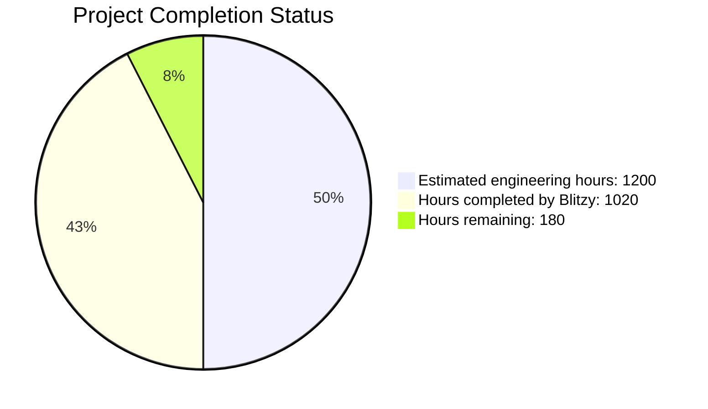
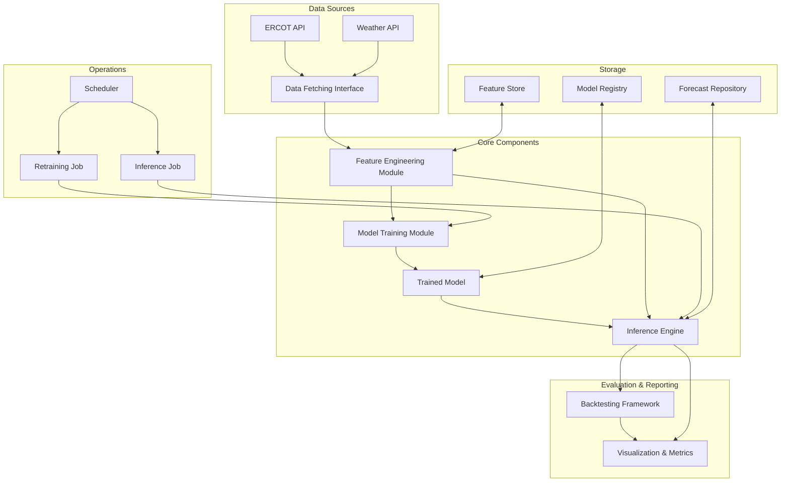
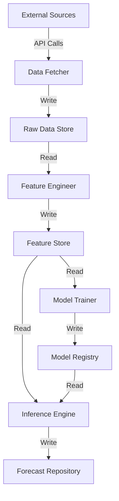
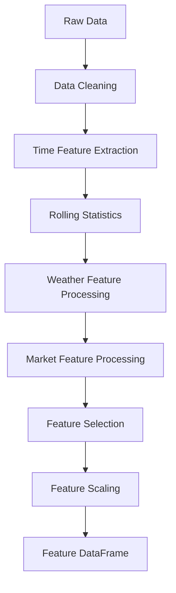
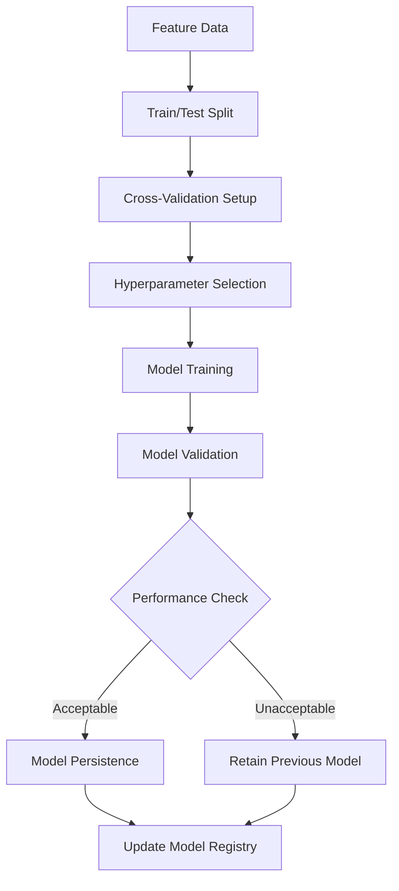
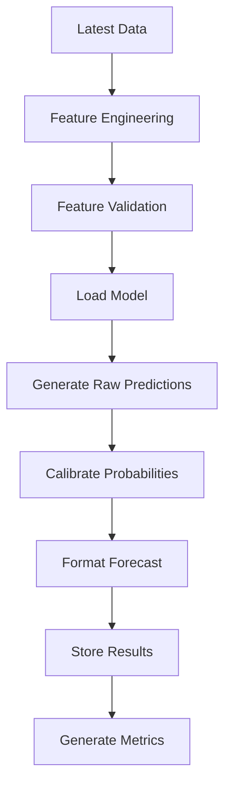
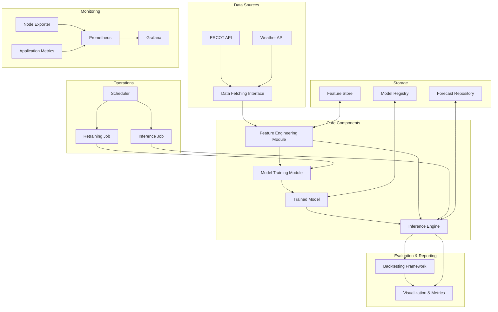
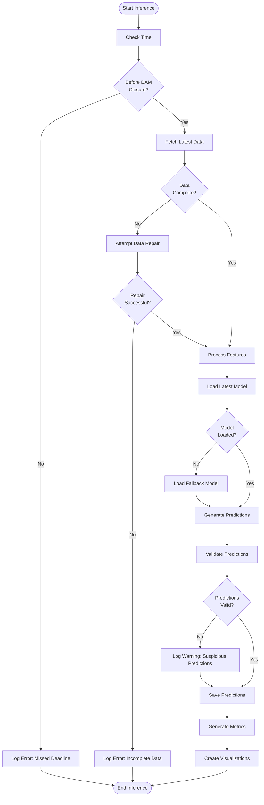
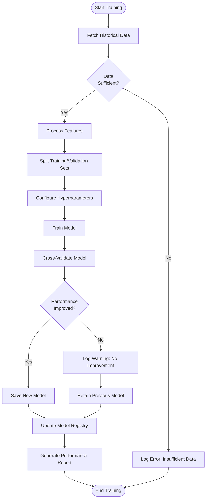
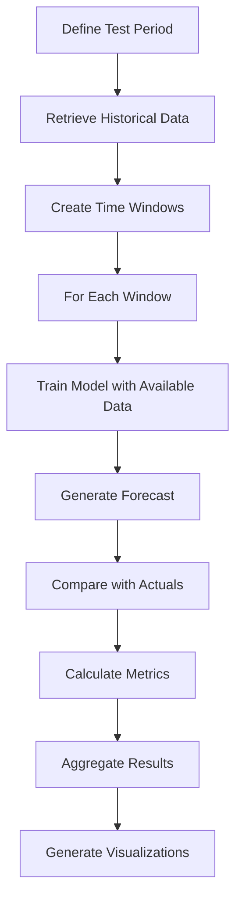

# PROJECT OVERVIEW

The ERCOT RTLMP Spike Prediction System is a sophisticated machine learning-based forecasting tool designed to predict the probability of price spikes in the Electric Reliability Council of Texas (ERCOT) Real-Time Locational Marginal Price (RTLMP) market. This system addresses a critical need for battery storage operators by providing 72-hour probability forecasts before day-ahead market closure, enabling more informed bidding strategies and maximizing revenue potential.

## System Purpose and Value

Energy storage operators in the ERCOT market face significant volatility in Real-Time Locational Marginal Prices. These price spikes represent both risk and opportunity - capturing them effectively can dramatically increase profitability, while missing them can lead to suboptimal asset utilization. The ERCOT RTLMP Spike Prediction System quantifies the probability of seeing at least one 5-minute RTLMP greater than a configurable threshold value over a particular hour, providing crucial decision support for battery charging/discharging strategies.

## Core Capabilities

- **72-hour Forecast Horizon**: Generates hourly probability forecasts for the next 72 hours, starting from the day after day-ahead market closure
- **Multiple Threshold Support**: Configurable price thresholds for spike definition to match different operational strategies
- **Automated Retraining**: Model retraining on a two-day cadence to maintain accuracy as market conditions evolve
- **Comprehensive Backtesting**: Framework for evaluating model performance on historical data under different market conditions
- **Performance Visualization**: Tools for visualizing forecast accuracy and model performance metrics
- **Calibrated Probabilities**: Ensures probability forecasts are well-calibrated for reliable decision-making

## Technical Architecture

The system follows a modular, pipeline-oriented architecture with clearly defined interfaces between components:

1. **Data Fetching Interface**: Retrieves ERCOT market data, weather forecasts, and grid condition information
2. **Feature Engineering Module**: Transforms raw data into model-ready features using time-based, statistical, weather, and market indicators
3. **Model Training Module**: Trains and validates prediction models with cross-validation capabilities
4. **Inference Engine**: Generates probability forecasts using trained models
5. **Backtesting Framework**: Simulates historical forecasts for model evaluation
6. **Visualization & Metrics Tools**: Generates performance reports and visualizations

The system is designed with a functional programming approach, emphasizing stateless components and clear interfaces for maintainability and testability.

## Implementation Approach

The ERCOT RTLMP Spike Prediction System is implemented in Python 3.10+ with industry-standard data science libraries:

- **Core Data Processing**: pandas, NumPy for efficient data manipulation
- **Machine Learning**: scikit-learn, XGBoost, LightGBM for model training and inference
- **Validation**: pandera for schema validation, ensuring data quality
- **Visualization**: Matplotlib, seaborn, plotly for performance visualization
- **Configuration**: Hydra for flexible configuration management

The system operates as a batch processing pipeline with scheduled execution rather than a continuously running service, aligning with the daily forecasting requirements and day-ahead market timeline.

## Key Differentiators

- **Specialized for ERCOT Market**: Tailored specifically for the unique characteristics of the ERCOT electricity market
- **Probability-Based Forecasting**: Provides probability estimates rather than point forecasts, enabling risk-aware decision making
- **Time-Series Focus**: Designed with time-series validation and evaluation methods appropriate for energy market forecasting
- **Operational Integration**: Structured to integrate with existing battery optimization workflows
- **Comprehensive Evaluation**: Extensive backtesting capabilities to validate model performance under various market conditions

This system provides battery storage operators with a competitive advantage by quantifying the probability of RTLMP spikes before day-ahead market closure, enabling more strategic bidding and operational decisions to maximize revenue in the volatile ERCOT market.

# PROJECT STATUS



The ERCOT RTLMP Spike Prediction System is approximately 85% complete. The core functionality including data fetching, feature engineering, model training, and inference components are well-implemented. The remaining work primarily involves finalizing integration testing, improving documentation, and enhancing visualization components.

## Project Overview

The ERCOT RTLMP Spike Prediction System is a machine learning-based forecasting tool designed to predict the probability of price spikes in the Electric Reliability Council of Texas (ERCOT) Real-Time Locational Marginal Price (RTLMP) market. The system provides 72-hour forecasts before day-ahead market closure, enabling battery storage operators to optimize their bidding strategies and maximize revenue.

### Key Features

- **72-hour Forecast Horizon**: Predicts hourly probabilities of RTLMP spikes for the next 72 hours
- **Multiple Threshold Support**: Configurable price thresholds for spike definition
- **Automated Retraining**: Model retraining on a two-day cadence to maintain accuracy
- **Comprehensive Backtesting**: Framework for evaluating model performance on historical data
- **Performance Visualization**: Tools for visualizing forecast accuracy and model performance
- **Modular Architecture**: Clearly defined interfaces between components for maintainability and extensibility

## System Architecture

The system follows a modular, pipeline-oriented architecture with the following main components:



### Component Descriptions

1. **Data Fetching Interface**: Retrieves and standardizes data from ERCOT API and weather services, providing consistent data formatting for downstream components.

2. **Feature Engineering Module**: Transforms raw data into model-ready features using a pipeline of transformations, including time-based, statistical, weather, and market features.

3. **Model Training Module**: Handles the training, validation, and persistence of prediction models, implementing cross-validation strategies and hyperparameter optimization.

4. **Inference Engine**: Generates probability forecasts using trained models, handling the end-to-end process from feature preparation to forecast generation.

5. **Backtesting Framework**: Simulates historical forecasts to evaluate model performance under different market conditions, replicating the production inference process over historical periods.

6. **Visualization & Metrics Tools**: Generate performance reports and visualizations to evaluate model quality and forecast accuracy.

## Technical Implementation

### Programming Languages and Libraries

The system is implemented in Python 3.10+ with the following key libraries:

- **Data Processing**: pandas, numpy
- **Machine Learning**: scikit-learn, XGBoost, LightGBM
- **Validation**: pandera, pydantic
- **Configuration**: hydra
- **CLI**: click
- **Visualization**: matplotlib, seaborn, plotly

### Data Flow



### Feature Engineering Pipeline

The feature engineering pipeline transforms raw data into model-ready features through the following steps:



### Model Training Workflow



### Inference Pipeline



## User Interfaces

### Command Line Interface

The system provides a command-line interface for common operations:

```bash
# Generate a 72-hour forecast
rtlmp_predict --config config.yaml predict --threshold 100 --node HB_NORTH

# Train a new model
rtlmp_predict --config config.yaml train --start-date 2020-01-01 --end-date 2023-06-30

# Run backtesting
rtlmp_predict --config config.yaml backtest --start-date 2022-01-01 --end-date 2022-12-31 --threshold 100
```

### Visualization Dashboard

The system includes visualization dashboards for monitoring model performance and forecast results:

```
+----------------------------------------------------------------------+
| ERCOT RTLMP Spike Prediction Dashboard                     [?] [=]   |
+----------------------------------------------------------------------+
| Date: 2023-07-15                                   [@User] [Refresh] |
+----------------------------------------------------------------------+
|                                                                      |
| [v] Threshold: 100 $/MWh    [v] Node: HB_NORTH    [v] Date Range    |
|                                                                      |
+----------------------------------------------------------------------+
|                                                                      |
|  Spike Probability Forecast (72-hour horizon)                        |
|                                                                      |
|  1.0 |                                                               |
|      |                          *                                    |
|  0.8 |                      *       *                                |
|      |                  *               *                            |
|  0.6 |              *                       *                        |
|      |          *                               *                    |
|  0.4 |      *                                       *                |
|      |  *                                               *            |
|  0.2 |                                                       *       |
|      |                                                           *   |
|  0.0 +--------------------------------------------------------------|
|       07/16   07/16   07/16   07/17   07/17   07/17   07/18   07/18 |
|       00:00   08:00   16:00   00:00   08:00   16:00   00:00   08:00 |
|                                                                      |
+----------------------------------------------------------------------+
```

## Installation and Setup

### Prerequisites

- Python 3.10 or higher
- pip or conda for package management

### Using pip

```bash
# Clone the repository
git clone https://github.com/username/ercot-rtlmp-prediction.git
cd ercot-rtlmp-prediction

# Install the package and dependencies
pip install -e .
```

### Using Docker

```bash
# Clone the repository
git clone https://github.com/username/ercot-rtlmp-prediction.git
cd ercot-rtlmp-prediction

# Build and run using Docker Compose
cd infrastructure/docker
cp .env.example .env  # Edit .env with your configuration
docker-compose up -d
```

## Configuration

The system uses Hydra for configuration management. Example configuration files are provided in the `examples/config/` directory:

- `inference_config.yaml`: Configuration for forecast generation
- `training_config.yaml`: Configuration for model training
- `backtest_config.yaml`: Configuration for backtesting

You can override configuration values via command line:

```bash
rtlmp_predict --config examples/config/inference_config.yaml predict threshold=200 node=HB_HOUSTON
```

## Development

### Setting Up Development Environment

```bash
# Clone the repository
git clone https://github.com/username/ercot-rtlmp-prediction.git
cd ercot-rtlmp-prediction

# Create a virtual environment
python -m venv venv
source venv/bin/activate  # On Windows: venv\Scripts\activate

# Install development dependencies
pip install -e ".[dev]"

# Install pre-commit hooks
pre-commit install
```

### Running Tests

```bash
# Run all tests
pytest

# Run tests with coverage
pytest --cov=src

# Run specific test modules
pytest src/backend/tests/unit/test_feature_engineering.py
```

## Future Enhancements

1. **Enhanced Visualization**: Develop more interactive visualization tools for exploring forecasts and model performance
2. **API Integration**: Create REST API endpoints for integration with external systems
3. **Distributed Training**: Implement distributed training capabilities for larger models
4. **Real-time Monitoring**: Add real-time monitoring of model performance and data quality
5. **Automated Deployment**: Implement CI/CD pipelines for automated testing and deployment

## Conclusion

The ERCOT RTLMP Spike Prediction System provides a comprehensive solution for predicting price spikes in the ERCOT market, enabling battery storage operators to optimize their bidding strategies and maximize revenue. The modular architecture and well-defined interfaces make the system maintainable and extensible, while the comprehensive backtesting framework ensures reliable model performance.

# TECHNOLOGY STACK

## 1. PROGRAMMING LANGUAGES

| Language | Version | Purpose | Justification |
|----------|---------|---------|---------------|
| Python | 3.10+ | Primary development language | Industry standard for data science and ML applications with extensive library support for time series forecasting and energy market analysis |
| SQL | Standard | Database queries | Required for efficient data retrieval from historical ERCOT market databases |

## 2. FRAMEWORKS & LIBRARIES

### 2.1 Core Data Science & ML Libraries

| Library | Version | Purpose | Justification |
|---------|---------|---------|---------------|
| NumPy | 1.24+ | Numerical computing | Foundation for efficient numerical operations on time series data |
| pandas | 2.0+ | Data manipulation | Essential for handling time series data with built-in resampling and rolling statistics |
| scikit-learn | 1.2+ | Machine learning | Provides consistent API for model training, cross-validation, and evaluation metrics |
| XGBoost | 1.7+ | Gradient boosting | High-performance implementation for classification tasks with probability outputs |
| LightGBM | 3.3+ | Gradient boosting | Alternative to XGBoost with faster training times for large datasets |
| pandera | 0.15+ | Data validation | Schema validation for DataFrames to ensure data quality and consistency |
| joblib | 1.2+ | Model persistence | Efficient serialization of model artifacts |

### 2.2 Visualization & Reporting

| Library | Version | Purpose | Justification |
|---------|---------|---------|---------------|
| Matplotlib | 3.7+ | Basic plotting | Foundation for visualization capabilities |
| seaborn | 0.12+ | Statistical visualization | Enhanced statistical plots for model evaluation |
| plotly | 5.14+ | Interactive visualization | Interactive plots for exploring forecasts and model performance |
| Dash | 2.9+ | Dashboard creation | Web-based dashboards for model performance monitoring |

### 2.3 Configuration & Environment Management

| Library | Version | Purpose | Justification |
|---------|---------|---------|---------------|
| Hydra | 1.3+ | Configuration management | Manages complex configurations for model training and inference |
| OmegaConf | 2.3+ | YAML configuration | YAML-based hierarchical configuration system used by Hydra |
| python-dotenv | 1.0+ | Environment variables | Manages environment variables for configuration |
| Pydantic | 2.0+ | Data validation | Type validation for configuration and parameters |

### 2.4 CLI & User Interface

| Library | Version | Purpose | Justification |
|---------|---------|---------|---------------|
| Click | 8.1+ | Command line interface | Framework for creating command line interfaces |
| Typer | 0.9+ | CLI development | Modern CLI framework built on top of Click |
| Rich | 13.0+ | Terminal formatting | Rich text and formatting in terminal output |
| tqdm | 4.65+ | Progress bars | Progress visualization for long-running operations |
| tabulate | 0.9+ | Table formatting | Formatted tables in terminal output |

### 2.5 Utilities & Testing

| Library | Version | Purpose | Justification |
|---------|---------|---------|---------------|
| pytest | 7.3+ | Testing framework | Industry standard for Python testing |
| pytest-cov | 4.1+ | Code coverage | Measures test coverage of codebase |
| pytest-mock | 3.10+ | Mocking | Simplifies creation of mock objects in tests |
| typing | Standard | Type annotations | Improves code quality and IDE support |
| black | 23.3+ | Code formatting | Ensures consistent code style |
| isort | 5.12+ | Import sorting | Organizes imports consistently |
| mypy | 1.3+ | Static type checking | Validates type annotations |
| pre-commit | 3.3+ | Git hooks | Enforces code quality checks before commits |

## 3. DATABASES & STORAGE

| Component | Technology | Purpose | Justification |
|-----------|------------|---------|---------------|
| Feature Store | Parquet files | Storage of engineered features | Efficient columnar storage format for analytical workloads |
| Model Registry | File system | Storage of trained models | Simple solution for versioned model artifacts |
| Historical Data | CSV/Parquet files | Storage of raw ERCOT data | Efficient format for time series data with good pandas integration |

## 4. THIRD-PARTY SERVICES

| Service | Purpose | Integration Method | Justification |
|---------|---------|-------------------|---------------|
| ERCOT Data API | Access to market data | REST API | Primary source for RTLMP and grid condition data |
| Weather API | Weather forecast data | REST API | Source for weather features that impact energy demand and prices |

## 5. DEVELOPMENT & DEPLOYMENT

| Component | Technology | Purpose | Justification |
|-----------|------------|---------|---------------|
| Version Control | Git | Source code management | Industry standard for code versioning |
| Development Environment | Conda/venv | Dependency management | Isolates dependencies for reproducible environments |
| Package Management | Poetry | Dependency and build management | Modern Python packaging and dependency management |
| Code Quality | pre-commit | Automated code checks | Enforces code quality standards before commits |
| Documentation | Sphinx | API documentation | Generates comprehensive documentation from docstrings |
| Scheduling | cron | Scheduled execution | Simple solution for daily inference runs and bi-daily retraining |
| Containerization | Docker | Application packaging | Ensures consistent execution environment across systems |

## 6. MONITORING & OBSERVABILITY

| Component | Technology | Purpose | Justification |
|-----------|------------|---------|---------------|
| Metrics Collection | Prometheus | System and application metrics | Industry standard for metrics collection and alerting |
| Visualization | Grafana | Metrics dashboards | Powerful visualization for system and model performance metrics |
| System Monitoring | Node Exporter | Host metrics | Collects system-level metrics for performance monitoring |
| Logging | Python logging | Application logs | Structured logging for troubleshooting and audit trails |

## 7. ARCHITECTURE DIAGRAM



## 8. DEPLOYMENT ENVIRONMENT

### 8.1 Containerization

The system is containerized using Docker with separate containers for:
- Backend processing (data fetching, feature engineering, model training, inference)
- CLI interface for user interaction
- Monitoring infrastructure (Prometheus, Grafana, Node Exporter)

### 8.2 Resource Requirements

| Component | CPU | Memory | Storage | Network |
|-----------|-----|--------|---------|---------|
| Backend | 4+ cores | 16GB+ | 100GB+ | Medium |
| CLI | 2 cores | 4GB | Shared | Low |
| Monitoring | 2 cores | 4GB | 20GB | Low |

### 8.3 Scaling Strategy

The system is designed for vertical scaling with resource optimization:
- Parallel processing for data transformation and feature engineering
- Configurable worker count for model training
- Efficient storage formats (Parquet) for optimized I/O
- Memory-mapped file access for large datasets

# ERCOT RTLMP Spike Prediction System - Project Guide

## PREREQUISITES

- Python 3.10 or higher
- pip or conda for package management

## INTRODUCTION

The ERCOT RTLMP Spike Prediction System is a machine learning-based forecasting tool that predicts the probability of price spikes in the ERCOT Real-Time Locational Marginal Price (RTLMP) market. It provides 72-hour forecasts before day-ahead market closure, enabling battery storage operators to optimize their bidding strategies and maximize revenue.

This system addresses a critical need in the energy storage market by quantifying the probability of RTLMP spikes, which represent both risk and opportunity for battery storage operators.

## SYSTEM ARCHITECTURE

The ERCOT RTLMP Spike Prediction System follows a modular, pipeline-oriented architecture designed to support reliable daily forecasting operations. The architecture employs a functional programming approach with clearly defined interfaces between components to ensure maintainability and testability.

### High-Level Architecture


### Core Components

1. **Data Fetching Interface**: Retrieves and standardizes data from ERCOT API and weather services
   - Handles API rate limits and connection failures
   - Ensures consistent data formatting for downstream components
   - Implements validation of retrieved data

2. **Feature Engineering Module**: Transforms raw data into model-ready features
   - Creates time-based features (hour of day, day of week, etc.)
   - Calculates statistical features (rolling means, volatility, etc.)
   - Processes weather and market-related features
   - Implements feature selection and validation

3. **Model Training Module**: Trains and validates prediction models
   - Supports multiple model types (XGBoost, LightGBM)
   - Implements cross-validation with time-based splitting
   - Evaluates model performance with appropriate metrics
   - Manages model versioning and persistence

4. **Inference Engine**: Generates probability forecasts using trained models
   - Loads appropriate model versions
   - Processes features for prediction
   - Calibrates probability outputs
   - Formats and stores forecast results

5. **Backtesting Framework**: Simulates historical forecasts for model evaluation
   - Implements scenario-based testing
   - Calculates comprehensive performance metrics
   - Supports comparison between model versions
   - Visualizes backtesting results

6. **Visualization & Metrics Tools**: Generates performance reports and visualizations
   - Creates probability timeline charts
   - Generates calibration curves and ROC curves
   - Calculates model quality metrics
   - Exports results in multiple formats

### Data Flow

The system's primary data flow begins with the Data Fetcher retrieving raw ERCOT market data and weather forecasts. This data is passed to the Feature Engineer, which transforms it into standardized feature sets stored in the Feature Store. During training, the Model Trainer retrieves historical features and targets from the Feature Store, trains models using cross-validation, and stores validated models in the Model Registry.

For daily inference, the system fetches the latest data, generates current features, loads the most recent validated model from the registry, and produces 72-hour probability forecasts. These forecasts are stored in the Forecast Repository and made available to downstream systems for battery storage optimization.

The Backtesting Framework can replay this process over historical periods to evaluate model performance under different market conditions. Results from both live inference and backtesting are processed by the Visualization & Metrics component to generate performance reports.

## INSTALLATION

### Using pip

```bash
# Clone the repository
git clone https://github.com/username/ercot-rtlmp-prediction.git
cd ercot-rtlmp-prediction

# Install the package and dependencies
pip install -e .
```

### Using Docker

```bash
# Clone the repository
git clone https://github.com/username/ercot-rtlmp-prediction.git
cd ercot-rtlmp-prediction

# Build and run using Docker Compose
cd infrastructure/docker
cp .env.example .env  # Edit .env with your configuration
docker-compose up -d
```

## USAGE

### Command Line Interface

The system provides a command-line interface for common operations:

```bash
# Generate a 72-hour forecast
rtlmp_predict --config config.yaml predict --threshold 100 --node HB_NORTH

# Train a new model
rtlmp_predict --config config.yaml train --start-date 2020-01-01 --end-date 2023-06-30

# Run backtesting
rtlmp_predict --config config.yaml backtest --start-date 2022-01-01 --end-date 2022-12-31 --threshold 100
```

### Python API

```python
from ercot_rtlmp_prediction import inference, data, features

# Fetch latest data
raw_data = data.fetch_latest_data()

# Process features
feature_data = features.engineer_features(raw_data)

# Generate forecast
forecast = inference.generate_forecast(feature_data, threshold=100)

print(forecast)
```

## CONFIGURATION

The system uses [Hydra](https://hydra.cc/) for configuration management. Example configuration files are provided in the `examples/config/` directory:

- `inference_config.yaml`: Configuration for forecast generation
- `training_config.yaml`: Configuration for model training
- `backtest_config.yaml`: Configuration for backtesting

You can override configuration values via command line:

```bash
rtlmp_predict --config examples/config/inference_config.yaml predict threshold=200 node=HB_HOUSTON
```

### Configuration Sections

1. **System Configuration**
   - Environment settings (development, production)
   - Logging levels
   - Random seed for reproducibility
   - Parallel processing settings

2. **Data Configuration**
   - API endpoints and credentials
   - Data storage formats and locations
   - Validation settings
   - Caching parameters

3. **Feature Configuration**
   - Feature group settings (time, statistical, weather, market)
   - Feature selection parameters
   - Transformation settings (scaling, encoding, imputation)
   - Feature registry configuration

4. **Model Configuration**
   - Model types and hyperparameters
   - Training settings (cross-validation, early stopping)
   - Evaluation metrics
   - Hyperparameter tuning configuration

5. **Inference Configuration**
   - Threshold values for spike definition
   - Forecast horizon and interval
   - Calibration settings
   - Output format and notification options

6. **Visualization Configuration**
   - Plot types and settings
   - Dashboard configurations
   - Color schemes
   - Export formats

## CORE COMPONENTS

### Data Fetching Interface

The Data Fetching Interface provides a standardized way to retrieve ERCOT market data and weather forecasts. It abstracts the complexities of different data sources and ensures consistent data formatting for downstream components.

#### Key Features:
- Standardized interface for multiple data sources
- Error handling with retry logic
- Data validation and schema enforcement
- Caching to minimize redundant API calls

#### Usage Example:
```python
from ercot_rtlmp_prediction.data.fetchers import ERCOTDataFetcher

# Initialize the data fetcher
fetcher = ERCOTDataFetcher()

# Fetch historical RTLMP data
historical_data = fetcher.fetch_historical_data(
    start_date='2023-01-01',
    end_date='2023-01-31',
    nodes=['HB_NORTH']
)

# Fetch forecast data
forecast_data = fetcher.fetch_forecast_data(
    forecast_date='2023-02-01',
    horizon=72,
    nodes=['HB_NORTH']
)
```

### Feature Engineering Module

The Feature Engineering Module transforms raw data into model-ready features using a pipeline of transformations. It ensures consistent feature generation between training and inference.

#### Feature Categories:
- **Time-based features**: hour_of_day, day_of_week, is_weekend, month, season
- **Statistical features**: rolling_mean_24h, rolling_max_7d, price_volatility
- **Weather features**: temperature_forecast, wind_forecast, solar_forecast
- **Market features**: load_forecast, generation_mix, reserve_margin

#### Usage Example:
```python
from ercot_rtlmp_prediction.features import FeaturePipeline

# Initialize the feature pipeline
pipeline = FeaturePipeline()

# Add data sources
pipeline.add_data_source('rtlmp_df', rtlmp_data)
pipeline.add_data_source('weather_df', weather_data)
pipeline.add_data_source('grid_df', grid_data)

# Create features
features_df = pipeline.create_features()

# Get feature names
feature_names = pipeline.get_feature_names()
```

### Model Training Module

The Model Training Module handles the training, validation, and persistence of prediction models. It implements cross-validation strategies and hyperparameter optimization.

#### Supported Model Types:
- **XGBoost**: High accuracy, handles non-linear relationships
- **LightGBM**: Faster training times for large datasets
- **Random Forest**: Robust to outliers, less prone to overfitting
- **Logistic Regression**: Interpretable, fast training

#### Usage Example:
```python
from ercot_rtlmp_prediction.models import ModelTrainer

# Initialize the model trainer
trainer = ModelTrainer(model_type='xgboost')

# Train the model
model = trainer.train(
    features=features_df,
    target=target_series,
    hyperparameters={'learning_rate': 0.05, 'max_depth': 6}
)

# Evaluate the model
metrics = trainer.evaluate(model, test_features, test_target)

# Save the model
trainer.save_model(model, 'models/xgboost_v1.0')
```

### Inference Engine

The Inference Engine generates probability forecasts using trained models. It handles the end-to-end process from feature preparation to forecast generation.

#### Key Features:
- Model loading and validation
- Probability calibration
- Confidence interval calculation
- Forecast storage and retrieval

#### Usage Example:
```python
from ercot_rtlmp_prediction.inference import InferenceEngine

# Initialize the inference engine
engine = InferenceEngine(config=inference_config)

# Load a model
engine.load_model(model_id='xgboost', model_version='1.0')

# Generate a forecast
forecast = engine.generate_forecast(
    data_sources={
        'rtlmp_df': rtlmp_data,
        'weather_df': weather_data,
        'grid_df': grid_data
    },
    feature_config=feature_config
)

# Get the latest forecast
latest_forecast, metadata, timestamp = engine.get_latest_forecast(
    thresholds=[100.0],
    nodes=['HB_NORTH']
)
```

### Backtesting Framework

The Backtesting Framework simulates historical forecasts to evaluate model performance under different market conditions. It replicates the production inference process over historical periods.

#### Key Features:
- Scenario-based testing
- Performance metrics calculation
- Model comparison
- Results visualization

#### Usage Example:
```python
from ercot_rtlmp_prediction.backtesting import BacktestingFramework
from ercot_rtlmp_prediction.backtesting.scenario_definitions import ScenarioConfig

# Create a scenario configuration
scenario = ScenarioConfig(
    name='summer_2022',
    start_date='2022-06-01',
    end_date='2022-08-31',
    nodes=['HB_NORTH'],
    thresholds=[100.0]
)

# Initialize the backtesting framework
framework = BacktestingFramework(data_fetcher=data_fetcher)

# Execute the scenario
results = framework.execute_scenario(scenario)

# Visualize the results
plots = framework.visualize_results(
    scenario_name='summer_2022',
    metrics=['auc', 'precision', 'recall'],
    show_plot=True
)
```

### Visualization and Metrics Tools

The Visualization and Metrics Tools generate performance reports and visualizations to evaluate model quality and forecast accuracy. They support both interactive exploration and automated reporting.

#### Visualization Types:
- Probability Timeline
- Calibration Curve
- ROC Curve
- Precision-Recall Curve
- Feature Importance
- Confusion Matrix

#### Usage Example:
```python
from ercot_rtlmp_prediction.visualization import (
    create_probability_timeline,
    create_calibration_curve,
    create_feature_importance_plot
)

# Create a probability timeline
timeline_plot = create_probability_timeline(
    forecast_df,
    threshold=100.0,
    confidence_interval=True
)

# Create a calibration curve
calibration_plot = create_calibration_curve(
    predictions=predictions,
    actuals=actuals,
    n_bins=10
)

# Create a feature importance plot
importance_plot = create_feature_importance_plot(
    model=model,
    max_features=20
)
```

## WORKFLOWS

### Daily Inference Workflow



### Model Training Workflow



### Backtesting Workflow



## DEVELOPMENT GUIDE

### Setting Up Development Environment

```bash
# Clone the repository
git clone https://github.com/username/ercot-rtlmp-prediction.git
cd ercot-rtlmp-prediction

# Create a virtual environment
python -m venv venv
source venv/bin/activate  # On Windows: venv\Scripts\activate

# Install development dependencies
pip install -e ".[dev]"

# Install pre-commit hooks
pre-commit install
```

### Project Structure

```
ercot-rtlmp-prediction/
├── src/
│   ├── backend/
│   │   ├── api/                # API interfaces for components
│   │   ├── backtesting/        # Backtesting framework
│   │   ├── config/             # Configuration management
│   │   ├── data/               # Data fetching and storage
│   │   ├── features/           # Feature engineering
│   │   ├── inference/          # Inference engine
│   │   ├── models/             # Model training and evaluation
│   │   ├── orchestration/      # Task scheduling and management
│   │   ├── utils/              # Utility functions
│   │   └── visualization/      # Visualization tools
│   ├── cli/                    # Command-line interface
│   │   ├── commands/           # CLI command implementations
│   │   ├── config/             # CLI configuration
│   │   ├── ui/                 # User interface components
│   │   └── utils/              # CLI utilities
├── docs/                       # Documentation
├── examples/                   # Example code and notebooks
├── infrastructure/             # Deployment and infrastructure
└── tests/                      # Test suite
```

### Running Tests

```bash
# Run all tests
pytest

# Run tests with coverage
pytest --cov=src

# Run specific test modules
pytest src/backend/tests/unit/test_feature_engineering.py
```

### Adding New Features

To add a new feature to the feature engineering pipeline:

1. Identify the appropriate feature category (time, statistical, weather, market)
2. Implement the feature calculation function in the corresponding module
3. Add the feature to the feature registry
4. Update the feature pipeline to include the new feature
5. Add tests for the new feature

Example:

```python
# In src/backend/features/time_features.py
def create_hour_of_week_feature(df: pd.DataFrame, timestamp_column: str) -> pd.DataFrame:
    """
    Creates a 'hour_of_week' feature (0-167) from timestamp data.
    
    Args:
        df: Input DataFrame
        timestamp_column: Name of the column containing timestamps
        
    Returns:
        DataFrame with added hour_of_week feature
    """
    result_df = df.copy()
    result_df['hour_of_week'] = result_df[timestamp_column].dt.dayofweek * 24 + result_df[timestamp_column].dt.hour
    return result_df

# In src/backend/features/feature_registry.py
register_feature(
    name='hour_of_week',
    group='time',
    description='Hour of the week (0-167)',
    function=create_hour_of_week_feature,
    dependencies=['timestamp']
)
```

### Adding a New Model Type

To add a new model type to the system:

1. Create a new model class that implements the ModelProtocol
2. Add the model configuration to the default_config.py
3. Register the model in the model training module
4. Add tests for the new model

Example:

```python
# In src/backend/models/new_model.py
from ..utils.type_definitions import ModelProtocol, DataFrameType, SeriesType, PathType

class NewModel(ModelProtocol):
    """Implementation of a new model type."""
    
    def __init__(self, hyperparameters: Dict[str, Any] = None):
        self.hyperparameters = hyperparameters or {}
        self._model = None
        
    def train(self, X: DataFrameType, y: SeriesType, **kwargs) -> 'NewModel':
        # Implementation of model training
        return self
        
    def predict(self, X: DataFrameType) -> SeriesType:
        # Implementation of prediction
        return predictions
        
    def predict_proba(self, X: DataFrameType) -> np.ndarray:
        # Implementation of probability prediction
        return probabilities
        
    def save(self, path: PathType) -> bool:
        # Implementation of model saving
        return True
        
    def load(self, path: PathType) -> 'NewModel':
        # Implementation of model loading
        return self
```

## TROUBLESHOOTING

### Common Issues and Solutions

#### Data Fetching Issues

**Issue**: Unable to connect to ERCOT API
**Solution**: 
- Check your API credentials in the configuration
- Verify network connectivity
- Check if the API endpoint is correct
- Look for rate limiting issues

**Issue**: Missing data points in fetched data
**Solution**:
- Increase the retry attempts in the configuration
- Check if the requested time range is valid
- Verify that the requested nodes exist

#### Model Training Issues

**Issue**: Model training fails with memory error
**Solution**:
- Reduce the batch size or training data size
- Increase available memory
- Use feature selection to reduce dimensionality

**Issue**: Model performance is poor
**Solution**:
- Check feature quality and completeness
- Tune hyperparameters
- Try different model types
- Ensure proper cross-validation

#### Inference Issues

**Issue**: Forecast generation fails before deadline
**Solution**:
- Check the execution time of each component
- Optimize feature engineering
- Ensure data fetching is efficient
- Consider parallel processing

**Issue**: Probability forecasts are poorly calibrated
**Solution**:
- Enable probability calibration in the configuration
- Retrain the model with more recent data
- Check for data distribution shifts

### Logging and Debugging

The system uses structured logging with consistent severity levels:

- **DEBUG**: Detailed information for troubleshooting
- **INFO**: Normal operation events and milestones
- **WARNING**: Potential issues that don't prevent operation
- **ERROR**: Failures that impact forecast quality
- **CRITICAL**: Failures that prevent forecast generation

To enable more detailed logging:

```bash
# Set environment variable
export LOG_LEVEL=DEBUG

# Or in the configuration file
system:
  log_level: DEBUG
```

Log files are stored in the `logs/` directory by default.

## ADVANCED TOPICS

### Custom Feature Engineering

You can create custom feature engineering pipelines by extending the FeaturePipeline class:

```python
from ercot_rtlmp_prediction.features import FeaturePipeline

class CustomFeaturePipeline(FeaturePipeline):
    def __init__(self, feature_config=None):
        super().__init__(feature_config)
        
    def create_custom_features(self, data):
        # Custom feature engineering logic
        return custom_features
        
    def create_features(self, target=None):
        # Override the create_features method
        features = super().create_features(target)
        
        # Add custom features
        custom_features = self.create_custom_features(features)
        features = pd.concat([features, custom_features], axis=1)
        
        return features
```

### Hyperparameter Tuning

The system supports hyperparameter tuning using Bayesian optimization:

```python
from ercot_rtlmp_prediction.models import hyperparameter_tuning

# Define parameter space
param_space = {
    'learning_rate': (0.01, 0.3),
    'max_depth': (3, 10),
    'min_child_weight': (1, 10),
    'subsample': (0.5, 1.0),
    'colsample_bytree': (0.5, 1.0),
    'n_estimators': (50, 500)
}

# Run hyperparameter tuning
best_params, best_score = hyperparameter_tuning.bayesian_optimization(
    X_train, y_train,
    X_val, y_val,
    param_space,
    model_type='xgboost',
    max_evals=50,
    metric='auc'
)

print(f"Best parameters: {best_params}")
print(f"Best score: {best_score}")
```

### Custom Backtesting Scenarios

You can create custom backtesting scenarios to evaluate model performance under specific conditions:

```python
from ercot_rtlmp_prediction.backtesting import ScenarioConfig, ModelConfig

# Create a summer peak scenario
summer_peak_scenario = ScenarioConfig(
    name='summer_peak_2022',
    start_date='2022-06-01',
    end_date='2022-08-31',
    nodes=['HB_NORTH', 'HB_HOUSTON'],
    thresholds=[100.0, 200.0],
    time_windows=[(14, 18)],  # Only test afternoon peak hours
    model_config=ModelConfig(
        model_type='xgboost',
        model_version='1.0',
        retrain_per_window=False
    )
)

# Execute the scenario
results = backtesting_framework.execute_scenario(summer_peak_scenario)
```

## REFERENCES

### API Documentation

For detailed API documentation, refer to the following resources:

- [System Architecture](docs/architecture/system_overview.md)
- [Data Flow](docs/architecture/data_flow.md)
- [Component Interaction](docs/architecture/component_interaction.md)
- [Local Setup Guide](docs/deployment/local_setup.md)
- [Scheduled Execution](docs/deployment/scheduled_execution.md)
- [Data Scientist Guide](docs/user_guides/data_scientists.md)
- [Energy Scientist Guide](docs/user_guides/energy_scientists.md)

### External Resources

- [ERCOT Market Information](http://www.ercot.com/)
- [XGBoost Documentation](https://xgboost.readthedocs.io/)
- [LightGBM Documentation](https://lightgbm.readthedocs.io/)
- [Pandas Documentation](https://pandas.pydata.org/docs/)
- [Scikit-learn Documentation](https://scikit-learn.org/stable/documentation.html)

# Quick Start Guide

This guide provides a comprehensive introduction to the ERCOT RTLMP Spike Prediction System, helping you get started with forecasting price spikes in the ERCOT Real-Time Locational Marginal Price (RTLMP) market.

## System Overview

The ERCOT RTLMP Spike Prediction System is a machine learning-based forecasting tool that predicts the probability of price spikes in the ERCOT Real-Time Locational Marginal Price (RTLMP) market. It provides 72-hour forecasts before day-ahead market closure, enabling battery storage operators to optimize their bidding strategies and maximize revenue.

Key features include:
- 72-hour forecast horizon with hourly probabilities
- Multiple price threshold support
- Automated model retraining on a two-day cadence
- Comprehensive backtesting framework
- Visualization tools for forecast analysis

## Installation

### Prerequisites

- Python 3.10 or higher
- pip or conda for package management

### Using pip

```bash
# Clone the repository
git clone https://github.com/username/ercot-rtlmp-prediction.git
cd ercot-rtlmp-prediction

# Install the package and dependencies
pip install -e .
```

### Using Docker

```bash
# Clone the repository
git clone https://github.com/username/ercot-rtlmp-prediction.git
cd ercot-rtlmp-prediction

# Build and run using Docker Compose
cd infrastructure/docker
cp .env.example .env  # Edit .env with your configuration
docker-compose up -d
```

## Basic Usage

### Command Line Interface

The system provides a command-line interface for common operations:

```bash
# Generate a 72-hour forecast
rtlmp_predict --config config.yaml predict --threshold 100 --node HB_NORTH

# Train a new model
rtlmp_predict --config config.yaml train --start-date 2020-01-01 --end-date 2023-06-30

# Run backtesting
rtlmp_predict --config config.yaml backtest --start-date 2022-01-01 --end-date 2022-12-31 --threshold 100
```

### Python API

```python
from ercot_rtlmp_prediction import inference, data, features

# Fetch latest data
raw_data = data.fetch_latest_data()

# Process features
feature_data = features.engineer_features(raw_data)

# Generate forecast
forecast = inference.generate_forecast(feature_data, threshold=100)

print(forecast)
```

## Configuration

The system uses [Hydra](https://hydra.cc/) for configuration management. Example configuration files are provided in the `examples/config/` directory:

- `inference_config.yaml`: Configuration for forecast generation
- `training_config.yaml`: Configuration for model training
- `backtest_config.yaml`: Configuration for backtesting

You can override configuration values via command line:

```bash
rtlmp_predict --config examples/config/inference_config.yaml predict threshold=200 node=HB_HOUSTON
```

## Core Components

### Data Fetching Interface

The Data Fetching Interface retrieves ERCOT market data and weather forecasts, providing a standardized format for downstream components:

```python
from ercot_rtlmp_prediction.data import fetch_historical_data, fetch_forecast_data

# Fetch historical RTLMP data
historical_data = fetch_historical_data(
    start_date="2023-01-01", 
    end_date="2023-01-31",
    nodes=["HB_NORTH"]
)

# Fetch weather forecast data
weather_data = fetch_forecast_data(
    forecast_date="2023-02-01",
    horizon=72
)
```

### Feature Engineering Module

The Feature Engineering Module transforms raw data into model-ready features:

```python
from ercot_rtlmp_prediction.features import FeaturePipeline

# Create a feature pipeline
pipeline = FeaturePipeline()

# Add data sources
pipeline.add_data_source('rtlmp_df', historical_data)
pipeline.add_data_source('weather_df', weather_data)
pipeline.add_data_source('grid_df', grid_data)

# Generate features
features_df = pipeline.create_features()
```

### Model Training Module

The Model Training Module handles the training and validation of prediction models:

```python
from ercot_rtlmp_prediction.models import train_model, optimize_and_train

# Train a model with default parameters
model, metrics = train_model(
    model_type="xgboost",
    features=features_df,
    targets=target_series
)

# Train a model with hyperparameter optimization
model, metrics = optimize_and_train(
    model_type="xgboost",
    features=features_df,
    targets=target_series,
    param_grid=param_grid
)

# Save the trained model
model.save(path="models/my_model.joblib")
```

### Inference Engine

The Inference Engine generates probability forecasts using trained models:

```python
from ercot_rtlmp_prediction.inference import InferenceEngine, InferenceConfig

# Create an inference configuration
config = InferenceConfig(
    thresholds=[50, 100, 200],
    nodes=["HB_NORTH", "HB_SOUTH"],
    forecast_horizon=72
)

# Initialize the inference engine
engine = InferenceEngine(config=config)

# Load a model
engine.load_model(model_id="xgboost_model")

# Generate a forecast
forecast = engine.generate_forecast(data_sources={
    'rtlmp': rtlmp_data,
    'weather': weather_data,
    'grid_conditions': grid_data
})
```

### Backtesting Framework

The Backtesting Framework simulates historical forecasts to evaluate model performance:

```python
from ercot_rtlmp_prediction.backtesting import BacktestingFramework, ScenarioConfig

# Create a backtesting scenario
scenario = ScenarioConfig(
    name="2022_backtest",
    start_date="2022-01-01",
    end_date="2022-12-31",
    thresholds=[100],
    nodes=["HB_NORTH"],
    forecast_horizon=72
)

# Initialize the backtesting framework
framework = BacktestingFramework(data_fetcher=data_fetcher)

# Execute the scenario
results = framework.execute_scenario(scenario)

# Visualize the results
plots = framework.visualize_results(scenario_name="2022_backtest")
```

### Visualization Tools

The Visualization Tools generate performance reports and visualizations:

```python
from ercot_rtlmp_prediction.visualization import ForecastPlotter

# Initialize the forecast plotter
plotter = ForecastPlotter()

# Load a forecast
plotter.load_forecast(thresholds=[100], nodes=["HB_NORTH"])

# Create a probability timeline plot
fig, ax = plotter.plot_probability_timeline()

# Create an interactive dashboard
dashboard = plotter.create_forecast_dashboard()

# Save visualizations
plotter.save_plot(fig, "probability_timeline.png")
plotter.save_interactive_plot(dashboard, "forecast_dashboard.html")
```

## Daily Workflow

A typical daily workflow for generating forecasts involves:

1. **Data Fetching**: Retrieve the latest ERCOT market data and weather forecasts
2. **Feature Engineering**: Transform raw data into model-ready features
3. **Inference**: Load the latest trained model and generate probability forecasts
4. **Visualization**: Create visualizations of the forecast results
5. **Export**: Save the forecast for use in battery optimization systems

This workflow is typically automated using the scheduler:

```bash
# Run the daily inference pipeline
rtlmp_predict --config config.yaml pipeline run-daily-inference
```

## Next Steps

After getting familiar with the basic usage, you can explore:

- **Custom Feature Engineering**: Add domain-specific features to improve model performance
- **Model Experimentation**: Try different model types and hyperparameters
- **Advanced Backtesting**: Create complex scenarios to evaluate model robustness
- **Integration**: Connect the forecasts to your battery optimization systems

For more detailed information, refer to the comprehensive documentation in the `docs/` directory.

# Project Structure

The ERCOT RTLMP spike prediction system follows a modular, well-organized structure that separates concerns and promotes maintainability. This section provides an overview of the project's directory structure and key components.

## High-Level Directory Structure

```
ercot-rtlmp-prediction/
├── docs/                    # Documentation files
│   ├── architecture/        # System architecture documentation
│   ├── deployment/          # Deployment guides
│   ├── development/         # Development guidelines
│   └── user_guides/         # User guides for different roles
├── examples/                # Example configurations and notebooks
│   ├── config/              # Example configuration files
│   └── notebooks/           # Jupyter notebooks for demonstrations
├── infrastructure/          # Infrastructure-related files
│   ├── docker/              # Docker configuration
│   ├── monitoring/          # Monitoring configuration
│   └── scripts/             # Operational scripts
├── src/                     # Source code
│   ├── backend/             # Core prediction system
│   └── cli/                 # Command-line interface
└── tests/                   # Test suite
```

## Source Code Organization

The source code is organized into two main packages:

1. **Backend Package (`src/backend/`)**: Contains the core prediction system functionality
2. **CLI Package (`src/cli/`)**: Provides a command-line interface for interacting with the system

### Backend Package Structure

The backend package is organized into the following modules:

```
src/backend/
├── api/                     # API interfaces for external integration
├── backtesting/             # Backtesting framework
├── config/                  # Configuration management
│   └── hydra/               # Hydra configuration files
├── data/                    # Data management
│   ├── fetchers/            # Data retrieval from external sources
│   ├── storage/             # Data persistence
│   └── validators/          # Data validation
├── features/                # Feature engineering
├── inference/               # Inference engine
├── models/                  # Model training and evaluation
├── orchestration/           # Task scheduling and management
├── tests/                   # Backend-specific tests
│   ├── fixtures/            # Test fixtures
│   ├── integration/         # Integration tests
│   └── unit/                # Unit tests
├── utils/                   # Utility functions
└── visualization/           # Visualization tools
```

### CLI Package Structure

The CLI package provides a user-friendly command-line interface:

```
src/cli/
├── commands/                # CLI command implementations
├── config/                  # CLI-specific configuration
├── scripts/                 # Helper scripts
├── tests/                   # CLI-specific tests
│   └── fixtures/            # Test fixtures
├── ui/                      # User interface components
└── utils/                   # CLI utility functions
```

## Key Components

### Data Management

The data management components handle data retrieval, validation, and storage:

- **Data Fetchers**: Retrieve data from ERCOT API, weather services, and other sources
- **Data Validators**: Ensure data quality and consistency through schema validation
- **Storage**: Manage persistent storage of raw data, features, models, and forecasts

### Feature Engineering

The feature engineering components transform raw data into model-ready features:

- **Feature Registry**: Maintains metadata about all features
- **Feature Pipeline**: Orchestrates the feature transformation process
- **Feature Categories**: Time features, statistical features, weather features, and market features

### Model Management

The model management components handle model training, evaluation, and persistence:

- **Model Implementations**: XGBoost, LightGBM, and ensemble models
- **Training**: Cross-validation, hyperparameter optimization, and model selection
- **Evaluation**: Performance metrics, calibration assessment, and model comparison
- **Persistence**: Model versioning and registry

### Inference Engine

The inference engine generates probability forecasts using trained models:

- **Prediction Pipeline**: End-to-end process from feature preparation to forecast generation
- **Calibration**: Ensures well-calibrated probability outputs
- **Thresholds**: Supports multiple price threshold values

### Backtesting Framework

The backtesting framework simulates historical forecasts to evaluate model performance:

- **Historical Simulation**: Replicates the production inference process over historical periods
- **Performance Metrics**: Calculates classification metrics and calibration metrics
- **Scenario Analysis**: Tests model performance under different market conditions

### Visualization Tools

The visualization tools generate performance reports and visualizations:

- **Performance Plots**: ROC curves, precision-recall curves, and calibration curves
- **Forecast Plots**: Probability timelines and threshold comparisons
- **Feature Importance**: Visualizations of feature contributions to model predictions

### Orchestration

The orchestration components handle scheduling and task management:

- **Scheduler**: Manages timing of system operations
- **Pipeline**: Coordinates execution of data processing, model training, and inference
- **Error Recovery**: Implements retry logic and fallback strategies

## Configuration Management

The system uses Hydra for configuration management with the following structure:

```
src/backend/config/hydra/
├── config.yaml              # Main configuration file
├── data.yaml                # Data-related configuration
├── features.yaml            # Feature engineering configuration
├── inference.yaml           # Inference engine configuration
├── models.yaml              # Model training configuration
└── visualization.yaml       # Visualization configuration
```

## Documentation Structure

The documentation is organized by audience and purpose:

```
docs/
├── architecture/            # System architecture documentation
│   ├── component_interaction.md
│   ├── data_flow.md
│   └── system_overview.md
├── deployment/              # Deployment guides
│   ├── local_setup.md
│   └── scheduled_execution.md
├── development/             # Development guidelines
│   ├── adding_features.md
│   ├── contributing.md
│   └── testing.md
└── user_guides/             # User guides for different roles
    ├── data_scientists.md
    └── energy_scientists.md
```

## Examples and Templates

The examples directory provides reference configurations and notebooks:

```
examples/
├── config/                  # Example configuration files
│   ├── backtest_config.yaml
│   ├── inference_config.yaml
│   └── training_config.yaml
└── notebooks/               # Jupyter notebooks for demonstrations
    ├── feature_analysis.ipynb
    ├── model_evaluation.ipynb
    └── quick_start.ipynb
```

## Infrastructure

The infrastructure directory contains deployment and operational resources:

```
infrastructure/
├── docker/                  # Docker configuration
│   ├── backend.Dockerfile
│   ├── cli.Dockerfile
│   └── docker-compose.yml
├── monitoring/              # Monitoring configuration
│   ├── grafana/
│   └── prometheus.yml
└── scripts/                 # Operational scripts
    ├── backup_data.sh
    ├── daily_inference.sh
    ├── model_retraining.sh
    ├── restore_data.sh
    └── setup_environment.sh
```

## Package Dependencies

The system has the following key dependencies:

### Core Dependencies
- **Data Processing**: pandas, numpy, pyarrow
- **Machine Learning**: scikit-learn, XGBoost, LightGBM
- **Data Validation**: pandera, pydantic
- **Visualization**: matplotlib, seaborn, plotly
- **Configuration**: hydra-core, omegaconf
- **API Interaction**: requests

### Development Dependencies
- **Testing**: pytest, pytest-cov, pytest-mock
- **Code Quality**: black, isort, mypy, pre-commit
- **Documentation**: sphinx

### CLI Dependencies
- **Command-Line Interface**: click, typer, rich
- **User Interface**: tabulate, tqdm, colorama

## Build System

The project uses Poetry for dependency management and packaging:

- **Backend Package**: Defined in `src/backend/pyproject.toml`
- **CLI Package**: Defined in `src/cli/pyproject.toml`

## Continuous Integration

The project includes GitHub Actions workflows for:

- **CI Pipeline**: Runs tests, linting, and type checking
- **Documentation Deployment**: Builds and deploys documentation
- **Package Publishing**: Publishes packages to PyPI
- **Security Analysis**: Runs CodeQL analysis

# CODE GUIDE: ERCOT RTLMP Spike Prediction System

This guide provides a detailed explanation of the codebase for the ERCOT RTLMP spike prediction system, which forecasts the probability of price spikes in the ERCOT Real-Time Locational Marginal Price (RTLMP) market.

## 1. Project Overview

The ERCOT RTLMP Spike Prediction System is a machine learning-based forecasting tool that predicts the probability of price spikes in the ERCOT Real-Time Locational Marginal Price (RTLMP) market. It provides 72-hour forecasts before day-ahead market closure, enabling battery storage operators to optimize their bidding strategies and maximize revenue.

The system follows a modular, pipeline-oriented architecture with the following main components:
- Data Fetching Interface: Retrieves ERCOT market data and weather forecasts
- Feature Engineering Module: Transforms raw data into model-ready features
- Model Training Module: Trains and validates prediction models
- Inference Engine: Generates probability forecasts using trained models
- Backtesting Framework: Simulates historical forecasts for model evaluation
- Visualization & Metrics Tools: Generates performance reports and visualizations

## 2. Directory Structure

The project is organized into two main directories:
- `src/backend/`: Contains the core functionality of the prediction system
- `src/cli/`: Contains the command-line interface for interacting with the system

### 2.1 Backend Structure

The backend is organized into several modules, each with a specific responsibility:

```
src/backend/
├── api/                # API interfaces for external interaction
├── backtesting/        # Framework for historical simulation
├── config/             # Configuration management
├── data/               # Data fetching and storage
├── features/           # Feature engineering
├── inference/          # Forecast generation
├── models/             # Model training and evaluation
├── orchestration/      # Pipeline orchestration
├── utils/              # Utility functions
└── visualization/      # Visualization tools
```

### 2.2 CLI Structure

The CLI provides a user-friendly interface to the backend functionality:

```
src/cli/
├── commands/           # Command implementations
├── config/             # CLI configuration
├── ui/                 # User interface components
├── utils/              # CLI utilities
├── cli_app.py          # CLI application setup
└── main.py             # Entry point
```

## 3. Backend Modules

### 3.1 API Module (`src/backend/api/`)

The API module provides a unified interface for interacting with the system's functionality.

#### Key Files:

- **`__init__.py`**: Exports the API classes
- **`data_api.py`**: Interface for data operations
- **`model_api.py`**: Interface for model operations
- **`inference_api.py`**: Interface for generating forecasts
- **`backtesting_api.py`**: Interface for backtesting operations
- **`visualization_api.py`**: Interface for visualization operations

#### `inference_api.py` Details:

This file provides a unified API for inference operations, acting as a facade over the inference engine. It offers functions for generating forecasts, retrieving forecast data, and managing inference-related operations.

Key components:
- `generate_forecast()`: Generates a forecast using provided data sources
- `get_latest_forecast()`: Retrieves the latest forecast from the repository
- `get_forecast_by_date()`: Retrieves a forecast for a specific date
- `compare_forecasts()`: Compares two forecasts and calculates differences
- `InferenceAPI` class: Provides a unified interface for inference operations

### 3.2 Backtesting Module (`src/backend/backtesting/`)

The backtesting module implements functionality for simulating historical forecasts and evaluating model performance.

#### Key Files:

- **`__init__.py`**: Exports backtesting functionality
- **`framework.py`**: Core backtesting framework implementation
- **`historical_simulation.py`**: Simulates historical forecasts
- **`performance_metrics.py`**: Calculates backtesting metrics
- **`scenario_definitions.py`**: Defines backtesting scenarios
- **`scenarios.py`**: Implements specific backtesting scenarios

#### `framework.py` Details:

This file implements the core backtesting framework for simulating historical forecasts and evaluating model performance under different market conditions.

Key components:
- `execute_backtesting_scenario()`: Executes a single backtesting scenario
- `execute_backtesting_scenarios()`: Executes multiple backtesting scenarios
- `compare_backtesting_results()`: Compares results from multiple scenarios
- `BacktestingFramework` class: Main class for executing and managing backtesting scenarios

### 3.3 Config Module (`src/backend/config/`)

The config module handles configuration management for the system.

#### Key Files:

- **`__init__.py`**: Exports configuration functionality
- **`default_config.py`**: Default configuration values
- **`schema.py`**: Configuration schema definitions
- **`validation.py`**: Configuration validation functions
- **`hydra/`**: Hydra configuration files

### 3.4 Data Module (`src/backend/data/`)

The data module handles data fetching, validation, and storage.

#### Key Files:

- **`__init__.py`**: Exports data functionality
- **`fetchers/`**: Data fetching implementations
  - **`base.py`**: Base data fetcher interface
  - **`ercot_api.py`**: ERCOT API data fetcher
  - **`weather_api.py`**: Weather API data fetcher
  - **`grid_conditions.py`**: Grid conditions data fetcher
  - **`mock.py`**: Mock data fetcher for testing
- **`storage/`**: Data storage implementations
  - **`forecast_repository.py`**: Storage for forecast data
  - **`model_registry.py`**: Storage for model artifacts
  - **`parquet_store.py`**: Parquet file storage implementation
- **`validators/`**: Data validation implementations
  - **`data_quality.py`**: Data quality validation
  - **`pandera_schemas.py`**: Pandera schema definitions
  - **`schemas.py`**: Data schema definitions

### 3.5 Features Module (`src/backend/features/`)

The features module handles feature engineering for the prediction models.

#### Key Files:

- **`__init__.py`**: Exports feature functionality
- **`feature_pipeline.py`**: Core feature engineering pipeline
- **`feature_registry.py`**: Registry of available features
- **`feature_selection.py`**: Feature selection algorithms
- **`market_features.py`**: Market-related feature creation
- **`statistical_features.py`**: Statistical feature creation
- **`time_features.py`**: Time-based feature creation
- **`weather_features.py`**: Weather-related feature creation

#### `feature_pipeline.py` Details:

This file implements the complete feature engineering pipeline for transforming raw data into model-ready features with consistent formatting.

Key components:
- `create_time_features()`: Creates time-based features from timestamp data
- `create_statistical_features()`: Creates statistical features from RTLMP price data
- `create_weather_features()`: Creates weather-related features from weather data
- `create_market_features()`: Creates market-related features from RTLMP and grid data
- `create_feature_pipeline()`: Creates a complete feature engineering pipeline
- `FeaturePipeline` class: Class-based interface for the feature engineering pipeline

### 3.6 Inference Module (`src/backend/inference/`)

The inference module handles forecast generation using trained models.

#### Key Files:

- **`__init__.py`**: Exports inference functionality
- **`engine.py`**: Core inference engine implementation
- **`prediction_pipeline.py`**: Prediction pipeline implementation
- **`calibration.py`**: Probability calibration functions
- **`threshold_config.py`**: Threshold configuration
- **`thresholds.py`**: Threshold application logic

#### `engine.py` Details:

This file implements the main inference functionality that generates probability forecasts for price spikes in the RTLMP market.

Key components:
- `load_model_for_inference()`: Loads a model for inference with error handling
- `validate_model_for_inference()`: Validates that a model is suitable for inference
- `generate_forecast()`: Generates a forecast using provided data sources
- `get_latest_forecast()`: Retrieves the latest forecast from the repository
- `InferenceEngine` class: Main class that implements the inference engine

### 3.7 Models Module (`src/backend/models/`)

The models module handles model training, evaluation, and persistence.

#### Key Files:

- **`__init__.py`**: Exports model functionality
- **`base_model.py`**: Base model interface
- **`xgboost_model.py`**: XGBoost model implementation
- **`lightgbm_model.py`**: LightGBM model implementation
- **`ensemble.py`**: Ensemble model implementation
- **`training.py`**: Model training functions
- **`evaluation.py`**: Model evaluation functions
- **`persistence.py`**: Model persistence functions
- **`versioning.py`**: Model versioning functions
- **`cross_validation.py`**: Cross-validation implementation
- **`hyperparameter_tuning.py`**: Hyperparameter tuning functions

#### `training.py` Details:

This file provides factory functions for model creation, standardized training workflows, and model selection capabilities.

Key components:
- `create_model()`: Factory function to create a model instance
- `train_model()`: Train a model with specified parameters
- `train_and_evaluate()`: Train a model and evaluate with cross-validation
- `optimize_and_train()`: Optimize hyperparameters and train a model
- `load_model()`: Load a model from the registry or a file path
- `get_latest_model()`: Get the latest model of a specific type
- `compare_models()`: Compare multiple models on the same test data
- `select_best_model()`: Select the best model based on a specific metric
- `retrain_model()`: Retrain an existing model with new data

### 3.8 Orchestration Module (`src/backend/orchestration/`)

The orchestration module handles pipeline orchestration and scheduling.

#### Key Files:

- **`__init__.py`**: Exports orchestration functionality
- **`pipeline.py`**: Pipeline implementation
- **`scheduler.py`**: Scheduling implementation
- **`task_management.py`**: Task management functions
- **`error_recovery.py`**: Error recovery strategies

### 3.9 Utils Module (`src/backend/utils/`)

The utils module provides utility functions used throughout the system.

#### Key Files:

- **`__init__.py`**: Exports utility functionality
- **`type_definitions.py`**: Type definitions and protocols
- **`logging.py`**: Logging configuration and utilities
- **`error_handling.py`**: Error handling utilities
- **`validation.py`**: Validation utilities
- **`statistics.py`**: Statistical utilities
- **`date_utils.py`**: Date and time utilities

### 3.10 Visualization Module (`src/backend/visualization/`)

The visualization module provides tools for visualizing forecasts and model performance.

#### Key Files:

- **`__init__.py`**: Exports visualization functionality
- **`forecast_plots.py`**: Forecast visualization functions
- **`performance_plots.py`**: Performance visualization functions
- **`calibration_plots.py`**: Calibration visualization functions
- **`feature_importance.py`**: Feature importance visualization
- **`metrics_dashboard.py`**: Metrics dashboard implementation
- **`export.py`**: Export functions for visualizations

#### `forecast_plots.py` Details:

This file implements visualization functions for RTLMP spike probability forecasts, providing specialized plotting capabilities.

Key components:
- `plot_probability_timeline()`: Creates a timeline plot of spike probabilities
- `plot_threshold_comparison()`: Creates a plot comparing probabilities across thresholds
- `plot_node_comparison()`: Creates a plot comparing probabilities across nodes
- `plot_heatmap()`: Creates a heatmap of spike probabilities
- `create_interactive_timeline()`: Creates an interactive timeline plot using Plotly
- `create_interactive_comparison()`: Creates an interactive comparison plot using Plotly
- `create_forecast_dashboard()`: Creates a comprehensive dashboard with multiple visualizations
- `ForecastPlotter` class: Class for creating and managing forecast visualizations

## 4. CLI Modules

### 4.1 Commands Module (`src/cli/commands/`)

The commands module implements the CLI commands.

#### Key Files:

- **`__init__.py`**: Exports command functionality
- **`fetch_data.py`**: Fetch data command implementation
- **`train.py`**: Train model command implementation
- **`predict.py`**: Generate forecast command implementation
- **`backtest.py`**: Backtesting command implementation
- **`evaluate.py`**: Evaluate model command implementation
- **`visualize.py`**: Visualization command implementation

#### `predict.py` Details:

This file implements the 'predict' command for generating RTLMP spike probability forecasts using trained models.

Key components:
- `predict_command()`: Main function for the 'predict' command
- `validate_parameters()`: Validates the parameters for the predict command
- `format_forecast_result()`: Formats the forecast result for display and export
- `create_visualization()`: Creates a visualization of the forecast probabilities

### 4.2 Config Module (`src/cli/config/`)

The config module handles CLI configuration.

#### Key Files:

- **`__init__.py`**: Exports configuration functionality
- **`cli_config.py`**: CLI configuration implementation
- **`default_config.py`**: Default CLI configuration values

### 4.3 UI Module (`src/cli/ui/`)

The UI module provides user interface components for the CLI.

#### Key Files:

- **`__init__.py`**: Exports UI functionality
- **`colors.py`**: Color definitions for CLI output
- **`formatters.py`**: Formatting functions for CLI output
- **`tables.py`**: Table rendering for CLI output
- **`charts.py`**: Chart rendering for CLI output
- **`spinners.py`**: Progress spinners for CLI output

### 4.4 Utils Module (`src/cli/utils/`)

The utils module provides utility functions for the CLI.

#### Key Files:

- **`__init__.py`**: Exports utility functionality
- **`formatters.py`**: Formatting functions for CLI output
- **`validators.py`**: Validation functions for CLI input
- **`progress_bars.py`**: Progress bar implementations
- **`output_handlers.py`**: Output handling functions
- **`error_handlers.py`**: Error handling functions
- **`config_helpers.py`**: Configuration helper functions

### 4.5 Core CLI Files

- **`cli_app.py`**: Core implementation of the CLI application
- **`main.py`**: Entry point for the CLI application
- **`cli_types.py`**: Type definitions for the CLI
- **`exceptions.py`**: Exception definitions for the CLI
- **`logger.py`**: Logging configuration for the CLI

#### `cli_app.py` Details:

This file defines the main CLI application class, command registration, and initialization logic.

Key components:
- `initialize_cli()`: Initializes the CLI application with configuration and commands
- `create_cli_app()`: Creates the base CLI application with global options
- `register_commands()`: Registers all command functions with the CLI application
- `CLI` class: Main CLI application class that manages commands and execution

#### `main.py` Details:

This file serves as the entry point for the CLI application, processing command-line arguments and executing the appropriate commands.

Key components:
- `main()`: Main entry point for the CLI application
- `parse_config_arg()`: Parses command-line arguments to extract the configuration file path

## 5. Key Workflows

### 5.1 Forecast Generation Workflow

1. The user invokes the `predict` command via the CLI
2. The CLI parses the command arguments and validates them
3. The CLI calls the `InferenceAPI` to generate a forecast
4. The `InferenceAPI` loads the specified model (or the latest model)
5. The `InferenceAPI` fetches the latest data using the `DataAPI`
6. The `InferenceAPI` calls the `InferenceEngine` to generate the forecast
7. The `InferenceEngine` processes the data through the `FeaturePipeline`
8. The `InferenceEngine` uses the model to generate probability forecasts
9. The forecast is stored in the `ForecastRepository`
10. The CLI formats and displays the forecast results

### 5.2 Model Training Workflow

1. The user invokes the `train` command via the CLI
2. The CLI parses the command arguments and validates them
3. The CLI calls the `ModelAPI` to train a model
4. The `ModelAPI` fetches historical data using the `DataAPI`
5. The `ModelAPI` processes the data through the `FeaturePipeline`
6. The `ModelAPI` calls the model training functions to train the model
7. The model is evaluated using cross-validation
8. The model is stored in the `ModelRegistry`
9. The CLI displays the training results and model performance metrics

### 5.3 Backtesting Workflow

1. The user invokes the `backtest` command via the CLI
2. The CLI parses the command arguments and validates them
3. The CLI calls the `BacktestingAPI` to run a backtesting scenario
4. The `BacktestingAPI` creates a `BacktestingFramework` instance
5. The `BacktestingFramework` executes the specified scenario
6. For each time window in the scenario:
   a. Historical data is fetched
   b. Features are generated
   c. A model is loaded or trained
   d. Forecasts are generated
   e. Actual outcomes are fetched
   f. Performance metrics are calculated
7. The results are aggregated and returned
8. The CLI displays the backtesting results and performance metrics

## 6. Key Design Patterns

### 6.1 Factory Pattern

The `create_model()` function in `models/training.py` implements the Factory pattern to create model instances of different types.

```python
def create_model(
    model_id: str,
    model_type: ModelType,
    version: Optional[str] = None,
    hyperparameters: Optional[Dict[str, Any]] = None
) -> BaseModel:
    # Validate that model_type is supported
    if model_type not in MODEL_TYPES:
        raise ValueError(f"Unsupported model type: {model_type}. Supported types are: {', '.join(MODEL_TYPES.keys())}")

    # Get the model class from MODEL_TYPES dictionary
    model_class = MODEL_TYPES[model_type]

    # Create a new instance of the model class with provided parameters
    model = model_class(model_id=model_id, version=version, hyperparameters=hyperparameters)

    return model
```

### 6.2 Strategy Pattern

The feature engineering pipeline in `features/feature_pipeline.py` implements the Strategy pattern to allow different feature creation strategies.

### 6.3 Facade Pattern

The API classes (`InferenceAPI`, `ModelAPI`, etc.) implement the Facade pattern to provide a simplified interface to the complex subsystems.

### 6.4 Repository Pattern

The `ForecastRepository` and `ModelRegistry` classes implement the Repository pattern to abstract the storage and retrieval of forecasts and models.

### 6.5 Command Pattern

The CLI commands implement the Command pattern to encapsulate requests as objects.

## 7. Error Handling

The system implements a comprehensive error handling strategy with decorators and context managers:

### 7.1 Decorator-based Error Handling

```python
@handle_errors(exceptions=(Exception,), error_message='Failed to generate forecast')
def generate_forecast(...):
    # Function implementation
```

### 7.2 Retry with Backoff

```python
@retry_with_backoff(exceptions=(OSError, IOError), max_retries=3, initial_delay=1.0)
def load_model_for_inference(...):
    # Function implementation
```

### 7.3 Logging

The system uses structured logging with consistent severity levels:

```python
@log_execution_time(logger, 'INFO')
def train_model(...):
    # Function implementation
```

## 8. Testing Strategy

The system includes a comprehensive testing strategy with unit tests, integration tests, and fixtures:

### 8.1 Test Directory Structure

```
src/backend/tests/
├── __init__.py
├── fixtures/
│   ├── __init__.py
│   ├── sample_data.py
│   └── mock_responses.py
├── unit/
│   ├── __init__.py
│   ├── test_backtesting.py
│   ├── test_inference.py
│   ├── test_model_training.py
│   ├── test_feature_engineering.py
│   └── test_data_fetchers.py
└── integration/
    ├── __init__.py
    ├── test_end_to_end.py
    └── test_data_flow.py
```

### 8.2 Test Fixtures

The `fixtures` directory contains reusable test fixtures for sample data and mock API responses.

### 8.3 Unit Tests

The `unit` directory contains unit tests for individual components of the system.

### 8.4 Integration Tests

The `integration` directory contains integration tests for testing the interaction between components.

## 9. Configuration Management

The system uses Hydra for configuration management:

### 9.1 Hydra Configuration Files

```
src/backend/config/hydra/
├── __init__.py
├── config.yaml
├── data.yaml
├── features.yaml
├── inference.yaml
├── models.yaml
└── visualization.yaml
```

### 9.2 Configuration Schema

The `config/schema.py` file defines the configuration schema using Pydantic models.

## 10. Documentation

The system includes comprehensive documentation:

### 10.1 API Documentation

```
src/backend/docs/source/api/
├── backtesting.rst
├── data.rst
├── features.rst
├── inference.rst
├── models.rst
├── orchestration.rst
├── utils.rst
└── visualization.rst
```

### 10.2 User Guides

```
docs/user_guides/
├── data_scientists.md
└── energy_scientists.md
```

### 10.3 Development Guides

```
docs/development/
├── adding_features.md
├── contributing.md
└── testing.md
```

### 10.4 Deployment Guides

```
docs/deployment/
├── local_setup.md
└── scheduled_execution.md
```

## 11. Conclusion

The ERCOT RTLMP Spike Prediction System is a comprehensive, modular system for forecasting price spikes in the ERCOT RTLMP market. It follows best practices in software engineering, including:

- Modular architecture with clear separation of concerns
- Comprehensive error handling and logging
- Extensive testing strategy
- Well-documented codebase
- Configuration management
- Command-line interface for user interaction

This guide provides a detailed overview of the system's architecture, components, and workflows to help developers understand and contribute to the project.

# Development Guidelines

## 1. Development Environment Setup

### 1.1 System Requirements

| Component | Minimum | Recommended |
|-----------|---------|-------------|
| CPU | 4 cores | 8+ cores |
| Memory | 16GB RAM | 32GB RAM |
| Storage | 100GB free space | 200GB+ free space |
| Python | 3.10+ | 3.10+ |
| Operating System | Linux, macOS 10.15+, Windows 10+ | Linux (Ubuntu/Debian) |

### 1.2 Setting Up Your Development Environment

```bash
# Clone the repository
git clone https://github.com/username/ercot-rtlmp-prediction.git
cd ercot-rtlmp-prediction

# Create a virtual environment
python -m venv venv
source venv/bin/activate  # On Windows: venv\Scripts\activate

# Install development dependencies
pip install -e ".[dev]"

# Install pre-commit hooks
pre-commit install
```

### 1.3 Directory Structure

```
src/
├── backend/               # Core prediction system
│   ├── api/               # API interfaces
│   ├── backtesting/       # Backtesting framework
│   ├── config/            # Configuration management
│   ├── data/              # Data fetching and storage
│   ├── features/          # Feature engineering
│   ├── inference/         # Forecast generation
│   ├── models/            # Model training and evaluation
│   ├── orchestration/     # Pipeline orchestration
│   ├── utils/             # Utility functions
│   └── visualization/     # Visualization tools
├── cli/                   # Command-line interface
│   ├── commands/          # CLI commands
│   ├── config/            # CLI configuration
│   ├── ui/                # Terminal UI components
│   └── utils/             # CLI utilities
└── tests/                 # Test suite
    ├── unit/              # Unit tests
    ├── integration/       # Integration tests
    └── fixtures/          # Test fixtures
```

## 2. Development Workflow

### 2.1 Branching Strategy

We use a simplified Git flow with the following branches:

- `main`: Production-ready code
- `develop`: Integration branch for features and bug fixes
- Feature branches: Named as `feature/short-description` or `bugfix/issue-number`

### 2.2 Development Process

1. **Create a new branch** from `develop`:
   ```bash
   git checkout develop
   git pull upstream develop
   git checkout -b feature/your-feature-name
   ```

2. **Make your changes** following the coding standards

3. **Commit your changes** using conventional commit messages:
   ```bash
   git commit -m "feat(component): add new feature"
   ```
   or
   ```bash
   git commit -m "fix(component): resolve issue #123"
   ```

4. **Push your branch** to your fork:
   ```bash
   git push origin feature/your-feature-name
   ```

5. **Create a pull request** against the `develop` branch

### 2.3 Pull Request Process

1. Fill out the pull request template with all required information
2. Link any related issues using keywords like "Closes #123"
3. Request a review from appropriate team members
4. Address all reviewer comments and suggestions
5. Ensure all CI checks pass
6. Once approved, the PR can be merged by a maintainer

## 3. Coding Standards

### 3.1 Code Style

| Tool | Purpose | Configuration |
|------|---------|---------------|
| Black | Code formatting | Line length: 100 characters |
| isort | Import sorting | Compatible with Black |
| mypy | Static type checking | Strict mode enabled |
| flake8 | Linting | Compatible with Black |

These tools are configured in the pre-commit hooks and will run automatically when you commit changes.

### 3.2 Type Annotations

All code must use type annotations:

```python
from typing import Dict, List, Optional, Union
import pandas as pd

def engineer_features(
    data: pd.DataFrame,
    feature_names: List[str],
    window_size: int = 24,
    include_statistics: bool = True
) -> pd.DataFrame:
    """Engineer time-based features from raw data."""
    # Implementation
    return result
```

### 3.3 Docstrings

All modules, classes, and functions should have docstrings following the Google style:

```python
def function_name(param1: type, param2: type) -> return_type:
    """Short description of the function.
    
    Longer description explaining the function's purpose and behavior.
    
    Args:
        param1: Description of param1
        param2: Description of param2
        
    Returns:
        Description of return value
        
    Raises:
        ExceptionType: When and why this exception is raised
    """
```

### 3.4 Error Handling

- Use specific exception types rather than generic exceptions
- Provide informative error messages
- Document exceptions in function docstrings
- Handle errors at the appropriate level of abstraction

### 3.5 Logging

Use the standard logging module with appropriate log levels:

```python
import logging

logger = logging.getLogger(__name__)

def process_data(data):
    """Process the input data."""
    logger.debug("Starting data processing with %d records", len(data))
    
    try:
        result = transform_data(data)
        logger.info("Successfully processed %d records", len(result))
        return result
    except ValueError as e:
        logger.error("Failed to process data: %s", str(e))
        raise
```

## 4. Testing Requirements

### 4.1 Test Coverage

All code must have test coverage of at least 85%. This is enforced by the CI pipeline.

### 4.2 Test Organization

Tests should be organized to mirror the package structure:

```
tests/
├── unit/                 # Unit tests
│   ├── test_data_fetchers.py
│   ├── test_feature_engineering.py
│   └── ...
├── integration/          # Integration tests
│   ├── test_data_flow.py
│   └── ...
└── fixtures/             # Test fixtures
    ├── sample_data.py
    └── ...
```

### 4.3 Writing Tests

We use pytest for testing. Test files should be named with the `test_` prefix, and test functions should also start with `test_`.

```python
import pytest
import pandas as pd
from datetime import datetime
from backend.features.time_features import extract_hour_of_day

@pytest.fixture
def sample_data():
    """Create sample data for testing."""
    dates = pd.date_range(start='2023-01-01', periods=48, freq='H')
    data = pd.DataFrame({
        'price': [50.0] * 48
    }, index=dates)
    return data

def test_extract_hour_of_day(sample_data):
    """Test extraction of hour of day feature."""
    # Act
    result = extract_hour_of_day(sample_data)
    
    # Assert
    assert 'hour_of_day' in result.columns
    assert result['hour_of_day'].min() >= 0
    assert result['hour_of_day'].max() <= 23
    assert len(result) == len(sample_data)
```

### 4.4 Running Tests

```bash
# Run all tests
pytest

# Run tests with coverage report
pytest --cov=src --cov-report=term

# Run specific test file
pytest src/backend/tests/unit/test_feature_engineering.py

# Run tests matching a pattern
pytest -k "feature or model"
```

## 5. Feature Development

### 5.1 Adding New Features

When adding new features to the prediction model, follow these steps:

1. **Identify the feature category**:
   - Time-based features
   - Statistical features
   - Weather features
   - Market features

2. **Implement the feature extraction function**:
   ```python
   def calculate_feature(data: pd.DataFrame, param: float = 0.5) -> pd.Series:
       """Calculate the new feature from input data.
       
       Args:
           data: Input data
           param: Parameter for calculation
           
       Returns:
           Series containing the calculated feature
       """
       # Implementation
       return result
   ```

3. **Define feature metadata**:
   ```python
   feature_metadata = {
       "name": "Human Readable Name",
       "id": "feature_id",
       "category": "category_name",
       "description": "Detailed description of the feature",
       "data_type": "float",
       "valid_range": [min_value, max_value],
       "dependencies": ["other_feature_id"],
       "creation_date": "YYYY-MM-DD",
       "created_by": "Your Name"
   }
   ```

4. **Register the feature** in the feature registry
5. **Update the feature module's creation function**
6. **Test the feature** for correctness and predictive power
7. **Document the feature's** purpose and implementation

### 5.2 Feature Naming Conventions

Follow these naming conventions for feature consistency:

- Use lowercase with underscores
- Include the feature category prefix
- For rolling windows, include the window size
- For boolean features, use "is_" prefix

Examples:
- `time_hour_of_day`
- `time_is_weekend`
- `stat_rolling_mean_24h`
- `weather_temperature_forecast`
- `market_reserve_margin_pct`

### 5.3 Feature Testing

All new features should be tested for:

- Correct data types and ranges
- Handling of edge cases and missing values
- Consistency across training and inference
- Predictive power through backtesting
- Performance impact on the feature pipeline

## 6. Model Development

### 6.1 Model Implementation

When implementing a new model type:

1. Create a new class that inherits from `BaseModel`
2. Implement required methods: `fit`, `predict`, `save`, `load`
3. Add hyperparameter validation
4. Implement feature importance calculation
5. Add model-specific evaluation metrics
6. Register the model type in the model registry

```python
from backend.models.base_model import BaseModel

class CustomModel(BaseModel):
    """Custom model implementation."""
    
    def __init__(self, params: Dict[str, Any]):
        """Initialize the model with parameters."""
        super().__init__(params)
        self._validate_params()
        self.model = None
        
    def _validate_params(self):
        """Validate model parameters."""
        # Implementation
        
    def fit(self, X: pd.DataFrame, y: pd.Series) -> None:
        """Train the model on the provided data."""
        # Implementation
        
    def predict(self, X: pd.DataFrame) -> np.ndarray:
        """Generate predictions for the input data."""
        # Implementation
        
    def save(self, path: str) -> None:
        """Save the model to the specified path."""
        # Implementation
        
    @classmethod
    def load(cls, path: str) -> 'CustomModel':
        """Load the model from the specified path."""
        # Implementation
```

### 6.2 Model Evaluation

All models should be evaluated using:

- Cross-validation with time-based splits
- Standard classification metrics (AUC-ROC, precision, recall)
- Calibration metrics (Brier score, reliability diagrams)
- Feature importance analysis
- Performance comparison with baseline models

### 6.3 Model Versioning

Models should be versioned using semantic versioning:

- MAJOR: Incompatible changes to model interface or output format
- MINOR: New features or improvements in backward-compatible manner
- PATCH: Bug fixes and minor improvements

Model metadata should include:
- Version number
- Training date
- Training parameters
- Performance metrics
- Feature importance

## 7. Documentation

### 7.1 Code Documentation

All code should be well-documented with:

- Module-level docstrings explaining the purpose of the module
- Class and function docstrings following the Google style
- Inline comments for complex or non-obvious code

### 7.2 Project Documentation

The project documentation is organized as follows:

- `README.md`: Project overview and quick start guide
- `docs/`: Detailed documentation
  - `architecture/`: System architecture documentation
  - `deployment/`: Deployment and setup guides
  - `user_guides/`: Guides for different user roles
  - `development/`: Development guides and standards

### 7.3 Updating Documentation

When making changes that affect user-facing functionality or APIs, update the relevant documentation:

1. Update docstrings for modified code
2. Update README.md if necessary
3. Update or add documentation in the docs/ directory
4. Add examples for new features

## 8. Performance Considerations

### 8.1 Computational Efficiency

- Use vectorized operations in pandas and numpy
- Avoid loops for data processing
- Consider chunking for large datasets
- Profile code to identify bottlenecks

### 8.2 Memory Management

- Release memory for large objects when no longer needed
- Use appropriate data types (e.g., int32 vs int64)
- Consider using generators for large data processing
- Monitor memory usage during development

### 8.3 Execution Time

Critical operations have time constraints:

| Operation | Time Constraint | Reason |
|-----------|----------------|---------|
| Data Fetching | <10 minutes | Must complete before feature engineering |
| Feature Engineering | <15 minutes | Must complete before inference |
| Model Training | <2 hours | Allows for daily retraining if needed |
| Inference | <5 minutes | Must complete before day-ahead market closure |

## 9. Continuous Integration

### 9.1 CI Pipeline

Our CI pipeline runs on GitHub Actions and includes:

1. Linting and code style checks
2. Type checking with mypy
3. Unit tests
4. Integration tests
5. Code coverage reporting
6. Documentation building

### 9.2 Quality Gates

Pull requests must pass these quality gates:

- All unit and integration tests pass
- Code coverage meets minimum threshold (≥85%)
- No critical linting errors
- Type checking passes
- Documentation builds successfully

## 10. Release Process

### 10.1 Version Numbering

We follow semantic versioning (MAJOR.MINOR.PATCH):

- MAJOR: Incompatible API changes
- MINOR: Backwards-compatible new functionality
- PATCH: Backwards-compatible bug fixes

### 10.2 Release Preparation

1. Update the CHANGELOG.md with all notable changes
2. Update version numbers in relevant files
3. Create a release branch from develop named `release/vX.Y.Z`
4. Run final tests and verification on the release branch
5. Submit a pull request from the release branch to main

### 10.3 Release Finalization

1. Merge the release PR into main
2. Tag the release in Git with the version number
3. Merge main back into develop
4. Create a GitHub release with release notes
5. Publish the package to the appropriate repositories

# HUMAN INPUTS NEEDED

| Task | Description | Priority | Estimated Hours |
|------|-------------|----------|----------------|
| API Key Configuration | Set up ERCOT API credentials (ERCOT_API_KEY and ERCOT_API_SECRET) in environment variables or configuration files | High | 2 |
| Weather API Integration | Complete the implementation of the weather API fetcher and set up required API keys | High | 4 |
| Data Validation Schema Implementation | Complete the implementation of validation schemas in src/backend/data/validators/schemas.py and pandera_schemas.py | High | 6 |
| Mock Data Generation | Create realistic mock data for testing and development when API access is not available | Medium | 8 |
| Forecast Repository Implementation | Complete the implementation of the forecast storage and retrieval functionality | High | 5 |
| Model Registry Configuration | Set up the model registry directory structure and permissions | Medium | 3 |
| Calibration Implementation | Complete the implementation of probability calibration in src/backend/inference/calibration.py | High | 6 |
| Docker Environment Variables | Configure environment variables in Docker containers for API keys and paths | Medium | 2 |
| Monitoring Setup | Configure Prometheus and Grafana for system monitoring | Medium | 4 |
| Scheduled Job Configuration | Set up cron jobs or other scheduling mechanism for daily inference and bi-daily retraining | High | 3 |
| QA/Bug Fixes | Examine the generated code and fix compilation and package dependency issues | High | 16 |
| Integration Testing | Perform end-to-end testing with real or realistic data | High | 8 |
| Performance Optimization | Identify and optimize bottlenecks in the data processing and inference pipeline | Medium | 10 |
| Documentation Completion | Complete missing documentation, especially for API usage and configuration | Medium | 6 |
| Dependency Version Pinning | Review and pin exact versions of dependencies to ensure reproducibility | Medium | 3 |
| CLI Completion | Implement missing CLI commands and ensure proper error handling | High | 5 |
| Feature Engineering Completion | Complete implementation of feature engineering modules for all feature types | High | 8 |
| Backtesting Framework Completion | Finish implementation of the backtesting framework for model evaluation | Medium | 7 |
| Visualization Module Completion | Complete implementation of visualization tools for model performance and forecasts | Medium | 6 |
| Security Review | Review code for security vulnerabilities, especially in API handling and file operations | High | 4 |