# Technical Specifications

## 1. INTRODUCTION

### 1.1 EXECUTIVE SUMMARY

| Aspect | Description |
|--------|-------------|
| Project Overview | ERCOT RTLMP spike prediction system that forecasts the probability of price spikes in the Real-Time Locational Marginal Price (RTLMP) market before day-ahead market closure |
| Business Problem | Energy storage operators need accurate predictions of potential price spikes to optimize battery charging/discharging strategies and maximize revenue |
| Key Stakeholders | Data scientists and energy scientists working on battery storage optimization |
| Value Proposition | Enables more informed bidding strategies in the day-ahead market by quantifying the probability of RTLMP spikes, potentially increasing profitability of battery storage assets |

### 1.2 SYSTEM OVERVIEW

#### 1.2.1 Project Context

The Electric Reliability Council of Texas (ERCOT) market experiences significant volatility in Real-Time Locational Marginal Prices (RTLMP). These price spikes represent both risk and opportunity for battery storage operators. Currently, no alternative solution exists to predict the probability of RTLMP spikes before day-ahead market closure, creating a competitive advantage for operators who can accurately forecast these events.

#### 1.2.2 High-Level Description

| Component | Description |
|-----------|-------------|
| Primary Capabilities | Predicts the probability of seeing at least one 5-minute RTLMP greater than a threshold value (x) over a particular hour |
| Key Architecture | Modular Python-based prediction system with separate components for data fetching, feature engineering, model training, and inference |
| Major Components | Data fetching interface, feature engineering module, model training module with cross-validation, inference engine, visualization and metrics tools |
| Technical Approach | Machine learning model that produces 72-hour forecast horizon (hourly probabilities) with retraining every second day |

#### 1.2.3 Success Criteria

| Criteria Type | Description |
|---------------|-------------|
| Objectives | Accurate prediction of RTLMP spike probabilities for 72 hours ahead of day-ahead market closure |
| Critical Factors | Model accuracy, computational efficiency, reliable daily inference before market closure |
| KPIs | Prediction accuracy metrics, model calibration, financial impact on battery storage operations |

### 1.3 SCOPE

#### 1.3.1 In-Scope

**Core Features and Functionalities:**
- Daily inference runs before day-ahead market closure
- 72-hour forecast horizon starting from the day after DAM closure
- Probability predictions for each hour in the forecast horizon
- Modular code structure with clearly defined interfaces
- Retraining capability on a two-day cadence

**Implementation Boundaries:**
- ERCOT market data only
- Focus on 5-minute RTLMP data
- Designed for use by data scientists and energy scientists
- Integration with existing battery optimization workflows

#### 1.3.2 Out-of-Scope

- Real-time trading execution systems
- User interface development beyond basic visualization tools
- Integration with third-party trading platforms
- Price forecasting for markets outside ERCOT
- Optimization of battery charging/discharging strategies (system provides inputs to these systems but does not perform optimization)
- Long-term (beyond 72 hours) price forecasting

## 2. PRODUCT REQUIREMENTS

### 2.1 FEATURE CATALOG

#### 2.1.1 Data Management Features

| Feature Metadata | Description |
|------------------|-------------|
| **ID:** F-001 | **Name:** Data Fetching Interface |
| **Category:** Data Management | **Priority:** Critical |
| **Status:** Proposed | **Overview:** Standardized interface for retrieving ERCOT market data including RTLMP values, forecasts, and related features |
| **Business Value:** Ensures consistent, reliable data access for model training and inference | **User Benefits:** Reduces data preparation time and ensures data quality |
| **Dependencies:** External ERCOT data sources | **Integration Requirements:** Must output data in standardized format for feature engineering |

| Feature Metadata | Description |
|------------------|-------------|
| **ID:** F-002 | **Name:** Feature Engineering Module |
| **Category:** Data Management | **Priority:** Critical |
| **Status:** Proposed | **Overview:** Transforms raw data into model-ready features with consistent formatting |
| **Business Value:** Creates high-quality predictive signals for the model | **User Benefits:** Standardizes feature creation process |
| **Dependencies:** Data Fetching Interface (F-001) | **Integration Requirements:** Must output features in format required by model training module |

#### 2.1.2 Model Features

| Feature Metadata | Description |
|------------------|-------------|
| **ID:** F-003 | **Name:** Model Training Module |
| **Category:** Model Management | **Priority:** Critical |
| **Status:** Proposed | **Overview:** Trains prediction models with cross-validation capabilities |
| **Business Value:** Creates accurate, reliable prediction models | **User Benefits:** Enables data scientists to experiment with different model configurations |
| **Dependencies:** Feature Engineering Module (F-002) | **Integration Requirements:** Must output trained models in format usable by inference engine |

| Feature Metadata | Description |
|------------------|-------------|
| **ID:** F-004 | **Name:** Inference Engine |
| **Category:** Model Management | **Priority:** Critical |
| **Status:** Proposed | **Overview:** Generates 72-hour RTLMP spike probability forecasts |
| **Business Value:** Provides actionable predictions for battery storage optimization | **User Benefits:** Delivers timely forecasts before day-ahead market closure |
| **Dependencies:** Model Training Module (F-003) | **Integration Requirements:** Must output predictions in standardized format for visualization and downstream systems |

#### 2.1.3 Operational Features

| Feature Metadata | Description |
|------------------|-------------|
| **ID:** F-005 | **Name:** Model Retraining System |
| **Category:** Operations | **Priority:** High |
| **Status:** Proposed | **Overview:** Automatically retrains models on a two-day cadence |
| **Business Value:** Maintains model accuracy as market conditions evolve | **User Benefits:** Reduces manual intervention required for model maintenance |
| **Dependencies:** Model Training Module (F-003), Data Fetching Interface (F-001) | **Integration Requirements:** Must update model artifacts used by inference engine |

| Feature Metadata | Description |
|------------------|-------------|
| **ID:** F-006 | **Name:** Backtesting Framework |
| **Category:** Evaluation | **Priority:** High |
| **Status:** Proposed | **Overview:** Simulates historical forecasts over user-specified time windows |
| **Business Value:** Validates model performance before deployment | **User Benefits:** Provides confidence in model reliability |
| **Dependencies:** Inference Engine (F-004), Data Fetching Interface (F-001) | **Integration Requirements:** Must integrate with visualization and metrics tools |

| Feature Metadata | Description |
|------------------|-------------|
| **ID:** F-007 | **Name:** Visualization and Metrics Tools |
| **Category:** Reporting | **Priority:** Medium |
| **Status:** Proposed | **Overview:** Generates performance visualizations and calculates model quality metrics |
| **Business Value:** Enables quantitative assessment of model performance | **User Benefits:** Simplifies model evaluation and comparison |
| **Dependencies:** Inference Engine (F-004), Backtesting Framework (F-006) | **Integration Requirements:** Must output standardized reports and visualizations |

### 2.2 FUNCTIONAL REQUIREMENTS

#### 2.2.1 Data Fetching Interface Requirements

| Requirement Details | Specifications |
|---------------------|----------------|
| **ID:** F-001-RQ-001 | **Description:** Retrieve historical RTLMP data at 5-minute granularity |
| **Acceptance Criteria:** Successfully retrieves complete, accurate historical data | **Priority:** Must-Have |
| **Complexity:** Medium | **Input Parameters:** Date range, node locations |
| **Output:** Standardized DataFrame with RTLMP values | **Performance Criteria:** Complete data retrieval within 5 minutes for 1 year of historical data |
| **Business Rules:** Must handle missing data points appropriately | **Data Validation:** Verify data completeness and range validity |

| Requirement Details | Specifications |
|---------------------|----------------|
| **ID:** F-001-RQ-002 | **Description:** Retrieve weather forecast data relevant to ERCOT market |
| **Acceptance Criteria:** Successfully retrieves weather forecasts aligned with prediction timeframe | **Priority:** Should-Have |
| **Complexity:** Medium | **Input Parameters:** Forecast horizon, geographic coordinates |
| **Output:** Standardized DataFrame with weather features | **Performance Criteria:** Complete data retrieval within 3 minutes |
| **Business Rules:** Must handle multiple forecast horizons | **Data Validation:** Verify forecast timestamps and completeness |

| Requirement Details | Specifications |
|---------------------|----------------|
| **ID:** F-001-RQ-003 | **Description:** Retrieve ERCOT grid condition data (load, generation mix, etc.) |
| **Acceptance Criteria:** Successfully retrieves grid condition data | **Priority:** Must-Have |
| **Complexity:** Medium | **Input Parameters:** Date range, data types |
| **Output:** Standardized DataFrame with grid condition features | **Performance Criteria:** Complete data retrieval within 5 minutes |
| **Business Rules:** Must align timestamps with RTLMP data | **Data Validation:** Verify data completeness and consistency |

#### 2.2.2 Feature Engineering Module Requirements

| Requirement Details | Specifications |
|---------------------|----------------|
| **ID:** F-002-RQ-001 | **Description:** Generate time-based features from timestamps |
| **Acceptance Criteria:** Creates features for hour of day, day of week, month, holidays, etc. | **Priority:** Must-Have |
| **Complexity:** Low | **Input Parameters:** DataFrame with timestamp column |
| **Output:** DataFrame with additional time-based features | **Performance Criteria:** Process 1 year of data within 30 seconds |
| **Business Rules:** Must handle daylight saving time transitions | **Data Validation:** Verify feature completeness and accuracy |

| Requirement Details | Specifications |
|---------------------|----------------|
| **ID:** F-002-RQ-002 | **Description:** Calculate rolling statistics of RTLMP values |
| **Acceptance Criteria:** Creates rolling mean, standard deviation, max, min features | **Priority:** Must-Have |
| **Complexity:** Medium | **Input Parameters:** DataFrame with RTLMP values |
| **Output:** DataFrame with additional statistical features | **Performance Criteria:** Process 1 year of data within 1 minute |
| **Business Rules:** Must use appropriate lookback windows | **Data Validation:** Verify statistical calculations |

| Requirement Details | Specifications |
|---------------------|----------------|
| **ID:** F-002-RQ-003 | **Description:** Create features from weather forecast data |
| **Acceptance Criteria:** Transforms raw weather data into model-ready features | **Priority:** Should-Have |
| **Complexity:** Medium | **Input Parameters:** DataFrame with weather data |
| **Output:** DataFrame with weather-derived features | **Performance Criteria:** Process 1 year of data within 1 minute |
| **Business Rules:** Must handle multiple forecast horizons | **Data Validation:** Verify feature completeness |

#### 2.2.3 Model Training Module Requirements

| Requirement Details | Specifications |
|---------------------|----------------|
| **ID:** F-003-RQ-001 | **Description:** Train machine learning models with cross-validation |
| **Acceptance Criteria:** Successfully trains models with specified hyperparameters | **Priority:** Must-Have |
| **Complexity:** High | **Input Parameters:** Feature DataFrame, target variable, hyperparameters |
| **Output:** Trained model artifacts | **Performance Criteria:** Complete training within 30 minutes |
| **Business Rules:** Must implement appropriate validation strategy | **Data Validation:** Verify input feature quality |

| Requirement Details | Specifications |
|---------------------|----------------|
| **ID:** F-003-RQ-002 | **Description:** Evaluate model performance with appropriate metrics |
| **Acceptance Criteria:** Calculates classification metrics (AUC, precision, recall, etc.) | **Priority:** Must-Have |
| **Complexity:** Medium | **Input Parameters:** Model predictions, actual values |
| **Output:** Performance metrics | **Performance Criteria:** Calculate metrics within 1 minute |
| **Business Rules:** Must use metrics appropriate for probability predictions | **Data Validation:** Verify prediction and actual value alignment |

| Requirement Details | Specifications |
|---------------------|----------------|
| **ID:** F-003-RQ-003 | **Description:** Save and load model artifacts |
| **Acceptance Criteria:** Successfully persists and retrieves model artifacts | **Priority:** Must-Have |
| **Complexity:** Low | **Input Parameters:** Model objects, file paths |
| **Output:** Serialized model files | **Performance Criteria:** Save/load operations within 1 minute |
| **Business Rules:** Must maintain version control of models | **Data Validation:** Verify model integrity after load operations |

#### 2.2.4 Inference Engine Requirements

| Requirement Details | Specifications |
|---------------------|----------------|
| **ID:** F-004-RQ-001 | **Description:** Generate 72-hour hourly probability forecasts |
| **Acceptance Criteria:** Produces probability values for each hour in forecast horizon | **Priority:** Must-Have |
| **Complexity:** Medium | **Input Parameters:** Feature DataFrame, trained model |
| **Output:** DataFrame with hourly probability predictions | **Performance Criteria:** Generate complete forecast within 5 minutes |
| **Business Rules:** Must complete before day-ahead market closure | **Data Validation:** Verify prediction values are between 0 and 1 |

| Requirement Details | Specifications |
|---------------------|----------------|
| **ID:** F-004-RQ-002 | **Description:** Handle multiple price threshold values |
| **Acceptance Criteria:** Generates forecasts for different price spike thresholds | **Priority:** Should-Have |
| **Complexity:** Medium | **Input Parameters:** Feature DataFrame, trained models, threshold values |
| **Output:** DataFrame with probability predictions for each threshold | **Performance Criteria:** Linear scaling with number of thresholds |
| **Business Rules:** Must maintain consistent output format | **Data Validation:** Verify prediction completeness for all thresholds |

### 2.3 FEATURE RELATIONSHIPS

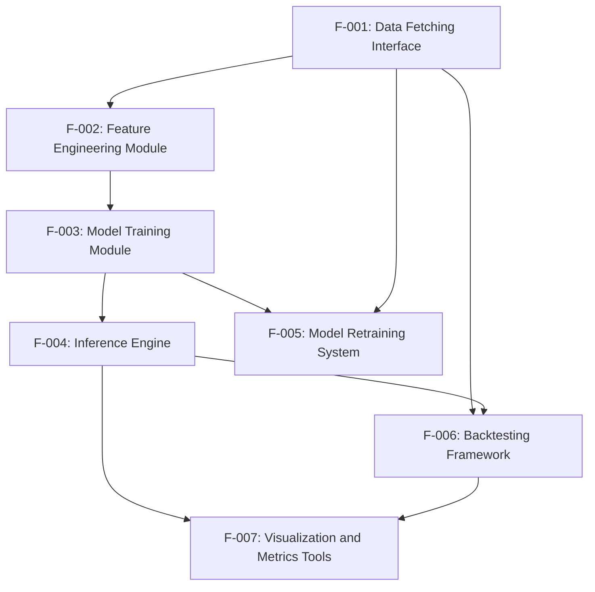
```mermaid
graph TD
    F001[F-001: Data Fetching Interface] --> F002[F-002: Feature Engineering Module]
    F002 --> F003[F-003: Model Training Module]
    F003 --> F004[F-004: Inference Engine]
    F003 --> F005[F-005: Model Retraining System]
    F001 --> F005
    F001 --> F006[F-006: Backtesting Framework]
    F004 --> F006
    F004 --> F007[F-007: Visualization and Metrics Tools]
    F006 --> F007
```

### 2.4 IMPLEMENTATION CONSIDERATIONS

| Feature | Technical Constraints | Performance Requirements | Scalability Considerations |
|---------|----------------------|--------------------------|----------------------------|
| **Data Fetching Interface** | Must handle API rate limits and connection issues | Complete data retrieval within specified timeframes | Should scale to handle increasing data volume |
| **Feature Engineering Module** | Must maintain consistent feature names and formats | Process data efficiently with minimal memory footprint | Should parallelize computation where possible |
| **Model Training Module** | Must support specified machine learning frameworks | Complete training within timeframe allowing for daily inference | Should support distributed training for larger models |
| **Inference Engine** | Must complete before day-ahead market closure | Generate forecasts within minutes | Should handle multiple concurrent forecast requests |
| **Model Retraining System** | Must maintain backward compatibility with inference engine | Complete retraining within allocated time window | Should manage increasing model complexity over time |
| **Backtesting Framework** | Must accurately simulate historical conditions | Process multi-year backtests within reasonable timeframe | Should support parallel backtesting scenarios |
| **Visualization and Metrics Tools** | Must generate consistent, interpretable outputs | Generate visualizations and metrics within seconds | Should handle increasing volumes of forecast data |

### 2.5 TRACEABILITY MATRIX

| Requirement ID | Feature ID | Business Need | Validation Method |
|----------------|------------|---------------|-------------------|
| F-001-RQ-001 | F-001 | Accurate historical data for training | Data completeness verification |
| F-001-RQ-002 | F-001 | Weather inputs for prediction | Data alignment verification |
| F-001-RQ-003 | F-001 | Grid condition inputs for prediction | Data completeness verification |
| F-002-RQ-001 | F-002 | Time-based predictive signals | Feature accuracy verification |
| F-002-RQ-002 | F-002 | Statistical predictive signals | Statistical validation |
| F-002-RQ-003 | F-002 | Weather-based predictive signals | Feature completeness verification |
| F-003-RQ-001 | F-003 | Accurate prediction models | Cross-validation performance |
| F-003-RQ-002 | F-003 | Model quality assessment | Metrics validation |
| F-003-RQ-003 | F-003 | Model persistence | Load/save verification |
| F-004-RQ-001 | F-004 | 72-hour probability forecasts | Forecast completeness verification |
| F-004-RQ-002 | F-004 | Multiple threshold support | Multi-threshold validation |

## 3. TECHNOLOGY STACK

### 3.1 PROGRAMMING LANGUAGES

| Language | Version | Purpose | Justification |
|----------|---------|---------|---------------|
| Python | 3.10+ | Primary development language | Industry standard for data science and ML applications with extensive library support for time series forecasting and energy market analysis |
| SQL | Standard | Database queries | Required for efficient data retrieval from historical ERCOT market databases |

### 3.2 FRAMEWORKS & LIBRARIES

#### 3.2.1 Core Data Science & ML Libraries

| Library | Version | Purpose | Justification |
|---------|---------|---------|---------------|
| NumPy | 1.24+ | Numerical computing | Foundation for efficient numerical operations on time series data |
| pandas | 2.0+ | Data manipulation | Essential for handling time series data with built-in resampling and rolling statistics |
| scikit-learn | 1.2+ | Machine learning | Provides consistent API for model training, cross-validation, and evaluation metrics |
| XGBoost | 1.7+ | Gradient boosting | High-performance implementation for classification tasks with probability outputs |
| LightGBM | 3.3+ | Gradient boosting | Alternative to XGBoost with faster training times for large datasets |
| pandera | 0.15+ | Data validation | Schema validation for DataFrames to ensure data quality and consistency |
| joblib | 1.2+ | Model persistence | Efficient serialization of model artifacts |

#### 3.2.2 Visualization & Reporting

| Library | Version | Purpose | Justification |
|---------|---------|---------|---------------|
| Matplotlib | 3.7+ | Basic plotting | Foundation for visualization capabilities |
| seaborn | 0.12+ | Statistical visualization | Enhanced statistical plots for model evaluation |
| plotly | 5.14+ | Interactive visualization | Interactive plots for exploring forecasts and model performance |

#### 3.2.3 Utilities & Testing

| Library | Version | Purpose | Justification |
|---------|---------|---------|---------------|
| pytest | 7.3+ | Testing framework | Industry standard for Python testing |
| typing | Standard | Type annotations | Improves code quality and IDE support |
| pydantic | 2.0+ | Data validation | Type validation for configuration and parameters |
| hydra | 1.3+ | Configuration management | Manages complex configurations for model training and inference |
| black | 23.3+ | Code formatting | Ensures consistent code style |
| isort | 5.12+ | Import sorting | Organizes imports consistently |
| mypy | 1.3+ | Static type checking | Validates type annotations |

### 3.3 DATABASES & STORAGE

| Component | Technology | Purpose | Justification |
|-----------|------------|---------|---------------|
| Feature Store | Parquet files | Storage of engineered features | Efficient columnar storage format for analytical workloads |
| Model Registry | File system | Storage of trained models | Simple solution for versioned model artifacts |
| Historical Data | CSV/Parquet files | Storage of raw ERCOT data | Efficient format for time series data with good pandas integration |

### 3.4 THIRD-PARTY SERVICES

| Service | Purpose | Integration Method | Justification |
|---------|---------|-------------------|---------------|
| ERCOT Data API | Access to market data | REST API | Primary source for RTLMP and grid condition data |
| Weather API | Weather forecast data | REST API | Source for weather features that impact energy demand and prices |

### 3.5 DEVELOPMENT & DEPLOYMENT

| Component | Technology | Purpose | Justification |
|-----------|------------|---------|---------------|
| Version Control | Git | Source code management | Industry standard for code versioning |
| Development Environment | Conda/venv | Dependency management | Isolates dependencies for reproducible environments |
| Code Quality | pre-commit | Automated code checks | Enforces code quality standards before commits |
| Documentation | Sphinx | API documentation | Generates comprehensive documentation from docstrings |
| Scheduling | cron | Scheduled execution | Simple solution for daily inference runs and bi-daily retraining |

### 3.6 ARCHITECTURE DIAGRAM

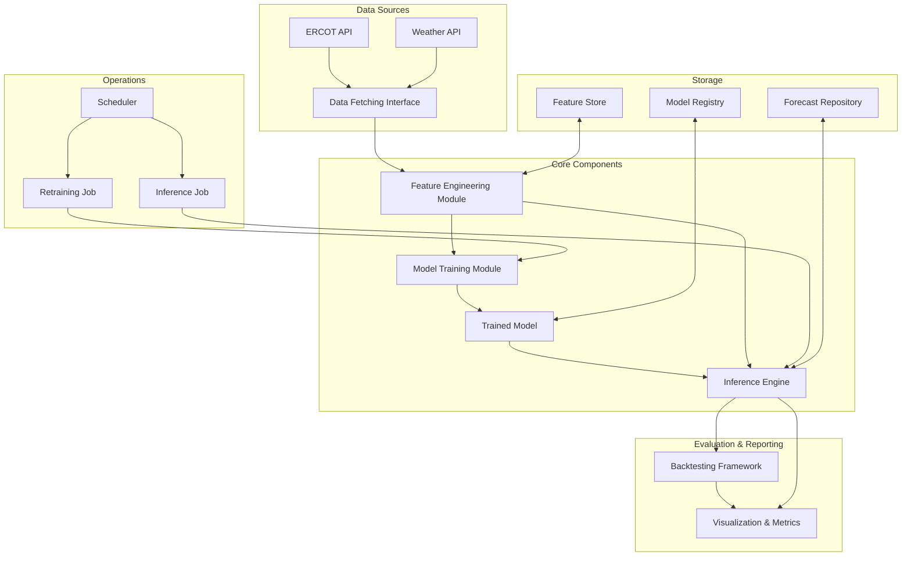
```mermaid
graph TD
    subgraph "Data Sources"
        A1[ERCOT API] --> B1[Data Fetching Interface]
        A2[Weather API] --> B1
    end
    
    subgraph "Core Components"
        B1 --> C1[Feature Engineering Module]
        C1 --> D1[Model Training Module]
        D1 --> E1[Trained Model]
        E1 --> F1[Inference Engine]
        C1 --> F1
    end
    
    subgraph "Operations"
        G1[Scheduler] --> H1[Retraining Job]
        G1 --> I1[Inference Job]
        H1 --> D1
        I1 --> F1
    end
    
    subgraph "Evaluation & Reporting"
        F1 --> J1[Backtesting Framework]
        J1 --> K1[Visualization & Metrics]
        F1 --> K1
    end
    
    subgraph "Storage"
        L1[Feature Store] <--> C1
        M1[Model Registry] <--> E1
        N1[Forecast Repository] <--> F1
    end
```

## 4. PROCESS FLOWCHART

### 4.1 SYSTEM WORKFLOWS

#### 4.1.1 Core Business Processes

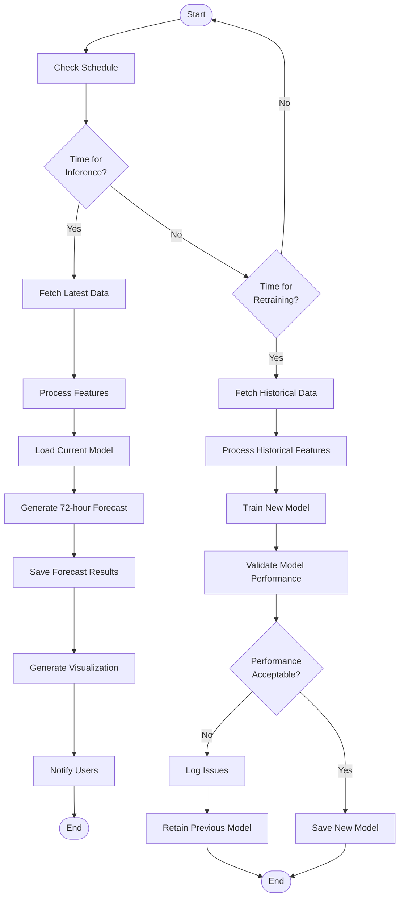
```mermaid
flowchart TD
    Start([Start]) --> A[Check Schedule]
    A --> B{Time for\nInference?}
    B -->|Yes| C[Fetch Latest Data]
    B -->|No| D{Time for\nRetraining?}
    D -->|Yes| E[Fetch Historical Data]
    D -->|No| Start
    
    C --> F[Process Features]
    F --> G[Load Current Model]
    G --> H[Generate 72-hour Forecast]
    H --> I[Save Forecast Results]
    I --> J[Generate Visualization]
    J --> K[Notify Users]
    K --> End1([End])
    
    E --> L[Process Historical Features]
    L --> M[Train New Model]
    M --> N[Validate Model Performance]
    N --> O{Performance\nAcceptable?}
    O -->|Yes| P[Save New Model]
    O -->|No| Q[Log Issues]
    Q --> R[Retain Previous Model]
    R --> End2([End])
    P --> End2
```

#### 4.1.2 Data Flow Process

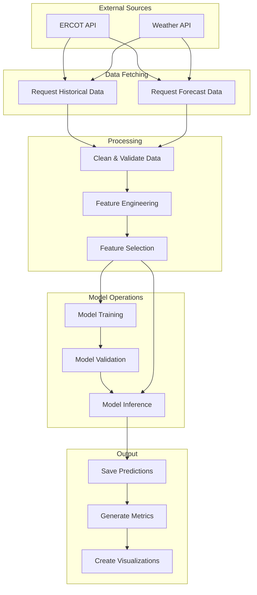
```mermaid
flowchart TD
    subgraph External Sources
        A1[ERCOT API] 
        A2[Weather API]
    end
    
    subgraph Data Fetching
        B1[Request Historical Data]
        B2[Request Forecast Data]
    end
    
    subgraph Processing
        C1[Clean & Validate Data]
        C2[Feature Engineering]
        C3[Feature Selection]
    end
    
    subgraph Model Operations
        D1[Model Training]
        D2[Model Validation]
        D3[Model Inference]
    end
    
    subgraph Output
        E1[Save Predictions]
        E2[Generate Metrics]
        E3[Create Visualizations]
    end
    
    A1 --> B1
    A1 --> B2
    A2 --> B1
    A2 --> B2
    
    B1 --> C1
    B2 --> C1
    C1 --> C2
    C2 --> C3
    
    C3 --> D1
    D1 --> D2
    D2 --> D3
    C3 --> D3
    
    D3 --> E1
    E1 --> E2
    E2 --> E3
```

### 4.2 FLOWCHART REQUIREMENTS

#### 4.2.1 Inference Workflow

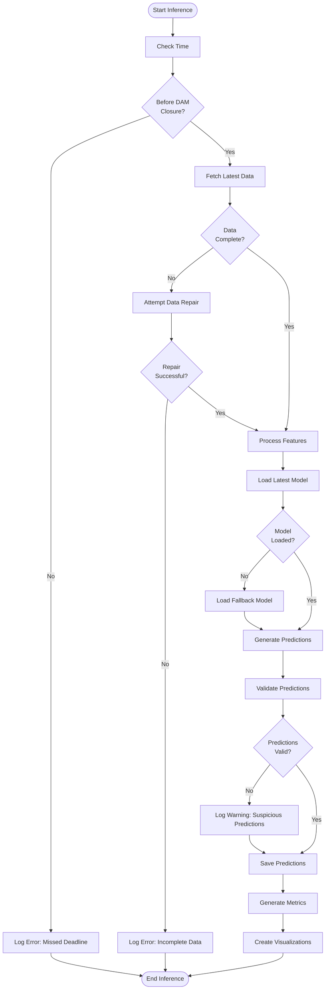
```mermaid
flowchart TD
    Start([Start Inference]) --> A[Check Time]
    A --> B{Before DAM\nClosure?}
    B -->|No| C[Log Error: Missed Deadline]
    B -->|Yes| D[Fetch Latest Data]
    
    D --> E{Data\nComplete?}
    E -->|No| F[Attempt Data Repair]
    F --> G{Repair\nSuccessful?}
    G -->|No| H[Log Error: Incomplete Data]
    G -->|Yes| I[Process Features]
    E -->|Yes| I
    
    I --> J[Load Latest Model]
    J --> K{Model\nLoaded?}
    K -->|No| L[Load Fallback Model]
    K -->|Yes| M[Generate Predictions]
    L --> M
    
    M --> N[Validate Predictions]
    N --> O{Predictions\nValid?}
    O -->|No| P[Log Warning: Suspicious Predictions]
    O -->|Yes| Q[Save Predictions]
    P --> Q
    
    Q --> R[Generate Metrics]
    R --> S[Create Visualizations]
    S --> End([End Inference])
    
    C --> End
    H --> End
```

#### 4.2.2 Model Training Workflow

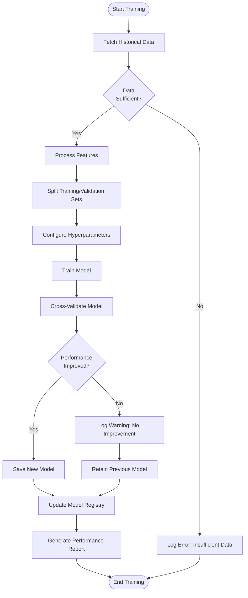
```mermaid
flowchart TD
    Start([Start Training]) --> A[Fetch Historical Data]
    A --> B{Data\nSufficient?}
    B -->|No| C[Log Error: Insufficient Data]
    B -->|Yes| D[Process Features]
    
    D --> E[Split Training/Validation Sets]
    E --> F[Configure Hyperparameters]
    F --> G[Train Model]
    G --> H[Cross-Validate Model]
    
    H --> I{Performance\nImproved?}
    I -->|No| J[Log Warning: No Improvement]
    I -->|Yes| K[Save New Model]
    J --> L[Retain Previous Model]
    
    K --> M[Update Model Registry]
    L --> M
    M --> N[Generate Performance Report]
    N --> End([End Training])
    
    C --> End
```

### 4.3 TECHNICAL IMPLEMENTATION

#### 4.3.1 Error Handling Process

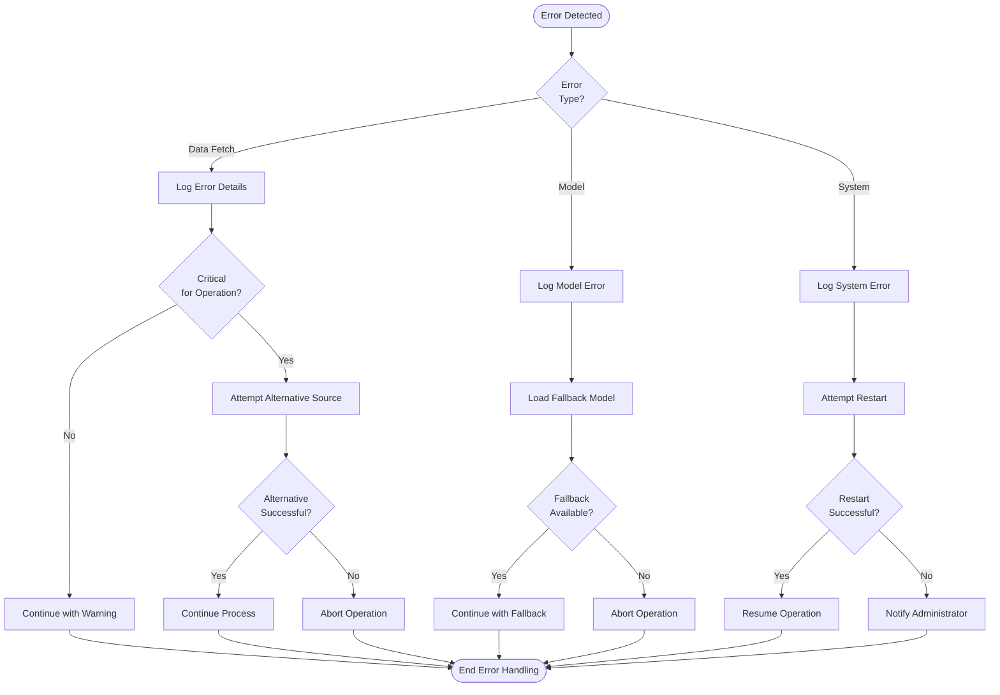
```mermaid
flowchart TD
    Start([Error Detected]) --> A{Error\nType?}
    
    A -->|Data Fetch| B[Log Error Details]
    B --> C{Critical\nfor Operation?}
    C -->|Yes| D[Attempt Alternative Source]
    C -->|No| E[Continue with Warning]
    
    D --> F{Alternative\nSuccessful?}
    F -->|Yes| G[Continue Process]
    F -->|No| H[Abort Operation]
    
    A -->|Model| I[Log Model Error]
    I --> J[Load Fallback Model]
    J --> K{Fallback\nAvailable?}
    K -->|Yes| L[Continue with Fallback]
    K -->|No| M[Abort Operation]
    
    A -->|System| N[Log System Error]
    N --> O[Attempt Restart]
    O --> P{Restart\nSuccessful?}
    P -->|Yes| Q[Resume Operation]
    P -->|No| R[Notify Administrator]
    
    E --> End([End Error Handling])
    G --> End
    H --> End
    L --> End
    M --> End
    Q --> End
    R --> End
```

#### 4.3.2 State Transition Diagram

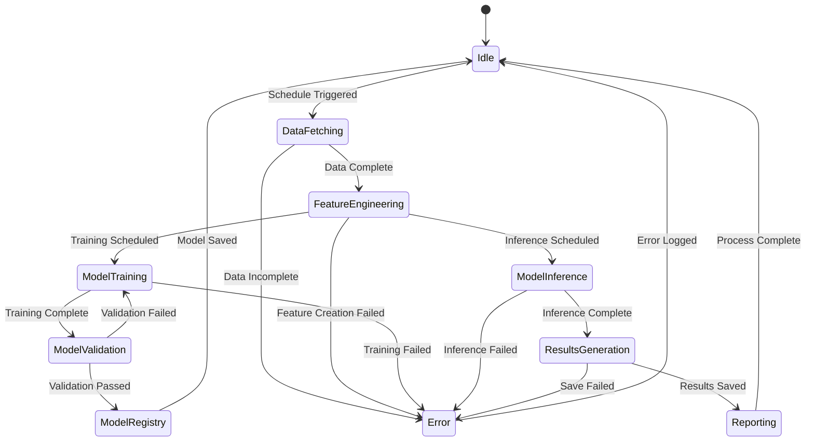
```mermaid
stateDiagram-v2
    [*] --> Idle
    
    Idle --> DataFetching: Schedule Triggered
    DataFetching --> FeatureEngineering: Data Complete
    DataFetching --> Error: Data Incomplete
    
    FeatureEngineering --> ModelTraining: Training Scheduled
    FeatureEngineering --> ModelInference: Inference Scheduled
    FeatureEngineering --> Error: Feature Creation Failed
    
    ModelTraining --> ModelValidation: Training Complete
    ModelTraining --> Error: Training Failed
    
    ModelValidation --> ModelRegistry: Validation Passed
    ModelValidation --> ModelTraining: Validation Failed
    
    ModelInference --> ResultsGeneration: Inference Complete
    ModelInference --> Error: Inference Failed
    
    ResultsGeneration --> Reporting: Results Saved
    ResultsGeneration --> Error: Save Failed
    
    Reporting --> Idle: Process Complete
    
    Error --> Idle: Error Logged
    
    ModelRegistry --> Idle: Model Saved
```

### 4.4 INTEGRATION WORKFLOWS

#### 4.4.1 Data Integration Sequence

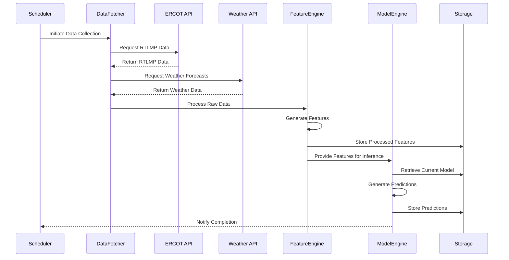
```mermaid
sequenceDiagram
    participant Scheduler
    participant DataFetcher
    participant ERCOT API
    participant Weather API
    participant FeatureEngine
    participant ModelEngine
    participant Storage
    
    Scheduler->>DataFetcher: Initiate Data Collection
    DataFetcher->>ERCOT API: Request RTLMP Data
    ERCOT API-->>DataFetcher: Return RTLMP Data
    DataFetcher->>Weather API: Request Weather Forecasts
    Weather API-->>DataFetcher: Return Weather Data
    DataFetcher->>FeatureEngine: Process Raw Data
    FeatureEngine->>FeatureEngine: Generate Features
    FeatureEngine->>Storage: Store Processed Features
    FeatureEngine->>ModelEngine: Provide Features for Inference
    ModelEngine->>Storage: Retrieve Current Model
    ModelEngine->>ModelEngine: Generate Predictions
    ModelEngine->>Storage: Store Predictions
    ModelEngine-->>Scheduler: Notify Completion
```

#### 4.4.2 Batch Processing Workflow

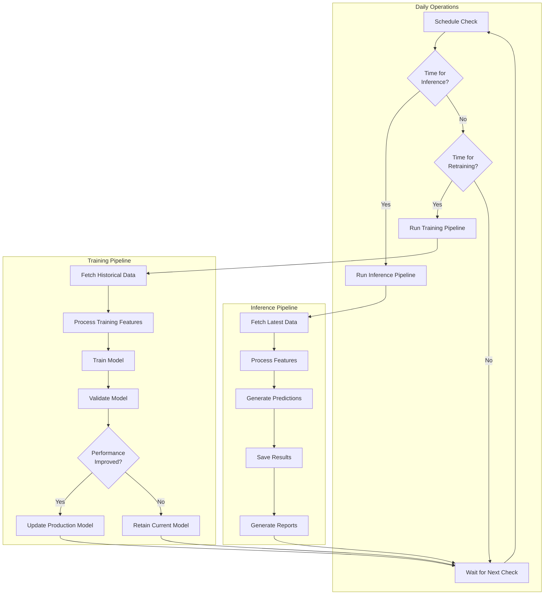
```mermaid
flowchart TD
    subgraph Daily Operations
        A[Schedule Check] --> B{Time for\nInference?}
        B -->|Yes| C[Run Inference Pipeline]
        B -->|No| D{Time for\nRetraining?}
        D -->|Yes| E[Run Training Pipeline]
        D -->|No| F[Wait for Next Check]
    end
    
    subgraph Inference Pipeline
        C --> G[Fetch Latest Data]
        G --> H[Process Features]
        H --> I[Generate Predictions]
        I --> J[Save Results]
        J --> K[Generate Reports]
    end
    
    subgraph Training Pipeline
        E --> L[Fetch Historical Data]
        L --> M[Process Training Features]
        M --> N[Train Model]
        N --> O[Validate Model]
        O --> P{Performance\nImproved?}
        P -->|Yes| Q[Update Production Model]
        P -->|No| R[Retain Current Model]
    end
    
    F --> A
    K --> F
    Q --> F
    R --> F
```

### 4.5 VALIDATION RULES

#### 4.5.1 Data Validation Process

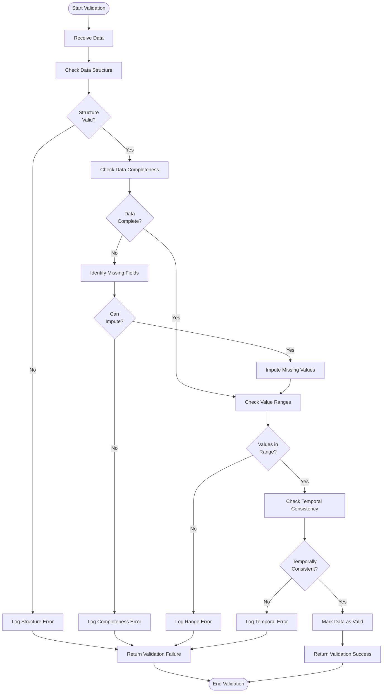
```mermaid
flowchart TD
    Start([Start Validation]) --> A[Receive Data]
    
    A --> B[Check Data Structure]
    B --> C{Structure\nValid?}
    C -->|No| D[Log Structure Error]
    C -->|Yes| E[Check Data Completeness]
    
    E --> F{Data\nComplete?}
    F -->|No| G[Identify Missing Fields]
    G --> H{Can\nImpute?}
    H -->|Yes| I[Impute Missing Values]
    H -->|No| J[Log Completeness Error]
    F -->|Yes| K[Check Value Ranges]
    I --> K
    
    K --> L{Values in\nRange?}
    L -->|No| M[Log Range Error]
    L -->|Yes| N[Check Temporal Consistency]
    
    N --> O{Temporally\nConsistent?}
    O -->|No| P[Log Temporal Error]
    O -->|Yes| Q[Mark Data as Valid]
    
    D --> R[Return Validation Failure]
    J --> R
    M --> R
    P --> R
    Q --> S[Return Validation Success]
    
    R --> End([End Validation])
    S --> End
```

#### 4.5.2 Model Validation Process

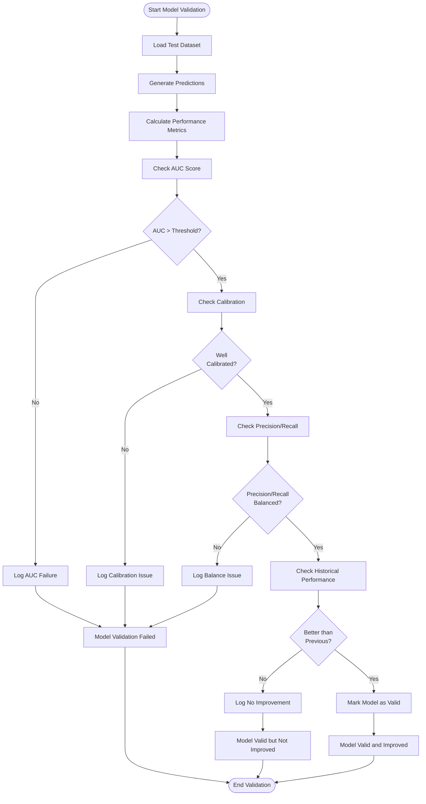
```mermaid
flowchart TD
    Start([Start Model Validation]) --> A[Load Test Dataset]
    
    A --> B[Generate Predictions]
    B --> C[Calculate Performance Metrics]
    
    C --> D[Check AUC Score]
    D --> E{AUC > Threshold?}
    E -->|No| F[Log AUC Failure]
    E -->|Yes| G[Check Calibration]
    
    G --> H{Well\nCalibrated?}
    H -->|No| I[Log Calibration Issue]
    H -->|Yes| J[Check Precision/Recall]
    
    J --> K{Precision/Recall\nBalanced?}
    K -->|No| L[Log Balance Issue]
    K -->|Yes| M[Check Historical Performance]
    
    M --> N{Better than\nPrevious?}
    N -->|No| O[Log No Improvement]
    N -->|Yes| P[Mark Model as Valid]
    
    F --> Q[Model Validation Failed]
    I --> Q
    L --> Q
    O --> R[Model Valid but Not Improved]
    P --> S[Model Valid and Improved]
    
    Q --> End([End Validation])
    R --> End
    S --> End
```

## 5. SYSTEM ARCHITECTURE

### 5.1 HIGH-LEVEL ARCHITECTURE

#### 5.1.1 System Overview

The ERCOT RTLMP spike prediction system follows a modular, pipeline-oriented architecture designed to support reliable daily forecasting operations. The architecture employs a functional programming approach with clearly defined interfaces between components to ensure maintainability and testability.

Key architectural principles:
- Separation of concerns between data acquisition, feature engineering, model training, and inference
- Functional programming paradigm with stateless components where possible
- Clear type definitions and validation at component boundaries
- Idempotent operations to support reliable retraining and inference

System boundaries include:
- External data sources (ERCOT API, weather data providers)
- Feature storage for historical and engineered features
- Model registry for versioned model artifacts
- Forecast repository for prediction outputs

#### 5.1.2 Core Components Table

| Component Name | Primary Responsibility | Key Dependencies | Critical Considerations |
|----------------|------------------------|------------------|-------------------------|
| Data Fetcher | Retrieve and standardize raw data from external sources | ERCOT API, Weather API | Handle API rate limits, connection failures, and data format changes |
| Feature Engineer | Transform raw data into model-ready features | Data Fetcher | Ensure consistent feature generation across training and inference |
| Model Trainer | Train and validate prediction models | Feature Engineer, Model Registry | Balance model complexity with inference speed requirements |
| Inference Engine | Generate probability forecasts using trained models | Feature Engineer, Model Registry | Must complete before day-ahead market closure |
| Backtesting Framework | Simulate historical forecasts for model evaluation | Data Fetcher, Feature Engineer, Inference Engine | Accurately reproduce historical conditions |
| Visualization & Metrics | Generate performance reports and visualizations | Inference Engine, Backtesting Framework | Provide actionable insights on model performance |

#### 5.1.3 Data Flow Description

The system's primary data flow begins with the Data Fetcher retrieving raw ERCOT market data and weather forecasts. This data is passed to the Feature Engineer, which transforms it into standardized feature sets stored in the Feature Store. During training, the Model Trainer retrieves historical features and targets from the Feature Store, trains models using cross-validation, and stores validated models in the Model Registry.

For daily inference, the system fetches the latest data, generates current features, loads the most recent validated model from the registry, and produces 72-hour probability forecasts. These forecasts are stored in the Forecast Repository and made available to downstream systems for battery storage optimization.

The Backtesting Framework can replay this process over historical periods to evaluate model performance under different market conditions. Results from both live inference and backtesting are processed by the Visualization & Metrics component to generate performance reports.

#### 5.1.4 External Integration Points

| System Name | Integration Type | Data Exchange Pattern | Protocol/Format | SLA Requirements |
|-------------|------------------|------------------------|-----------------|------------------|
| ERCOT API | Data Source | Pull-based, scheduled | REST/JSON | Complete data retrieval within 10 minutes |
| Weather API | Data Source | Pull-based, scheduled | REST/JSON | Complete data retrieval within 5 minutes |
| Battery Optimization System | Data Consumer | Push-based, event-driven | CSV/Parquet files | Forecasts available 1 hour before DAM closure |

### 5.2 COMPONENT DETAILS

#### 5.2.1 Data Fetcher

- **Purpose**: Retrieve, validate, and standardize data from external sources
- **Technologies**: Python requests, pandas, pandera for validation
- **Key Interfaces**: 
  - `fetch_historical_data(start_date, end_date, nodes)` → DataFrame
  - `fetch_forecast_data(forecast_date, horizon, nodes)` → DataFrame
- **Data Persistence**: Temporary caching of raw data to minimize API calls
- **Scaling Considerations**: Parallel requests for multiple data sources

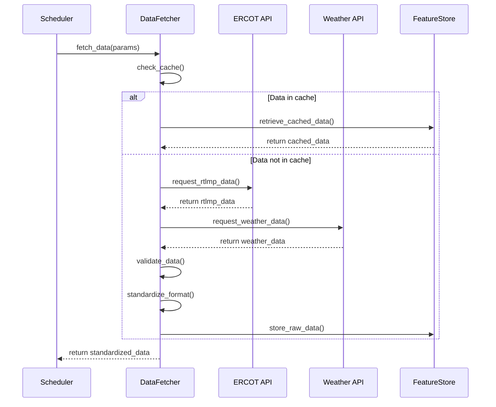
```mermaid
sequenceDiagram
    participant Scheduler
    participant DataFetcher
    participant ERCOT API
    participant Weather API
    participant FeatureStore
    
    Scheduler->>DataFetcher: fetch_data(params)
    DataFetcher->>DataFetcher: check_cache()
    alt Data in cache
        DataFetcher->>FeatureStore: retrieve_cached_data()
        FeatureStore-->>DataFetcher: return cached_data
    else Data not in cache
        DataFetcher->>ERCOT API: request_rtlmp_data()
        ERCOT API-->>DataFetcher: return rtlmp_data
        DataFetcher->>Weather API: request_weather_data()
        Weather API-->>DataFetcher: return weather_data
        DataFetcher->>DataFetcher: validate_data()
        DataFetcher->>DataFetcher: standardize_format()
        DataFetcher->>FeatureStore: store_raw_data()
    end
    DataFetcher-->>Scheduler: return standardized_data
```

#### 5.2.2 Feature Engineer

- **Purpose**: Transform raw data into model-ready features
- **Technologies**: pandas, numpy, scikit-learn for preprocessing
- **Key Interfaces**:
  - `engineer_features(raw_data)` → DataFrame
  - `get_feature_names()` → List[str]
- **Data Persistence**: Stores engineered features in Feature Store
- **Scaling Considerations**: Batch processing for large historical datasets

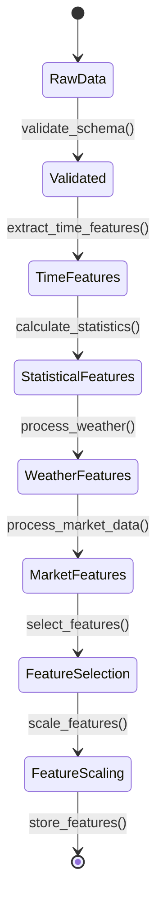
```mermaid
stateDiagram-v2
    [*] --> RawData
    RawData --> Validated: validate_schema()
    Validated --> TimeFeatures: extract_time_features()
    TimeFeatures --> StatisticalFeatures: calculate_statistics()
    StatisticalFeatures --> WeatherFeatures: process_weather()
    WeatherFeatures --> MarketFeatures: process_market_data()
    MarketFeatures --> FeatureSelection: select_features()
    FeatureSelection --> FeatureScaling: scale_features()
    FeatureScaling --> [*]: store_features()
```

#### 5.2.3 Model Trainer

- **Purpose**: Train, validate, and register prediction models
- **Technologies**: scikit-learn, XGBoost, LightGBM
- **Key Interfaces**:
  - `train_model(features, targets, params)` → Model
  - `validate_model(model, test_features, test_targets)` → Metrics
- **Data Persistence**: Stores trained models in Model Registry
- **Scaling Considerations**: Parallel cross-validation for faster training

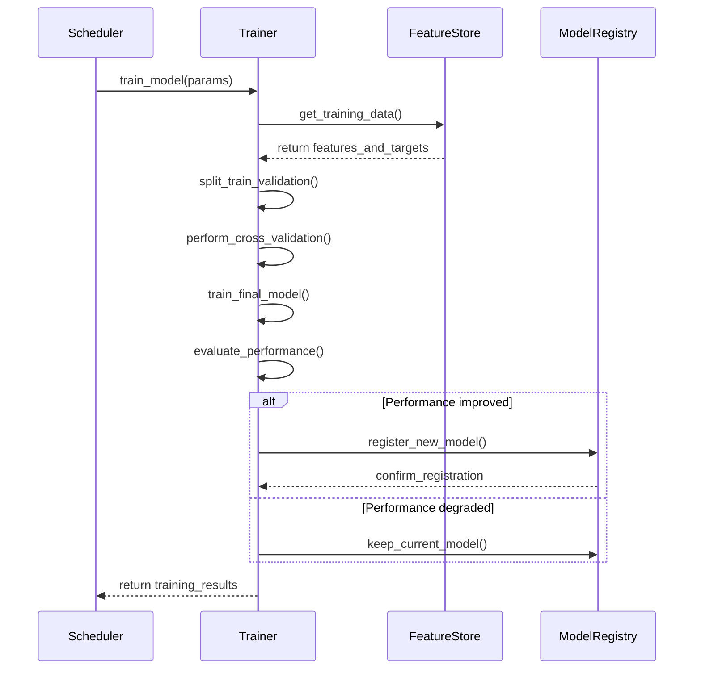
```mermaid
sequenceDiagram
    participant Scheduler
    participant Trainer
    participant FeatureStore
    participant ModelRegistry
    
    Scheduler->>Trainer: train_model(params)
    Trainer->>FeatureStore: get_training_data()
    FeatureStore-->>Trainer: return features_and_targets
    Trainer->>Trainer: split_train_validation()
    Trainer->>Trainer: perform_cross_validation()
    Trainer->>Trainer: train_final_model()
    Trainer->>Trainer: evaluate_performance()
    alt Performance improved
        Trainer->>ModelRegistry: register_new_model()
        ModelRegistry-->>Trainer: confirm_registration
    else Performance degraded
        Trainer->>ModelRegistry: keep_current_model()
    end
    Trainer-->>Scheduler: return training_results
```

#### 5.2.4 Inference Engine

- **Purpose**: Generate probability forecasts using trained models
- **Technologies**: pandas, numpy, joblib for model loading
- **Key Interfaces**:
  - `generate_forecast(features, model, thresholds)` → DataFrame
- **Data Persistence**: Stores forecasts in Forecast Repository
- **Scaling Considerations**: Parallel prediction for multiple thresholds

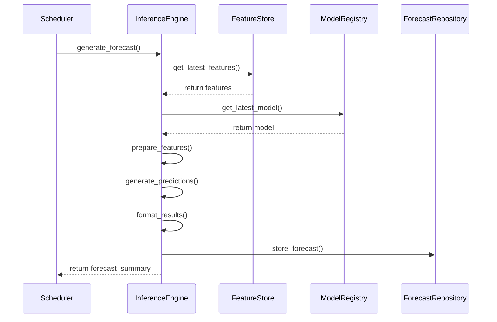
```mermaid
sequenceDiagram
    participant Scheduler
    participant InferenceEngine
    participant FeatureStore
    participant ModelRegistry
    participant ForecastRepository
    
    Scheduler->>InferenceEngine: generate_forecast()
    InferenceEngine->>FeatureStore: get_latest_features()
    FeatureStore-->>InferenceEngine: return features
    InferenceEngine->>ModelRegistry: get_latest_model()
    ModelRegistry-->>InferenceEngine: return model
    InferenceEngine->>InferenceEngine: prepare_features()
    InferenceEngine->>InferenceEngine: generate_predictions()
    InferenceEngine->>InferenceEngine: format_results()
    InferenceEngine->>ForecastRepository: store_forecast()
    InferenceEngine-->>Scheduler: return forecast_summary
```

### 5.3 TECHNICAL DECISIONS

#### 5.3.1 Architecture Style Decisions

| Decision | Options Considered | Selection | Rationale |
|----------|-------------------|-----------|-----------|
| Programming Paradigm | OOP, Functional, Hybrid | Functional with minimal classes | Simplifies testing, reduces state management complexity, and aligns with data pipeline nature |
| Component Coupling | Tight, Loose | Loose coupling with defined interfaces | Enables independent testing and evolution of components |
| Execution Model | Real-time, Batch | Scheduled batch processing | Aligns with daily forecasting requirements and reduces system complexity |
| Data Flow Pattern | Push, Pull | Pull-based with clear boundaries | Simplifies error handling and component responsibilities |

#### 5.3.2 Data Storage Solution Rationale

The system uses a combination of storage approaches optimized for different data types:

- **Raw Data**: Temporary caching in memory or local files to minimize redundant API calls
- **Engineered Features**: Parquet files organized by date for efficient columnar access
- **Model Artifacts**: Versioned storage using joblib serialization with metadata
- **Forecasts**: Structured storage in Parquet files with timestamp indexing

This approach balances simplicity with performance, avoiding the complexity of a full database system while maintaining data integrity and access efficiency.

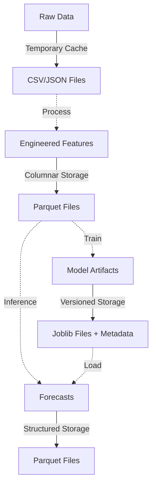
```mermaid
graph TD
    A[Raw Data] -->|Temporary Cache| B[CSV/JSON Files]
    C[Engineered Features] -->|Columnar Storage| D[Parquet Files]
    E[Model Artifacts] -->|Versioned Storage| F[Joblib Files + Metadata]
    G[Forecasts] -->|Structured Storage| H[Parquet Files]
    
    B -.->|Process| C
    D -.->|Train| E
    D -.->|Inference| G
    F -.->|Load| G
```

### 5.4 CROSS-CUTTING CONCERNS

#### 5.4.1 Error Handling Patterns

The system implements a comprehensive error handling strategy with three primary patterns:

1. **Fail-fast validation**: Input data is validated early with schema enforcement
2. **Graceful degradation**: For non-critical failures, the system continues with reduced functionality
3. **Retry with backoff**: For transient external service failures

Critical errors that prevent forecast generation trigger alerts and fallback to the most recent valid forecast when possible.

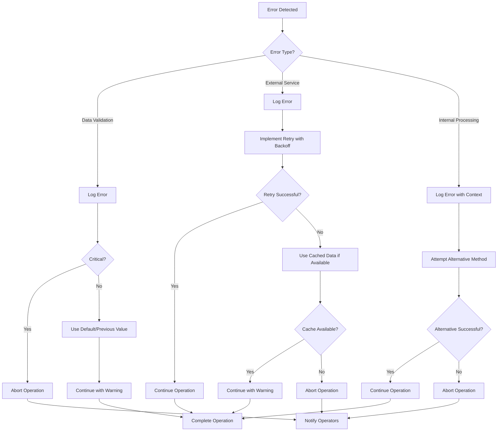
```mermaid
flowchart TD
    A[Error Detected] --> B{Error Type?}
    
    B -->|Data Validation| C[Log Error]
    C --> D{Critical?}
    D -->|Yes| E[Abort Operation]
    D -->|No| F[Use Default/Previous Value]
    F --> G[Continue with Warning]
    
    B -->|External Service| H[Log Error]
    H --> I[Implement Retry with Backoff]
    I --> J{Retry Successful?}
    J -->|Yes| K[Continue Operation]
    J -->|No| L[Use Cached Data if Available]
    L --> M{Cache Available?}
    M -->|Yes| N[Continue with Warning]
    M -->|No| O[Abort Operation]
    
    B -->|Internal Processing| P[Log Error with Context]
    P --> Q[Attempt Alternative Method]
    Q --> R{Alternative Successful?}
    R -->|Yes| S[Continue Operation]
    R -->|No| T[Abort Operation]
    
    E --> U[Notify Operators]
    O --> U
    T --> U
    G --> V[Complete Operation]
    K --> V
    N --> V
    S --> V
```

#### 5.4.2 Logging and Monitoring Strategy

The system implements structured logging with consistent severity levels:

- **DEBUG**: Detailed information for troubleshooting
- **INFO**: Normal operation events and milestones
- **WARNING**: Potential issues that don't prevent operation
- **ERROR**: Failures that impact forecast quality
- **CRITICAL**: Failures that prevent forecast generation

Key metrics monitored include:
- Data completeness percentages
- Feature engineering success rates
- Model performance metrics (AUC, calibration)
- Inference execution time
- Forecast availability before DAM closure

#### 5.4.3 Performance Requirements

| Component | Performance Requirement | Measurement Method |
|-----------|-------------------------|-------------------|
| Data Fetcher | Complete data retrieval within 10 minutes | Execution time logging |
| Feature Engineer | Process 1 year of historical data within 15 minutes | Execution time logging |
| Model Trainer | Complete training cycle within 2 hours | Execution time logging |
| Inference Engine | Generate 72-hour forecast within 5 minutes | Execution time logging |
| End-to-End Pipeline | Complete daily forecast before DAM closure | Success rate monitoring |

## 6. SYSTEM COMPONENTS DESIGN

### 6.1 DATA FETCHING INTERFACE

#### 6.1.1 Component Overview

The Data Fetching Interface provides a standardized way to retrieve ERCOT market data and weather forecasts. It abstracts the complexities of different data sources and ensures consistent data formatting for downstream components.

| Aspect | Description |
|--------|-------------|
| Primary Responsibility | Retrieve and standardize data from ERCOT API and weather services |
| Input | Date ranges, node locations, data types |
| Output | Standardized DataFrames with consistent schema |
| Key Dependencies | External APIs, network connectivity |

#### 6.1.2 Interface Definition

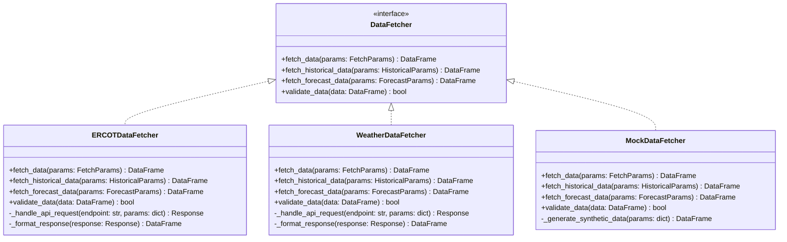
```mermaid
classDiagram
    class DataFetcher {
        <<interface>>
        +fetch_data(params: FetchParams) DataFrame
        +fetch_historical_data(params: HistoricalParams) DataFrame
        +fetch_forecast_data(params: ForecastParams) DataFrame
        +validate_data(data: DataFrame) bool
    }
    
    class ERCOTDataFetcher {
        +fetch_data(params: FetchParams) DataFrame
        +fetch_historical_data(params: HistoricalParams) DataFrame
        +fetch_forecast_data(params: ForecastParams) DataFrame
        +validate_data(data: DataFrame) bool
        -_handle_api_request(endpoint: str, params: dict) Response
        -_format_response(response: Response) DataFrame
    }
    
    class WeatherDataFetcher {
        +fetch_data(params: FetchParams) DataFrame
        +fetch_historical_data(params: HistoricalParams) DataFrame
        +fetch_forecast_data(params: ForecastParams) DataFrame
        +validate_data(data: DataFrame) bool
        -_handle_api_request(endpoint: str, params: dict) Response
        -_format_response(response: Response) DataFrame
    }
    
    class MockDataFetcher {
        +fetch_data(params: FetchParams) DataFrame
        +fetch_historical_data(params: HistoricalParams) DataFrame
        +fetch_forecast_data(params: ForecastParams) DataFrame
        +validate_data(data: DataFrame) bool
        -_generate_synthetic_data(params: dict) DataFrame
    }
    
    DataFetcher <|.. ERCOTDataFetcher
    DataFetcher <|.. WeatherDataFetcher
    DataFetcher <|.. MockDataFetcher
```

#### 6.1.3 Data Schemas

| Schema Name | Description | Key Fields |
|-------------|-------------|------------|
| RTLMPSchema | Schema for RTLMP data | timestamp, node_id, price, congestion_price, loss_price, energy_price |
| WeatherSchema | Schema for weather data | timestamp, location_id, temperature, wind_speed, solar_irradiance, humidity |
| GridConditionSchema | Schema for grid condition data | timestamp, total_load, available_capacity, wind_generation, solar_generation |

#### 6.1.4 Error Handling Strategy

| Error Type | Handling Approach | Recovery Strategy |
|------------|-------------------|-------------------|
| Connection Failure | Retry with exponential backoff | After max retries, use cached data if available |
| API Rate Limiting | Implement request throttling | Pause and resume with delayed execution |
| Data Format Changes | Schema validation with fallback parsing | Log warning and attempt best-effort conversion |
| Missing Data | Identify gaps and log | Implement configurable imputation strategies |

### 6.2 FEATURE ENGINEERING MODULE

#### 6.2.1 Component Overview

The Feature Engineering Module transforms raw data into model-ready features using a pipeline of transformations. It ensures consistent feature generation between training and inference.

| Aspect | Description |
|--------|-------------|
| Primary Responsibility | Transform raw data into model-ready features |
| Input | Raw DataFrames from Data Fetching Interface |
| Output | Feature DataFrames with engineered predictors |
| Key Dependencies | Data Fetching Interface, feature definitions |

#### 6.2.2 Feature Categories

| Category | Description | Example Features |
|----------|-------------|------------------|
| Temporal | Time-based features | hour_of_day, day_of_week, is_weekend, month, season |
| Statistical | Statistical aggregations | rolling_mean_24h, rolling_max_7d, price_volatility |
| Weather | Weather-derived features | temperature_forecast, wind_forecast, solar_forecast |
| Market | Market condition indicators | load_forecast, generation_mix, reserve_margin |
| Target | Engineered target variables | spike_occurred, max_price, price_delta |

#### 6.2.3 Feature Pipeline

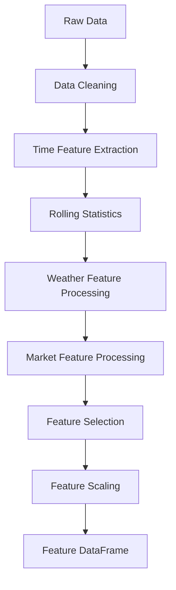
```mermaid
graph TD
    A[Raw Data] --> B[Data Cleaning]
    B --> C[Time Feature Extraction]
    C --> D[Rolling Statistics]
    D --> E[Weather Feature Processing]
    E --> F[Market Feature Processing]
    F --> G[Feature Selection]
    G --> H[Feature Scaling]
    H --> I[Feature DataFrame]
```

#### 6.2.4 Feature Registry

The Feature Registry maintains metadata about all features, including:
- Feature name and description
- Data type and valid range
- Transformation logic
- Dependencies on other features
- Feature importance history

This registry ensures consistent feature definitions across training and inference while facilitating feature documentation and governance.

### 6.3 MODEL TRAINING MODULE

#### 6.3.1 Component Overview

The Model Training Module handles the training, validation, and persistence of prediction models. It implements cross-validation strategies and hyperparameter optimization.

| Aspect | Description |
|--------|-------------|
| Primary Responsibility | Train and validate prediction models |
| Input | Feature DataFrames, configuration parameters |
| Output | Trained model artifacts, performance metrics |
| Key Dependencies | Feature Engineering Module, Model Registry |

#### 6.3.2 Training Pipeline

```mermaid
graph TD
    A[Feature Data] --> B[Train/Test Split]
    B --> C[Cross-Validation Setup]
    C --> D[Hyperparameter Selection]
    D --> E[Model Training]
    E --> F[Model Validation]
    F --> G{Performance Check}
    G -->|Acceptable| H[Model Persistence]
    G -->|Unacceptable| I[Retain Previous Model]
    H --> J[Update Model Registry]
    I --> J
```

#### 6.3.3 Model Types

| Model Type | Use Case | Advantages | Disadvantages |
|------------|----------|------------|---------------|
| Gradient Boosting (XGBoost/LightGBM) | Primary model | High accuracy, handles non-linear relationships | Requires careful tuning |
| Random Forest | Alternative model | Robust to outliers, less prone to overfitting | Can be slower for large datasets |
| Logistic Regression | Baseline model | Interpretable, fast training | Limited capacity for complex patterns |
| Ensemble | Meta-model | Combines strengths of multiple models | Increased complexity, slower inference |

#### 6.3.4 Cross-Validation Strategy

The module implements a time-based cross-validation strategy to account for the temporal nature of the data:

```mermaid
graph TD
    subgraph "Time-Series Cross-Validation"
        A[Full Dataset] --> B[Fold 1: Train Jan-Mar, Test Apr]
        A --> C[Fold 2: Train Feb-Apr, Test May]
        A --> D[Fold 3: Train Mar-May, Test Jun]
        A --> E[Fold N: Train...]
    end
    
    B --> F[Model Evaluation]
    C --> F
    D --> F
    E --> F
    F --> G[Aggregate Performance Metrics]
```

### 6.4 INFERENCE ENGINE

#### 6.4.1 Component Overview

The Inference Engine generates probability forecasts using trained models. It handles the end-to-end process from feature preparation to forecast generation.

| Aspect | Description |
|--------|-------------|
| Primary Responsibility | Generate probability forecasts for RTLMP spikes |
| Input | Current features, trained model, threshold values |
| Output | 72-hour probability forecasts |
| Key Dependencies | Feature Engineering Module, Model Registry |

#### 6.4.2 Inference Pipeline

```mermaid
graph TD
    A[Latest Data] --> B[Feature Engineering]
    B --> C[Feature Validation]
    C --> D[Load Model]
    D --> E[Generate Raw Predictions]
    E --> F[Calibrate Probabilities]
    F --> G[Format Forecast]
    G --> H[Store Results]
    H --> I[Generate Metrics]
```

#### 6.4.3 Forecast Output Format

| Field | Description | Data Type |
|-------|-------------|-----------|
| forecast_timestamp | When the forecast was generated | datetime |
| target_timestamp | Hour being forecasted | datetime |
| threshold_value | Price threshold for spike definition | float |
| spike_probability | Probability of price exceeding threshold | float (0-1) |
| confidence_interval_lower | Lower bound of confidence interval | float (0-1) |
| confidence_interval_upper | Upper bound of confidence interval | float (0-1) |
| model_version | Version of model used for prediction | string |

### 6.5 BACKTESTING FRAMEWORK

#### 6.5.1 Component Overview

The Backtesting Framework simulates historical forecasts to evaluate model performance under different market conditions. It replicates the production inference process over historical periods.

| Aspect | Description |
|--------|-------------|
| Primary Responsibility | Simulate historical forecasts for model evaluation |
| Input | Historical data, model configurations, time windows |
| Output | Performance metrics, visualizations |
| Key Dependencies | Feature Engineering Module, Inference Engine |

#### 6.5.2 Backtesting Process

```mermaid
graph TD
    A[Define Test Period] --> B[Retrieve Historical Data]
    B --> C[Create Time Windows]
    C --> D[For Each Window]
    D --> E[Train Model with Available Data]
    E --> F[Generate Forecast]
    F --> G[Compare with Actuals]
    G --> H[Calculate Metrics]
    H --> I[Aggregate Results]
    I --> J[Generate Visualizations]
```

#### 6.5.3 Performance Metrics

| Metric | Description | Calculation |
|--------|-------------|-------------|
| AUC-ROC | Area Under ROC Curve | Plot TPR vs FPR at various thresholds |
| Brier Score | Calibration of probability forecasts | Mean squared difference between predicted probabilities and outcomes |
| Precision | Ratio of true positives to predicted positives | TP / (TP + FP) |
| Recall | Ratio of true positives to actual positives | TP / (TP + FN) |
| F1 Score | Harmonic mean of precision and recall | 2 * (Precision * Recall) / (Precision + Recall) |
| Calibration Curve | Reliability diagram | Plot predicted probability vs observed frequency |

### 6.6 VISUALIZATION AND METRICS TOOLS

#### 6.6.1 Component Overview

The Visualization and Metrics Tools generate performance reports and visualizations to evaluate model quality and forecast accuracy. They support both interactive exploration and automated reporting.

| Aspect | Description |
|--------|-------------|
| Primary Responsibility | Generate performance visualizations and metrics |
| Input | Forecast results, actual outcomes, model metadata |
| Output | Visualizations, metric reports |
| Key Dependencies | Inference Engine, Backtesting Framework |

#### 6.6.2 Visualization Types

| Visualization | Purpose | Key Elements |
|---------------|---------|-------------|
| Probability Timeline | Show forecast probabilities over time | Line chart with confidence intervals |
| Calibration Curve | Assess probability calibration | Reliability diagram comparing predicted vs observed frequencies |
| ROC Curve | Evaluate classification performance | Plot of true positive rate vs false positive rate |
| Precision-Recall Curve | Assess model performance at different thresholds | Plot of precision vs recall |
| Feature Importance | Understand model drivers | Bar chart of feature importance values |
| Confusion Matrix | Visualize classification results | Heatmap of prediction outcomes |

#### 6.6.3 Metrics Dashboard

```mermaid
graph TD
    subgraph "Performance Dashboard"
        A[Model Performance] --> B[Classification Metrics]
        A --> C[Calibration Metrics]
        A --> D[Temporal Performance]
        
        B --> E[AUC, Precision, Recall]
        C --> F[Brier Score, Reliability]
        D --> G[Performance by Time of Day]
        D --> H[Performance by Season]
    end
    
    subgraph "Forecast Visualization"
        I[Current Forecast] --> J[72-hour Probability Timeline]
        I --> K[Threshold Comparison]
        I --> L[Historical Context]
    end
```

### 6.7 INTEGRATION COMPONENTS

#### 6.7.1 Component Overview

Integration Components handle the orchestration and scheduling of the system's operations. They ensure that data fetching, model training, and inference run on the required schedule.

| Aspect | Description |
|--------|-------------|
| Primary Responsibility | Orchestrate system operations and scheduling |
| Input | Configuration parameters, schedule definitions |
| Output | Execution logs, status reports |
| Key Dependencies | All core components |

#### 6.7.2 Scheduler

The Scheduler manages the timing of system operations:
- Daily inference runs before day-ahead market closure
- Bi-daily model retraining
- Data fetching operations

It implements retry logic for failed operations and ensures that critical deadlines are met.

#### 6.7.3 Configuration Manager

The Configuration Manager handles system configuration:
- Component parameters
- Model hyperparameters
- Feature definitions
- Execution schedules

It supports environment-specific configurations and version control of configuration files.

#### 6.7.4 Integration Flow

```mermaid
sequenceDiagram
    participant Scheduler
    participant ConfigManager
    participant DataFetcher
    participant FeatureEngineer
    participant ModelTrainer
    participant InferenceEngine
    
    Scheduler->>ConfigManager: Get Configuration
    ConfigManager-->>Scheduler: Return Configuration
    
    alt Inference Run
        Scheduler->>DataFetcher: Fetch Latest Data
        DataFetcher-->>Scheduler: Return Data
        Scheduler->>FeatureEngineer: Generate Features
        FeatureEngineer-->>Scheduler: Return Features
        Scheduler->>InferenceEngine: Generate Forecast
        InferenceEngine-->>Scheduler: Return Forecast
    else Retraining Run
        Scheduler->>DataFetcher: Fetch Historical Data
        DataFetcher-->>Scheduler: Return Data
        Scheduler->>FeatureEngineer: Generate Features
        FeatureEngineer-->>Scheduler: Return Features
        Scheduler->>ModelTrainer: Train Model
        ModelTrainer-->>Scheduler: Return Model Status
    end
    
    Scheduler->>Scheduler: Log Completion
```

## 6.1 CORE SERVICES ARCHITECTURE

Core Services Architecture is not applicable for this system in the traditional microservices sense. The ERCOT RTLMP spike prediction system is designed as a modular monolith with clearly defined functional boundaries rather than distributed microservices. This architectural decision is justified by:

1. The system's batch processing nature with daily inference runs and bi-daily retraining
2. Limited concurrent user requirements (data scientists and energy scientists)
3. Predictable resource utilization patterns
4. Simplified deployment and maintenance requirements

Instead, the system implements a functional decomposition approach with well-defined interfaces between components:

### 6.1.1 Component Boundaries

| Component | Responsibility | Interface Type | Data Exchange Pattern |
|-----------|----------------|----------------|------------------------|
| Data Fetcher | External data acquisition | Function calls | Synchronous with retry logic |
| Feature Engineer | Feature transformation | Function pipeline | Synchronous data processing |
| Model Trainer | Model training and validation | Function calls | Batch processing |
| Inference Engine | Forecast generation | Function calls | Scheduled batch execution |

### 6.1.2 Component Communication

```mermaid
graph TD
    A[Scheduler] -->|"schedule(task, time)"| B[Orchestrator]
    B -->|"fetch_data(params)"| C[Data Fetcher]
    C -->|"DataFrame"| D[Feature Engineer]
    D -->|"DataFrame"| E[Model Trainer/Inference]
    E -->|"Model/Forecast"| F[Storage]
    B -->|"load_model(version)"| F
    B -->|"store_results(data)"| F
```

### 6.1.3 Resilience Approach

While not implementing distributed resilience patterns, the system incorporates fault tolerance through:

| Mechanism | Implementation | Purpose |
|-----------|----------------|---------|
| Data Validation | Schema enforcement | Prevent invalid data propagation |
| Retry Logic | Exponential backoff | Handle transient external API failures |
| Checkpointing | Intermediate result storage | Resume interrupted processing |
| Fallback Strategy | Default model selection | Ensure forecast availability |

### 6.1.4 Scaling Strategy

The system is designed for vertical scaling with resource optimization:

```mermaid
flowchart TD
    subgraph "Resource Optimization"
        A[Memory Management] --> B[Chunked Processing]
        C[Computation Efficiency] --> D[Parallel Processing]
        E[Storage Optimization] --> F[Columnar Format]
    end
    
    subgraph "Vertical Scaling"
        G[CPU Cores] --> H[Parallel Training]
        I[Memory] --> J[Larger Datasets]
        K[Storage] --> L[Extended History]
    end
```

### 6.1.5 Performance Considerations

| Component | Optimization Technique | Expected Performance |
|-----------|------------------------|----------------------|
| Data Fetcher | Connection pooling, caching | <10 minutes for complete data |
| Feature Engineer | Vectorized operations | <15 minutes for feature creation |
| Model Trainer | Parallel cross-validation | <2 hours for complete training |
| Inference Engine | Optimized prediction | <5 minutes for 72-hour forecast |

The system prioritizes reliability and predictable execution over distributed scalability, which aligns with the project requirements for daily forecasting operations with a fixed schedule and well-defined resource needs.

## 6.2 DATABASE DESIGN

The ERCOT RTLMP spike prediction system does not use a traditional relational database management system, but instead relies on structured file storage for data persistence. This approach is chosen to optimize for the batch-oriented nature of the system and the specific requirements of time series data processing.

### 6.2.1 SCHEMA DESIGN

#### Data Models and Structures

| Entity | Description | Storage Format | Key Fields |
|--------|-------------|----------------|------------|
| Raw Data | Original data from external sources | Parquet | timestamp, node_id, values |
| Features | Engineered features for model training | Parquet | timestamp, feature_names, values |
| Models | Trained model artifacts | Joblib | model_id, version, metadata |
| Forecasts | Generated probability forecasts | Parquet | forecast_timestamp, target_timestamp, probabilities |

#### Entity Relationships

```mermaid
erDiagram
    RAW_DATA ||--o{ FEATURES : "transformed into"
    FEATURES ||--o{ MODELS : "used to train"
    MODELS ||--o{ FORECASTS : "generate"
    RAW_DATA {
        datetime timestamp
        string node_id
        float price
        float other_metrics
    }
    FEATURES {
        datetime timestamp
        string feature_id
        float feature_value
        string feature_group
    }
    MODELS {
        string model_id
        string version
        datetime training_date
        json hyperparameters
        float performance_metrics
    }
    FORECASTS {
        datetime forecast_timestamp
        datetime target_timestamp
        float probability
        float threshold_value
        string model_version
    }
```

#### Indexing Strategy

| Entity | Primary Index | Secondary Indexes | Purpose |
|--------|--------------|-------------------|---------|
| Raw Data | timestamp, node_id | - | Fast time-based queries |
| Features | timestamp, feature_id | feature_group | Efficient feature retrieval |
| Models | model_id, version | training_date | Model versioning |
| Forecasts | forecast_timestamp, target_timestamp | model_version | Forecast retrieval |

#### Partitioning Approach

Time-based partitioning is implemented for all data entities:

| Entity | Partition Key | Partition Size | Rationale |
|--------|--------------|----------------|-----------|
| Raw Data | year-month | Monthly | Balance between file size and query performance |
| Features | year-month | Monthly | Align with raw data partitioning |
| Models | training_date | N/A | Version-based storage |
| Forecasts | forecast_date | Daily | Optimize for daily forecast retrieval |

### 6.2.2 DATA MANAGEMENT

#### Storage and Retrieval Mechanisms

```mermaid
flowchart TD
    A[External Sources] -->|API Calls| B[Data Fetcher]
    B -->|Write| C[Raw Data Store]
    C -->|Read| D[Feature Engineer]
    D -->|Write| E[Feature Store]
    E -->|Read| F[Model Trainer]
    F -->|Write| G[Model Registry]
    E -->|Read| H[Inference Engine]
    G -->|Read| H
    H -->|Write| I[Forecast Repository]
```

#### Data Storage Structure

| Store Type | Directory Structure | File Naming Convention | Format |
|------------|---------------------|------------------------|--------|
| Raw Data | /data/raw/{source}/{year}/{month}/ | {date}_{node_id}.parquet | Parquet |
| Feature Store | /data/features/{feature_group}/{year}/{month}/ | {date}_features.parquet | Parquet |
| Model Registry | /models/{model_type}/{version}/ | model_{timestamp}.joblib | Joblib |
| Forecast Repository | /forecasts/{year}/{month}/{day}/ | forecast_{timestamp}.parquet | Parquet |

#### Versioning Strategy

| Entity | Versioning Approach | Metadata Storage | Compatibility Handling |
|--------|---------------------|------------------|------------------------|
| Features | Schema versioning with feature registry | JSON metadata files | Feature mapping for backward compatibility |
| Models | Semantic versioning (Major.Minor.Patch) | Model metadata in registry | Version-specific inference paths |
| Forecasts | Timestamp-based versioning | Embedded metadata | N/A |

#### Archival Policies

| Data Type | Retention Period | Archival Trigger | Archive Location |
|-----------|------------------|------------------|------------------|
| Raw Data | 2 years | Age > 2 years | Cold storage |
| Features | 2 years | Age > 2 years | Cold storage |
| Models | All versions | Never | Model registry |
| Forecasts | 1 year | Age > 1 year | Cold storage |

### 6.2.3 COMPLIANCE CONSIDERATIONS

#### Data Retention Rules

| Data Category | Minimum Retention | Maximum Retention | Justification |
|---------------|-------------------|-------------------|---------------|
| Market Data | 2 years | 5 years | Model retraining requirements |
| Model Artifacts | Duration of use | Indefinite | Audit and reproducibility |
| Forecasts | 1 year | 3 years | Performance evaluation |

#### Backup and Fault Tolerance

```mermaid
flowchart TD
    A[Primary Storage] -->|Daily Backup| B[Backup Storage]
    A -->|Continuous Replication| C[Replica Storage]
    
    subgraph "Fault Tolerance"
        C -->|Failover| D[Recovery Process]
        D -->|Restore| A
    end
    
    subgraph "Backup Strategy"
        B -->|Weekly| E[Weekly Snapshot]
        E -->|Monthly| F[Monthly Archive]
        F -->|Yearly| G[Yearly Archive]
    end
```

#### Access Controls

| Role | Raw Data Access | Feature Access | Model Access | Forecast Access |
|------|----------------|----------------|--------------|-----------------|
| Data Scientist | Read/Write | Read/Write | Read/Write | Read |
| Energy Scientist | Read | Read | Read | Read |
| System Administrator | Read/Write | Read/Write | Read/Write | Read/Write |

### 6.2.4 PERFORMANCE OPTIMIZATION

#### Caching Strategy

| Data Type | Cache Level | Refresh Policy | Size Limit |
|-----------|-------------|----------------|------------|
| Raw Data | Memory | LRU, 24-hour TTL | 2GB |
| Features | Memory/Disk | LRU, 24-hour TTL | 4GB |
| Models | Memory | On version change | 1GB per model |
| Recent Forecasts | Memory | On new forecast | 500MB |

#### Batch Processing Approach

```mermaid
flowchart TD
    A[Data Collection] -->|Batch Window| B[Feature Engineering]
    B -->|Chunked Processing| C[Model Training]
    
    subgraph "Batch Processing Strategy"
        D[Define Chunk Size] --> E[Process in Parallel]
        E --> F[Merge Results]
        F --> G[Validate Outputs]
    end
    
    C -->|Scheduled Execution| H[Inference]
    H -->|Write Optimization| I[Forecast Storage]
```

#### Read/Write Optimization

| Operation | Optimization Technique | Expected Performance |
|-----------|------------------------|----------------------|
| Feature Reading | Memory mapping, columnar access | <5s for 1 month of data |
| Model Loading | Lazy loading, shared memory | <2s per model |
| Forecast Writing | Batch inserts, async writes | <1s per forecast set |
| Historical Queries | Pre-aggregation, caching | <10s for 1 year of data |

### 6.2.5 IMPLEMENTATION CONSIDERATIONS

The file-based storage approach was selected over traditional RDBMS or NoSQL databases for several reasons:

1. The system operates primarily in batch mode with predictable access patterns
2. Time series data benefits from columnar storage formats like Parquet
3. The workflow is predominantly ETL-based rather than transactional
4. Simplified deployment without database infrastructure dependencies
5. Direct integration with pandas and scikit-learn data processing pipelines

This approach provides sufficient performance for the expected data volumes while maintaining simplicity and reducing operational overhead. If data volumes grow significantly or real-time access requirements emerge, a transition to a dedicated time series database could be considered.

## 6.3 INTEGRATION ARCHITECTURE

### 6.3.1 API DESIGN

The ERCOT RTLMP spike prediction system implements a lightweight internal API design to facilitate communication between components while maintaining modularity.

#### Protocol Specifications

| Protocol | Usage | Implementation | Justification |
|----------|-------|----------------|---------------|
| Function Calls | Primary internal communication | Python function interfaces | Simplifies integration between components in monolithic design |
| File I/O | Data persistence | Parquet/Joblib read/write | Efficient storage and retrieval of time series data |
| CLI | User interaction | Click/Typer commands | Enables scripted operation and manual intervention |

#### Authentication and Authorization

| Aspect | Approach | Implementation | Scope |
|--------|----------|----------------|-------|
| Authentication | File system permissions | OS-level access control | Access to data files and model artifacts |
| Authorization | Role-based access | Directory permissions | Separate permissions for data, models, and forecasts |
| Secrets Management | Environment variables | dotenv configuration | API keys for external data sources |

#### API Versioning Strategy

```mermaid
graph TD
    A[API Version Management] --> B[Function Signature Versioning]
    A --> C[Schema Versioning]
    A --> D[Model Version Compatibility]
    
    B --> E[Type Annotations]
    B --> F[Default Parameters]
    
    C --> G[Pandera Schemas]
    C --> H[Migration Functions]
    
    D --> I[Version Metadata]
    D --> J[Backward Compatibility]
```

### 6.3.2 MESSAGE PROCESSING

The system implements batch processing patterns rather than real-time message processing, aligning with the daily forecasting requirements.

#### Batch Processing Flows

```mermaid
sequenceDiagram
    participant Scheduler as Scheduler
    participant DataFetcher as Data Fetcher
    participant FeatureEng as Feature Engineering
    participant ModelEngine as Model Engine
    participant Storage as Storage
    
    Scheduler->>Scheduler: Trigger daily run
    Scheduler->>DataFetcher: Request latest data
    DataFetcher->>Storage: Check cache
    
    alt Data in cache
        Storage-->>DataFetcher: Return cached data
    else Data not in cache
        DataFetcher->>External: Fetch from external sources
        External-->>DataFetcher: Return raw data
        DataFetcher->>Storage: Cache raw data
    end
    
    DataFetcher-->>FeatureEng: Pass raw data
    FeatureEng->>FeatureEng: Generate features
    FeatureEng->>Storage: Store features
    FeatureEng-->>ModelEngine: Pass features
    
    ModelEngine->>Storage: Load current model
    ModelEngine->>ModelEngine: Generate predictions
    ModelEngine->>Storage: Store predictions
    ModelEngine-->>Scheduler: Report completion
```

#### Error Handling Strategy

| Error Type | Detection Method | Recovery Action | Notification |
|------------|------------------|-----------------|-------------|
| Data Fetch Failure | Exception handling | Retry with backoff | Log error, continue with cached data |
| Feature Engineering Error | Schema validation | Use default features | Log warning, flag affected features |
| Model Loading Failure | Exception handling | Fall back to previous model | Log error, notify administrators |
| Prediction Error | Output validation | Use conservative estimates | Log warning, flag affected predictions |

### 6.3.3 EXTERNAL SYSTEMS

The system integrates with external data sources to retrieve ERCOT market data and weather forecasts.

#### Third-Party Integration Patterns

```mermaid
graph TD
    subgraph "External Data Sources"
        A[ERCOT API] --> B[Data Adapter]
        C[Weather API] --> D[Data Adapter]
    end
    
    subgraph "Integration Layer"
        B --> E[Data Normalization]
        D --> E
        E --> F[Schema Validation]
        F --> G[Cache Management]
    end
    
    subgraph "Core System"
        G --> H[Feature Engineering]
        H --> I[Model Operations]
    end
```

#### External Service Contracts

| Service | Data Provided | Access Method | Fallback Strategy |
|---------|---------------|---------------|-------------------|
| ERCOT API | RTLMP data, grid conditions | REST API | Cached historical data |
| Weather API | Weather forecasts | REST API | Historical averages, cached forecasts |

#### Integration Flow Diagram

```mermaid
flowchart TD
    A[Scheduler] -->|"Trigger Data Collection"| B[Data Fetcher]
    
    subgraph "External Integration"
        B -->|"Request RTLMP Data"| C[ERCOT API]
        B -->|"Request Weather Data"| D[Weather API]
        C -->|"Return RTLMP Data"| B
        D -->|"Return Weather Data"| B
    end
    
    B -->|"Normalized Data"| E[Feature Engineering]
    E -->|"Engineered Features"| F[Model Operations]
    
    subgraph "Internal Integration"
        F -->|"Load Model"| G[Model Registry]
        F -->|"Store Predictions"| H[Forecast Repository]
        G -->|"Return Model"| F
    end
    
    F -->|"Completion Status"| A
```

### 6.3.4 INTEGRATION PATTERNS

#### Data Integration Sequence

```mermaid
sequenceDiagram
    participant S as Scheduler
    participant DF as DataFetcher
    participant EA as ERCOT Adapter
    participant WA as Weather Adapter
    participant FE as FeatureEngine
    participant ST as Storage
    
    S->>DF: fetch_data(params)
    
    par ERCOT Data
        DF->>EA: get_rtlmp_data(params)
        EA->>External: API Request
        External-->>EA: Raw Response
        EA->>EA: Format Data
        EA-->>DF: Formatted RTLMP Data
    and Weather Data
        DF->>WA: get_weather_data(params)
        WA->>External: API Request
        External-->>WA: Raw Response
        WA->>WA: Format Data
        WA-->>DF: Formatted Weather Data
    end
    
    DF->>DF: merge_data_sources()
    DF->>ST: cache_raw_data()
    DF->>FE: process_features()
    FE->>ST: store_features()
    FE-->>S: return status
```

#### Model Integration Pattern

```mermaid
flowchart TD
    subgraph "Model Integration"
        A[Feature Store] -->|"Retrieve Features"| B[Model Interface]
        C[Model Registry] -->|"Load Model"| B
        B -->|"Generate Predictions"| D[Prediction Interface]
        D -->|"Store Results"| E[Forecast Repository]
    end
    
    subgraph "Downstream Integration"
        E -->|"Retrieve Forecasts"| F[Battery Optimization System]
        E -->|"Retrieve Forecasts"| G[Visualization Tools]
        E -->|"Retrieve Forecasts"| H[Backtesting Framework]
    end
```

### 6.3.5 INTEGRATION CONSIDERATIONS

#### API Documentation Standards

The system uses the following documentation standards for internal APIs:

1. **Function Documentation**:
   - Purpose and behavior description
   - Parameter types and constraints
   - Return value specification
   - Exception handling behavior
   - Usage examples

2. **Data Schema Documentation**:
   - Field definitions and types
   - Validation rules
   - Relationships between schemas
   - Version compatibility information

#### Integration Testing Strategy

```mermaid
flowchart TD
    A[Integration Test Suite] --> B[Component Interface Tests]
    A --> C[Data Flow Tests]
    A --> D[End-to-End Tests]
    
    B --> E[Function Contract Tests]
    B --> F[Schema Validation Tests]
    
    C --> G[Data Transformation Tests]
    C --> H[Storage/Retrieval Tests]
    
    D --> I[Daily Inference Flow]
    D --> J[Retraining Flow]
```

#### External Dependency Management

| Dependency Type | Management Approach | Versioning Strategy | Failure Handling |
|-----------------|---------------------|---------------------|------------------|
| External APIs | Adapter pattern with interface contracts | Explicit version pinning | Circuit breaker pattern |
| Python Libraries | Requirements.txt with version constraints | Semantic versioning | Dependency injection |
| Data Schemas | Schema registry with versioning | Schema evolution rules | Schema validation with fallbacks |

The integration architecture prioritizes reliability and maintainability through clear interface contracts, comprehensive error handling, and well-defined data flows. By implementing adapter patterns for external systems and standardized internal interfaces, the system maintains loose coupling between components while ensuring consistent data exchange.

## 6.4 SECURITY ARCHITECTURE

Detailed Security Architecture is not applicable for this system as it operates as a standalone data processing and modeling pipeline without external user interfaces or sensitive data storage requirements. The system will follow standard security practices appropriate for a data science workflow, focusing on data integrity and access controls rather than complex authentication and authorization frameworks.

### 6.4.1 SECURITY APPROACH

| Security Aspect | Implementation Approach | Justification |
|-----------------|-------------------------|---------------|
| Access Control | File system permissions | System operates on local or shared file systems without web interfaces |
| Data Protection | Standard file encryption | ERCOT market data is not personally identifiable or highly sensitive |
| Authentication | Operating system authentication | Users access the system through their OS credentials |
| Audit Logging | Function-level logging | Track data processing and model operations for reproducibility |

### 6.4.2 DATA ACCESS CONTROLS

```mermaid
flowchart TD
    subgraph "Access Control Model"
        A[System Users] --> B{Role Assignment}
        B -->|Data Scientist| C[Full Access]
        B -->|Energy Scientist| D[Read-Only Access]
        
        C --> E[Read/Write Data]
        C --> F[Train Models]
        C --> G[Run Inference]
        
        D --> H[Read Data]
        D --> I[View Models]
        D --> J[View Forecasts]
    end
```

#### File System Permissions

| Resource Type | Data Scientist | Energy Scientist | System Process |
|---------------|----------------|------------------|----------------|
| Raw Data | Read/Write | Read | Read/Write |
| Feature Store | Read/Write | Read | Read/Write |
| Model Registry | Read/Write | Read | Read/Write |
| Forecast Repository | Read/Write | Read | Read/Write |

### 6.4.3 DATA PROTECTION MEASURES

```mermaid
flowchart TD
    subgraph "Data Protection Flow"
        A[External Data] -->|"Validate Schema"| B[Data Fetcher]
        B -->|"Standardize Format"| C[Feature Store]
        C -->|"Access Controls"| D[Protected Storage]
        D -->|"Integrity Checks"| E[Data Consumers]
    end
```

#### Data Integrity Controls

| Control Type | Implementation | Purpose |
|--------------|----------------|---------|
| Schema Validation | Pandera schemas | Ensure data consistency and prevent corruption |
| Checksums | Hash verification | Verify file integrity during transfers |
| Version Control | Git/DVC | Track changes to code and data |
| Audit Logging | Function-level logging | Record data transformations for reproducibility |

### 6.4.4 OPERATIONAL SECURITY

```mermaid
stateDiagram-v2
    [*] --> Configuration
    Configuration --> Validation
    Validation --> Execution
    
    state Configuration {
        [*] --> LoadParameters
        LoadParameters --> ValidateParameters
        ValidateParameters --> [*]
    }
    
    state Validation {
        [*] --> CheckInputs
        CheckInputs --> ValidateSchema
        ValidateSchema --> [*]
    }
    
    state Execution {
        [*] --> LogOperation
        LogOperation --> ExecuteFunction
        ExecuteFunction --> RecordOutcome
        RecordOutcome --> [*]
    }
    
    Execution --> [*]
```

#### Security Logging

| Log Type | Information Captured | Retention Period |
|----------|----------------------|------------------|
| Operation Logs | Function calls, parameters, timestamps | 90 days |
| Data Access Logs | Data retrieval, modifications, user | 90 days |
| Error Logs | Exceptions, warnings, system errors | 180 days |
| Model Logs | Training parameters, performance metrics | Duration of model life |

### 6.4.5 DEVELOPMENT SECURITY PRACTICES

| Practice | Implementation | Purpose |
|----------|----------------|---------|
| Code Review | Pull request workflow | Prevent security issues in code |
| Dependency Scanning | Safety/Dependabot | Identify vulnerable dependencies |
| Static Analysis | Mypy, Pylint | Catch potential security issues |
| Secrets Management | Environment variables | Prevent hardcoded credentials |

The system will follow the principle of least privilege, providing access only to the resources necessary for each role. As the system does not handle highly sensitive data or provide external interfaces, complex authentication and authorization frameworks are not required. Instead, security focuses on data integrity, access controls, and operational security practices appropriate for a data science workflow.

## 6.5 MONITORING AND OBSERVABILITY

### 6.5.1 MONITORING INFRASTRUCTURE

The ERCOT RTLMP spike prediction system requires focused monitoring to ensure reliable daily forecasting operations. The monitoring infrastructure is designed to track system health, performance, and forecast quality.

#### Metrics Collection

| Metric Type | Collection Method | Storage | Retention |
|-------------|-------------------|---------|-----------|
| System Health | Function decorators, context managers | CSV logs | 90 days |
| Performance Metrics | Execution time tracking | Parquet files | 180 days |
| Model Quality | Evaluation metrics calculation | Parquet files | Model lifetime |
| Data Quality | Schema validation results | CSV logs | 90 days |

#### Log Aggregation

```mermaid
flowchart TD
    A[Component Logs] --> B[Log Collector]
    B --> C[Log Parser]
    C --> D[Structured Logs]
    D --> E[Log Storage]
    E --> F[Log Query Interface]
    F --> G[Visualization]
```

The system implements structured logging with consistent severity levels and contextual information:

| Log Level | Usage | Example |
|-----------|-------|---------|
| DEBUG | Detailed troubleshooting | Feature calculation details |
| INFO | Normal operations | Successful data retrieval |
| WARNING | Potential issues | Missing data points |
| ERROR | Operation failures | Failed model loading |
| CRITICAL | System failures | Missed forecast deadline |

#### Alert Management

```mermaid
flowchart TD
    A[Monitoring System] --> B{Alert Condition?}
    B -->|Yes| C[Generate Alert]
    C --> D[Alert Router]
    D --> E[Email Notification]
    D --> F[Log Entry]
    B -->|No| G[Continue Monitoring]
```

| Alert Type | Trigger Condition | Severity | Notification Channel |
|------------|-------------------|----------|----------------------|
| Data Fetch Failure | 3 consecutive failures | High | Email + Log |
| Inference Delay | Runtime > 80% of window | Medium | Log |
| Forecast Failure | Missing forecast before deadline | Critical | Email + Log |
| Model Degradation | Performance drop > 10% | High | Email + Log |

### 6.5.2 OBSERVABILITY PATTERNS

#### Health Checks

The system implements component-level health checks to verify operational status:

```mermaid
graph TD
    subgraph "Health Check System"
        A[Scheduler] -->|"Periodic Check"| B[Component Health Checks]
        B --> C[Data Fetcher Check]
        B --> D[Feature Engineer Check]
        B --> E[Model Engine Check]
        B --> F[Storage Check]
        
        C --> G[Connectivity Test]
        D --> H[Feature Validation]
        E --> I[Model Loading Test]
        F --> J[Storage Access Test]
        
        G --> K[Health Status]
        H --> K
        I --> K
        J --> K
    end
```

#### Performance Metrics

| Metric | Description | Target | Critical Threshold |
|--------|-------------|--------|-------------------|
| Data Fetch Time | Time to retrieve all required data | <10 min | >15 min |
| Feature Engineering Time | Time to process all features | <15 min | >25 min |
| Model Training Time | Time to complete model training | <2 hours | >4 hours |
| Inference Time | Time to generate 72-hour forecast | <5 min | >10 min |
| End-to-End Pipeline | Total execution time | <30 min | >45 min |

#### Business Metrics

| Metric | Description | Target | Evaluation Frequency |
|--------|-------------|--------|----------------------|
| Forecast Accuracy | AUC-ROC score | >0.75 | Daily |
| Probability Calibration | Brier score | <0.15 | Daily |
| False Positive Rate | Incorrect spike predictions | <0.20 | Weekly |
| False Negative Rate | Missed spike predictions | <0.25 | Weekly |
| Model Stability | Variance in daily performance | <10% | Weekly |

#### SLA Monitoring

```mermaid
gantt
    title Daily Forecast SLA Timeline
    dateFormat  HH:mm
    axisFormat %H:%M
    
    section Critical Path
    Data Fetching           :a1, 00:00, 10m
    Feature Engineering     :a2, after a1, 15m
    Inference               :a3, after a2, 5m
    Result Validation       :a4, after a3, 5m
    
    section Deadlines
    DAM Closure Deadline    :milestone, m1, 10:00, 0m
    Forecast Available      :milestone, m2, 09:00, 0m
    Buffer                  :09:00, 10:00
```

| SLA Requirement | Target | Measurement | Recovery Action |
|-----------------|--------|-------------|-----------------|
| Forecast Availability | 1 hour before DAM closure | Time check | Expedite processing |
| Forecast Completeness | 100% of required hours | Count validation | Generate missing values |
| System Uptime | 99.5% | Availability monitoring | Automatic restart |
| Data Freshness | <24 hours old | Timestamp check | Force data refresh |

### 6.5.3 INCIDENT RESPONSE

#### Alert Routing and Escalation

```mermaid
flowchart TD
    A[Alert Generated] --> B{Severity?}
    B -->|Low| C[Log Only]
    B -->|Medium| D[Notify Data Scientist]
    B -->|High| E[Notify Team Lead]
    B -->|Critical| F[Notify All Stakeholders]
    
    C --> G[Monitor for Recurrence]
    D --> H{Resolved in 2h?}
    E --> I{Resolved in 1h?}
    F --> J{Resolved in 30m?}
    
    H -->|No| E
    I -->|No| F
    J -->|No| K[Escalate to Management]
    
    H -->|Yes| L[Document Resolution]
    I -->|Yes| L
    J -->|Yes| L
    K --> L
```

#### Incident Response Procedures

| Incident Type | Initial Response | Escalation Trigger | Recovery Steps |
|---------------|------------------|-------------------|----------------|
| Data Fetch Failure | Retry with alternative source | 3 failed retries | Switch to cached data |
| Model Loading Error | Try fallback model | No valid model available | Revert to previous version |
| Forecast Failure | Expedite processing | Approaching deadline | Use simplified model |
| Performance Degradation | Identify bottleneck | >50% slowdown | Optimize critical path |

#### Post-Incident Analysis

After each significant incident, the team conducts a structured post-mortem:

1. Incident timeline documentation
2. Root cause analysis
3. Impact assessment
4. Corrective action identification
5. Implementation of preventive measures
6. Monitoring improvement recommendations

### 6.5.4 MONITORING DASHBOARD

```mermaid
graph TD
    subgraph "System Health Dashboard"
        A[System Status] --> B[Component Status]
        A --> C[Performance Metrics]
        A --> D[Recent Alerts]
    end
    
    subgraph "Forecast Quality Dashboard"
        E[Current Forecast] --> F[Probability Timeline]
        E --> G[Historical Performance]
        E --> H[Calibration Metrics]
    end
    
    subgraph "Data Quality Dashboard"
        I[Data Completeness] --> J[Missing Data Points]
        I --> K[Data Freshness]
        I --> L[Schema Validation]
    end
```

#### Dashboard Components

| Dashboard | Key Visualizations | Primary Users | Update Frequency |
|-----------|-------------------|---------------|------------------|
| System Health | Component status, execution times | Data Scientists | Real-time |
| Forecast Quality | Calibration curves, ROC curves | Energy Scientists | Daily |
| Data Quality | Completeness metrics, validation results | Data Scientists | Daily |
| Model Performance | Feature importance, error analysis | Data Scientists | Weekly |

### 6.5.5 IMPLEMENTATION APPROACH

The monitoring and observability infrastructure is implemented using lightweight, file-based approaches consistent with the overall system architecture:

1. **Function Decorators**: Track execution time and success/failure of key functions
2. **Context Managers**: Measure resource utilization during critical operations
3. **Structured Logging**: Consistent log format with severity, timestamp, and context
4. **Metric Collection**: Automated calculation and storage of performance metrics
5. **Visualization Tools**: Standard plots for system health and forecast quality

This approach provides sufficient visibility into system operation without introducing complex dependencies or infrastructure requirements. The monitoring system focuses on ensuring reliable daily forecasts and maintaining model quality over time.

## 6.6 TESTING STRATEGY

### 6.6.1 TESTING APPROACH

The ERCOT RTLMP spike prediction system requires a comprehensive testing strategy to ensure reliable forecasting operations and model quality. The testing approach focuses on validating data processing, feature engineering, model training, and inference components.

#### Unit Testing

| Aspect | Implementation | Details |
|--------|----------------|---------|
| Testing Framework | pytest | Industry-standard Python testing framework with fixtures and parameterization |
| Test Organization | Module-based | Tests organized to mirror the package structure with test files prefixed with `test_` |
| Mocking Strategy | pytest-mock | Mock external APIs and file I/O to isolate component testing |
| Code Coverage | 85%+ | Measured using pytest-cov with emphasis on core prediction logic |

```mermaid
graph TD
    A[Unit Tests] --> B[Data Fetcher Tests]
    A --> C[Feature Engineering Tests]
    A --> D[Model Training Tests]
    A --> E[Inference Tests]
    
    B --> F[API Client Tests]
    B --> G[Data Validation Tests]
    
    C --> H[Feature Calculation Tests]
    C --> I[Feature Pipeline Tests]
    
    D --> J[Model Training Tests]
    D --> K[Cross-Validation Tests]
    
    E --> L[Prediction Tests]
    E --> M[Output Validation Tests]
```

**Test Data Management:**
- Small synthetic datasets stored as fixtures
- Parameterized tests for edge cases
- Snapshot testing for complex outputs

#### Integration Testing

| Aspect | Implementation | Details |
|--------|----------------|---------|
| Component Integration | pytest fixtures | Test interactions between components with controlled inputs/outputs |
| Data Flow Testing | End-to-end pipelines | Validate data transformations across component boundaries |
| External Service Mocking | VCR.py | Record and replay API responses for deterministic testing |
| Test Environment | Isolated environment | Separate test data directory with cleanup after test execution |

```mermaid
flowchart TD
    A[Integration Tests] --> B[Data Flow Tests]
    A --> C[Component Integration Tests]
    A --> D[Pipeline Tests]
    
    B --> E[Data Fetcher → Feature Engineering]
    B --> F[Feature Engineering → Model Training]
    B --> G[Feature Engineering → Inference]
    
    C --> H[End-to-End Training Flow]
    C --> I[End-to-End Inference Flow]
    
    D --> J[Backtesting Pipeline]
    D --> K[Retraining Pipeline]
```

#### Functional Testing

| Aspect | Implementation | Details |
|--------|----------------|---------|
| Scenario Testing | pytest fixtures | Test complete workflows with realistic scenarios |
| Model Quality Testing | Statistical validation | Verify model performance metrics meet minimum thresholds |
| Regression Testing | Historical comparisons | Compare new model versions against previous performance |
| Edge Case Testing | Parameterized tests | Test system behavior with extreme inputs and conditions |

### 6.6.2 TEST AUTOMATION

```mermaid
flowchart TD
    A[Git Push] --> B[CI Pipeline Trigger]
    B --> C[Install Dependencies]
    C --> D[Run Linters]
    D --> E[Run Unit Tests]
    E --> F[Run Integration Tests]
    F --> G[Generate Coverage Report]
    G --> H{Coverage >= 85%?}
    H -->|Yes| I[Build Package]
    H -->|No| J[Pipeline Failure]
    I --> K[Run Functional Tests]
    K --> L[Generate Test Report]
```

| Automation Aspect | Implementation | Details |
|-------------------|----------------|---------|
| CI Integration | GitHub Actions | Automated test execution on push and pull requests |
| Test Triggers | Push to main, PRs | Run tests on code changes and scheduled daily runs |
| Test Reporting | JUnit XML, HTML | Generate structured reports for CI and human review |
| Failed Test Handling | Automatic notification | Alert developers of test failures via email/Slack |

**Test Execution Strategy:**
- Fast tests (unit) run on every commit
- Integration tests run on pull requests
- Full test suite runs nightly
- Model quality tests run after retraining

### 6.6.3 QUALITY METRICS

| Metric | Target | Measurement Method |
|--------|--------|-------------------|
| Code Coverage | ≥85% | pytest-cov reporting |
| Unit Test Success | 100% | Test execution results |
| Integration Test Success | 100% | Test execution results |
| Model Quality | AUC ≥ 0.75 | Model evaluation metrics |
| Type Checking | 100% | mypy validation |

**Quality Gates:**
- All unit and integration tests must pass
- Code coverage must meet minimum threshold
- No critical linting errors
- Model performance metrics must meet thresholds

### 6.6.4 SPECIALIZED TESTING

#### Data Quality Testing

```mermaid
flowchart TD
    A[Data Quality Tests] --> B[Schema Validation]
    A --> C[Data Completeness]
    A --> D[Value Range Checks]
    A --> E[Temporal Consistency]
    
    B --> F[Column Types]
    B --> G[Required Fields]
    
    C --> H[Missing Value Detection]
    C --> I[Time Series Gaps]
    
    D --> J[Outlier Detection]
    D --> K[Boundary Validation]
    
    E --> L[Timestamp Ordering]
    E --> M[Frequency Validation]
```

| Test Type | Implementation | Purpose |
|-----------|----------------|---------|
| Schema Validation | pandera | Verify data structure and types |
| Completeness Checks | Custom validators | Detect missing values and time gaps |
| Statistical Validation | hypothesis | Property-based testing for data distributions |
| Data Consistency | Custom validators | Verify relationships between data fields |

#### Model Testing

| Test Type | Implementation | Purpose |
|-----------|----------------|---------|
| Performance Testing | Cross-validation | Verify model accuracy and calibration |
| Stability Testing | Multiple seeds | Check consistency across random initializations |
| Sensitivity Analysis | Feature perturbation | Measure impact of input variations |
| Backtesting | Historical simulation | Evaluate model on historical periods |

```mermaid
graph TD
    A[Model Tests] --> B[Performance Tests]
    A --> C[Stability Tests]
    A --> D[Sensitivity Tests]
    A --> E[Backtests]
    
    B --> F[Accuracy Metrics]
    B --> G[Calibration Tests]
    
    C --> H[Seed Variation Tests]
    C --> I[Training Stability]
    
    D --> J[Feature Importance]
    D --> K[Input Perturbation]
    
    E --> L[Historical Performance]
    E --> M[Scenario Analysis]
```

### 6.6.5 TEST IMPLEMENTATION EXAMPLES

#### Unit Test Example Pattern

```python
# Example unit test pattern (not actual code)
def test_feature_engineering_time_features():
    # Arrange
    input_data = create_test_dataframe()
    expected_features = ["hour_of_day", "day_of_week", "is_weekend"]
    
    # Act
    result = engineer_time_features(input_data)
    
    # Assert
    assert all(feature in result.columns for feature in expected_features)
    assert result["hour_of_day"].between(0, 23).all()
    assert result["day_of_week"].between(0, 6).all()
```

#### Integration Test Example Pattern

```python
# Example integration test pattern (not actual code)
def test_end_to_end_inference_flow(mock_data_fetcher, test_model):
    # Arrange
    config = InferenceConfig(forecast_horizon=72, threshold=100.0)
    
    # Act
    features = fetch_and_process_features(mock_data_fetcher, config)
    predictions = generate_predictions(features, test_model, config)
    
    # Assert
    assert len(predictions) == 72
    assert all(0 <= p <= 1 for p in predictions)
    assert predictions.index.freq == "H"
```

#### Model Quality Test Example Pattern

```python
# Example model quality test pattern (not actual code)
def test_model_performance_metrics(trained_model, test_dataset):
    # Arrange
    X_test, y_test = test_dataset
    
    # Act
    predictions = trained_model.predict_proba(X_test)[:, 1]
    auc_score = roc_auc_score(y_test, predictions)
    brier_score = brier_score_loss(y_test, predictions)
    
    # Assert
    assert auc_score >= 0.75, f"AUC score {auc_score} below threshold"
    assert brier_score <= 0.15, f"Brier score {brier_score} above threshold"
```

### 6.6.6 TEST ENVIRONMENT MANAGEMENT

```mermaid
flowchart TD
    A[Test Environments] --> B[Local Development]
    A --> C[CI Environment]
    A --> D[Model Evaluation Environment]
    
    B --> E[Developer Workstation]
    B --> F[Pre-commit Hooks]
    
    C --> G[GitHub Actions]
    C --> H[Scheduled Tests]
    
    D --> I[Backtesting Environment]
    D --> J[Model Comparison Environment]
```

| Environment | Purpose | Configuration |
|-------------|---------|---------------|
| Local Development | Fast feedback during development | pytest, pre-commit hooks |
| CI Environment | Automated validation of changes | GitHub Actions with full test suite |
| Model Evaluation | Comprehensive model assessment | Dedicated environment with historical data |

The testing strategy is designed to ensure reliable operation of the ERCOT RTLMP spike prediction system while maintaining high code quality and model performance. By implementing comprehensive testing across all system components, the strategy supports the critical requirement of delivering accurate forecasts before day-ahead market closure.

## 7. USER INTERFACE DESIGN

### 7.1 OVERVIEW

The ERCOT RTLMP spike prediction system is primarily a data processing and modeling pipeline designed for use by data scientists and energy scientists. While the system does not require a complex user interface, it includes basic visualization tools and dashboards to monitor model performance and forecast results.

### 7.2 VISUALIZATION DASHBOARD

#### 7.2.1 Forecast Visualization Dashboard

```
+----------------------------------------------------------------------+
| ERCOT RTLMP Spike Prediction Dashboard                     [?] [=]   |
+----------------------------------------------------------------------+
| Date: 2023-07-15                                   [@User] [Refresh] |
+----------------------------------------------------------------------+
|                                                                      |
| [v] Threshold: 100 $/MWh    [v] Node: HB_NORTH    [v] Date Range    |
|                                                                      |
+----------------------------------------------------------------------+
|                                                                      |
|  Spike Probability Forecast (72-hour horizon)                        |
|                                                                      |
|  1.0 |                                                               |
|      |                          *                                    |
|  0.8 |                      *       *                                |
|      |                  *               *                            |
|  0.6 |              *                       *                        |
|      |          *                               *                    |
|  0.4 |      *                                       *                |
|      |  *                                               *            |
|  0.2 |                                                       *       |
|      |                                                           *   |
|  0.0 +--------------------------------------------------------------|
|       07/16   07/16   07/16   07/17   07/17   07/17   07/18   07/18 |
|       00:00   08:00   16:00   00:00   08:00   16:00   00:00   08:00 |
|                                                                      |
+----------------------------------------------------------------------+
|                                                                      |
| Historical Performance                                               |
|                                                                      |
|  Metric         | Last 7 Days | Last 30 Days | Last 90 Days          |
| ------------------------------------------------------------         |
|  AUC-ROC        |      0.82   |      0.79    |      0.77             |
|  Brier Score    |      0.12   |      0.14    |      0.15             |
|  Precision      |      0.76   |      0.72    |      0.70             |
|  Recall         |      0.68   |      0.65    |      0.63             |
|                                                                      |
+----------------------------------------------------------------------+
|                                                                      |
| [Export CSV] [Export PNG] [Show Details] [Compare Models]            |
|                                                                      |
+----------------------------------------------------------------------+
```

**Key:**
- `[?]` - Help/information button
- `[=]` - Settings menu
- `[@User]` - User profile/account
- `[Refresh]` - Refresh data button
- `[v]` - Dropdown selector
- `*` - Data points on the graph
- `[Export CSV]`, `[Export PNG]`, etc. - Action buttons

#### 7.2.2 Model Performance Dashboard

```
+----------------------------------------------------------------------+
| Model Performance Dashboard                                [?] [=]   |
+----------------------------------------------------------------------+
| Model Version: v2.3.1                                 [@User] [<] [>]|
+----------------------------------------------------------------------+
|                                                                      |
| [v] Threshold: 100 $/MWh    [v] Node: HB_NORTH    [v] Date Range    |
|                                                                      |
+----------------------------------------------------------------------+
|                                                                      |
|  Calibration Curve                     | ROC Curve                   |
|                                        |                             |
|  1.0 |                    *           |  1.0 |              *****   |
|      |                *               |      |          ****        |
|  0.8 |            *                   |  0.8 |       ***            |
|      |         *                      |      |     **               |
|  0.6 |       *                        |  0.6 |   **                 |
|      |     *                          |      |  *                   |
|  0.4 |   *                            |  0.4 | *                    |
|      | *                              |      |*                     |
|  0.2 |*                               |  0.2 |*                     |
|      |                                |      |                      |
|  0.0 +----------------------------    |  0.0 +--------------------  |
|      0.0  0.2  0.4  0.6  0.8  1.0    |      0.0  0.2  0.4  0.6  0.8 1.0|
|      Predicted Probability            |      False Positive Rate    |
|                                                                      |
+----------------------------------------------------------------------+
|                                                                      |
| Feature Importance                                                   |
|                                                                      |
| Feature Name           | Importance                                  |
| ------------------------------------------------------------         |
| rolling_price_max_24h  | [====================] 0.32                 |
| hour_of_day            | [===============]      0.24                 |
| load_forecast          | [=============]        0.21                 |
| day_of_week            | [========]             0.13                 |
| temperature_forecast   | [=====]                0.08                 |
| wind_forecast          | [==]                   0.02                 |
|                                                                      |
+----------------------------------------------------------------------+
|                                                                      |
| [Export Report] [Compare Versions] [View Training Log]               |
|                                                                      |
+----------------------------------------------------------------------+
```

**Key:**
- `[?]` - Help/information button
- `[=]` - Settings menu
- `[@User]` - User profile/account
- `[<]` `[>]` - Navigation buttons (previous/next model version)
- `[v]` - Dropdown selector
- `*` - Data points on the graph
- `[==]` - Bar chart elements
- `[Export Report]`, etc. - Action buttons

### 7.3 BACKTESTING INTERFACE

```
+----------------------------------------------------------------------+
| Backtesting Interface                                      [?] [=]   |
+----------------------------------------------------------------------+
| Test Period: 2022-01-01 to 2022-12-31                    [@User]     |
+----------------------------------------------------------------------+
|                                                                      |
| Configuration                                                        |
|                                                                      |
| Start Date: [2022-01-01]  End Date: [2022-12-31]  [Set Range]       |
|                                                                      |
| Model Version: [v] 2.3.1                                            |
| Threshold Values: [x] 50 $/MWh  [x] 100 $/MWh  [x] 200 $/MWh  [+]   |
| Nodes: [x] HB_NORTH  [x] HB_SOUTH  [ ] HB_WEST  [ ] HB_HOUSTON  [+] |
|                                                                      |
| [Run Backtest]                                                       |
|                                                                      |
+----------------------------------------------------------------------+
|                                                                      |
| Results Summary                                                      |
|                                                                      |
| Threshold | Node      | AUC   | Brier | Precision | Recall | F1     |
| -------------------------------------------------------------------- |
| 50 $/MWh  | HB_NORTH  | 0.83  | 0.11  | 0.78      | 0.72   | 0.75   |
| 50 $/MWh  | HB_SOUTH  | 0.81  | 0.12  | 0.76      | 0.70   | 0.73   |
| 100 $/MWh | HB_NORTH  | 0.85  | 0.09  | 0.82      | 0.75   | 0.78   |
| 100 $/MWh | HB_SOUTH  | 0.84  | 0.10  | 0.80      | 0.73   | 0.76   |
| 200 $/MWh | HB_NORTH  | 0.88  | 0.07  | 0.85      | 0.77   | 0.81   |
| 200 $/MWh | HB_SOUTH  | 0.86  | 0.08  | 0.83      | 0.75   | 0.79   |
|                                                                      |
+----------------------------------------------------------------------+
|                                                                      |
| [View Detailed Results] [Export Results] [Compare Models]            |
|                                                                      |
+----------------------------------------------------------------------+
```

**Key:**
- `[?]` - Help/information button
- `[=]` - Settings menu
- `[@User]` - User profile/account
- `[...]` - Text input field
- `[v]` - Dropdown selector
- `[x]` - Checked checkbox
- `[ ]` - Unchecked checkbox
- `[+]` - Add button
- `[Run Backtest]`, etc. - Action buttons

### 7.4 MODEL TRAINING CONFIGURATION

```
+----------------------------------------------------------------------+
| Model Training Configuration                               [?] [=]   |
+----------------------------------------------------------------------+
| New Training Job                                          [@User]    |
+----------------------------------------------------------------------+
|                                                                      |
| Data Configuration                                                   |
|                                                                      |
| Training Period: [2020-01-01] to [2023-06-30]  [Set Range]          |
| Validation Method: [v] Time-based Cross-Validation                   |
| Number of Folds: [5]                                                 |
| Target Threshold: [v] 100 $/MWh                                      |
| Nodes: [x] HB_NORTH  [x] HB_SOUTH  [x] HB_WEST  [x] HB_HOUSTON      |
|                                                                      |
+----------------------------------------------------------------------+
|                                                                      |
| Model Configuration                                                  |
|                                                                      |
| Model Type: [v] XGBoost                                              |
|                                                                      |
| Hyperparameters:                                                     |
|                                                                      |
| Parameter         | Value     | Min   | Max   | Step                 |
| -------------------------------------------------------------------- |
| learning_rate     | [0.05]    | 0.01  | 0.3   | 0.01                 |
| max_depth         | [6]       | 3     | 10    | 1                    |
| min_child_weight  | [1]       | 1     | 10    | 1                    |
| subsample         | [0.8]     | 0.5   | 1.0   | 0.1                  |
| colsample_bytree  | [0.8]     | 0.5   | 1.0   | 0.1                  |
| n_estimators      | [200]     | 50    | 500   | 50                   |
|                                                                      |
| [x] Use Hyperparameter Optimization                                  |
| Optimization Method: [v] Bayesian Optimization                       |
| Max Evaluations: [50]                                                |
|                                                                      |
+----------------------------------------------------------------------+
|                                                                      |
| [Start Training] [Save Configuration] [Load Configuration]           |
|                                                                      |
+----------------------------------------------------------------------+
```

**Key:**
- `[?]` - Help/information button
- `[=]` - Settings menu
- `[@User]` - User profile/account
- `[...]` - Text input field
- `[v]` - Dropdown selector
- `[x]` - Checked checkbox
- `[ ]` - Unchecked checkbox
- `[Start Training]`, etc. - Action buttons

### 7.5 COMMAND LINE INTERFACE

For automated operations and scripting, the system provides a command-line interface with the following commands:

```
Usage: rtlmp_predict [OPTIONS] COMMAND [ARGS]...

Options:
  --config PATH  Path to configuration file
  --verbose      Enable verbose output
  --help         Show this message and exit

Commands:
  fetch-data     Fetch data from external sources
  train          Train a new model
  predict        Generate forecasts using trained model
  backtest       Run backtesting on historical data
  evaluate       Evaluate model performance
  visualize      Generate visualizations
```

Example usage:

```
# Generate a 72-hour forecast
rtlmp_predict --config config.yaml predict --threshold 100 --node HB_NORTH

# Train a new model
rtlmp_predict --config config.yaml train --start-date 2020-01-01 --end-date 2023-06-30

# Run backtesting
rtlmp_predict --config config.yaml backtest --start-date 2022-01-01 --end-date 2022-12-31 --threshold 100
```

### 7.6 INTERACTION FLOWS

#### 7.6.1 Daily Forecast Generation Flow

```
+----------------+     +----------------+     +----------------+
| Schedule       |     | Generate       |     | Review         |
| Inference      | --> | Forecast       | --> | Results        |
|                |     |                |     |                |
+----------------+     +----------------+     +----------------+
        |                                            |
        v                                            v
+----------------+                          +----------------+
| Handle         |                          | Export         |
| Errors         |                          | Forecast       |
|                |                          |                |
+----------------+                          +----------------+
```

#### 7.6.2 Model Training Flow

```
+----------------+     +----------------+     +----------------+
| Configure      |     | Train          |     | Evaluate       |
| Training       | --> | Model          | --> | Performance    |
|                |     |                |     |                |
+----------------+     +----------------+     +----------------+
        |                     |                      |
        v                     v                      v
+----------------+    +----------------+    +----------------+
| Select         |    | Monitor        |    | Compare with   |
| Features       |    | Progress       |    | Previous Model |
|                |    |                |    |                |
+----------------+    +----------------+    +----------------+
                                                    |
                                                    v
                                            +----------------+
                                            | Deploy or      |
                                            | Reject Model   |
                                            |                |
                                            +----------------+
```

### 7.7 RESPONSIVE DESIGN CONSIDERATIONS

The visualization dashboards are designed to be responsive and work across different screen sizes:

1. **Desktop (1920x1080 and larger)**
   - Full dashboard layout with all components visible
   - Side-by-side chart arrangements
   - Detailed data tables

2. **Laptop (1366x768)**
   - Slightly condensed layout
   - Maintained side-by-side charts
   - Scrollable data tables

3. **Tablet (768x1024)**
   - Stacked chart layout
   - Simplified data tables
   - Touch-friendly controls

4. **Mobile**
   - Not a primary use case, but basic viewing capabilities
   - Single column layout
   - Simplified charts
   - Essential controls only

### 7.8 ACCESSIBILITY CONSIDERATIONS

The visualization tools implement the following accessibility features:

1. **Color schemes** that are distinguishable for color-blind users
2. **Keyboard navigation** for all interactive elements
3. **Screen reader compatibility** for data tables and charts
4. **Text alternatives** for all graphical elements
5. **Sufficient contrast ratios** for text and background elements

## 8. INFRASTRUCTURE

### 8.1 DEPLOYMENT ENVIRONMENT

Detailed Infrastructure Architecture is not applicable for this system as it is designed as a standalone Python library for data processing and machine learning rather than a distributed application requiring complex deployment infrastructure. The system operates as a batch processing pipeline with scheduled execution rather than a continuously running service.

#### 8.1.1 Minimal Environment Requirements

| Requirement Type | Specification | Justification |
|------------------|---------------|---------------|
| Compute | 4+ CPU cores, 8+ recommended | Required for parallel processing during model training |
| Memory | 16GB minimum, 32GB recommended | Needed for handling historical data and model training |
| Storage | 100GB minimum | Storage for historical data, features, and model artifacts |
| Python | Version 3.10+ | Required for modern type hints and library compatibility |

#### 8.1.2 Build and Distribution

| Component | Approach | Details |
|-----------|----------|---------|
| Package Management | Poetry | Dependency management and packaging |
| Distribution | PyPI or private repository | Package distribution for installation |
| Environment Isolation | Conda or venv | Consistent execution environment |
| Version Control | Git | Source code management |

### 8.2 LOCAL EXECUTION ENVIRONMENT

```mermaid
flowchart TD
    A[Local Development] --> B[Data Storage]
    A --> C[Scheduled Execution]
    A --> D[Model Registry]
    
    B --> B1[Raw Data]
    B --> B2[Feature Store]
    B --> B3[Model Artifacts]
    B --> B4[Forecast Results]
    
    C --> C1[Daily Inference]
    C --> C2[Bi-daily Retraining]
    
    D --> D1[Version Control]
    D --> D2[Performance Tracking]
```

#### 8.2.1 File System Organization

| Directory | Purpose | Retention Policy |
|-----------|---------|------------------|
| /data/raw | Raw ERCOT and weather data | 2 years |
| /data/features | Processed feature sets | 2 years |
| /models | Trained model artifacts | All versions |
| /forecasts | Generated forecasts | 1 year |
| /logs | Execution and error logs | 90 days |

#### 8.2.2 Scheduling Configuration

| Job | Schedule | Execution Window | Priority |
|-----|----------|------------------|----------|
| Data Fetching | Daily, 00:00 | 1 hour | High |
| Inference | Daily, 06:00 | 2 hours | Critical |
| Model Retraining | Every 2 days, 01:00 | 4 hours | Medium |
| Backtesting | Weekly, Sunday 02:00 | 6 hours | Low |

### 8.3 CI/CD PIPELINE

While the system doesn't require complex deployment infrastructure, a lightweight CI/CD pipeline is recommended for quality assurance and reproducibility.

#### 8.3.1 Build Pipeline

```mermaid
flowchart TD
    A[Git Push] --> B[Run Linters]
    B --> C[Run Unit Tests]
    C --> D[Run Integration Tests]
    D --> E[Build Package]
    E --> F[Run Security Scan]
    F --> G[Publish Package]
```

| Stage | Tools | Purpose |
|-------|-------|---------|
| Linting | black, isort, mypy | Code quality and type checking |
| Testing | pytest | Verify functionality |
| Building | Poetry | Create distributable package |
| Security | Bandit, Safety | Identify security issues |
| Publishing | Poetry | Publish to package repository |

#### 8.3.2 Quality Gates

| Gate | Criteria | Action on Failure |
|------|----------|-------------------|
| Code Coverage | ≥85% | Block merge |
| Type Checking | 100% pass | Block merge |
| Security Scan | No high/critical issues | Block merge |
| Performance Test | Training < 2 hours, Inference < 5 min | Warning |

### 8.4 RESOURCE SIZING GUIDELINES

#### 8.4.1 Compute Resources

| Workload | CPU Cores | Memory | Disk I/O | Network |
|----------|-----------|--------|----------|---------|
| Data Fetching | 2 | 4GB | Medium | High |
| Feature Engineering | 4 | 8GB | High | Low |
| Model Training | 8+ | 16GB+ | Medium | Low |
| Inference | 2 | 4GB | Medium | Low |
| Backtesting | 4+ | 8GB+ | High | Low |

#### 8.4.2 Storage Requirements

| Data Type | Initial Size | Growth Rate | Retention |
|-----------|--------------|-------------|-----------|
| Raw Data | 10GB | ~5GB/year | 2 years |
| Features | 20GB | ~10GB/year | 2 years |
| Models | 1GB | ~0.5GB/year | Indefinite |
| Forecasts | 5GB | ~2.5GB/year | 1 year |
| Logs | 1GB | ~0.5GB/year | 90 days |

### 8.5 BACKUP AND RECOVERY

```mermaid
flowchart TD
    A[Backup Strategy] --> B[Code Repository]
    A --> C[Data Backup]
    A --> D[Model Registry]
    
    B --> B1[Git Repository]
    B --> B2[Regular Pushes]
    
    C --> C1[Daily Incremental]
    C --> C2[Weekly Full Backup]
    
    D --> D1[Version Control]
    D --> D2[Performance Metadata]
```

| Component | Backup Frequency | Method | Recovery Time Objective |
|-----------|------------------|--------|-------------------------|
| Source Code | Continuous | Git repository | < 1 hour |
| Raw Data | Weekly | Incremental backup | < 24 hours |
| Feature Store | Weekly | Incremental backup | < 24 hours |
| Model Registry | After each new model | Full backup | < 4 hours |
| Configuration | After changes | Version control | < 1 hour |

### 8.6 MONITORING APPROACH

While not requiring complex infrastructure monitoring, the system implements basic operational monitoring:

#### 8.6.1 Execution Monitoring

| Metric | Collection Method | Alert Threshold | Response |
|--------|-------------------|-----------------|----------|
| Job Completion | Log analysis | Failure or timeout | Email notification |
| Execution Time | Performance logging | >80% of window | Warning notification |
| Error Rate | Log analysis | >0 critical errors | Email notification |
| Data Completeness | Validation checks | <95% complete | Warning notification |

#### 8.6.2 Model Performance Monitoring

```mermaid
flowchart TD
    A[Performance Monitoring] --> B[Accuracy Metrics]
    A --> C[Calibration Metrics]
    A --> D[Execution Metrics]
    
    B --> B1[AUC-ROC Tracking]
    B --> B2[Precision/Recall]
    
    C --> C1[Brier Score]
    C --> C2[Reliability Diagram]
    
    D --> D1[Training Time]
    D --> D2[Inference Time]
```

| Metric | Tracking Method | Alert Threshold | Response |
|--------|-----------------|-----------------|----------|
| AUC-ROC | After each inference | <0.70 | Review model |
| Brier Score | After each inference | >0.20 | Review model |
| False Positive Rate | Weekly analysis | >0.25 | Tune threshold |
| False Negative Rate | Weekly analysis | >0.30 | Tune threshold |

### 8.7 MAINTENANCE PROCEDURES

#### 8.7.1 Routine Maintenance

| Task | Frequency | Procedure | Impact |
|------|-----------|-----------|--------|
| Data Cleanup | Monthly | Remove expired data | None |
| Log Rotation | Weekly | Archive old logs | None |
| Dependency Updates | Quarterly | Update libraries | Requires testing |
| Model Registry Cleanup | Semi-annually | Archive unused models | None |

#### 8.7.2 Emergency Procedures

```mermaid
flowchart TD
    A[Error Detected] --> B{Severity?}
    
    B -->|Critical| C[Stop Scheduled Jobs]
    B -->|High| D[Continue with Fallback]
    B -->|Medium| E[Log and Monitor]
    B -->|Low| F[Address in Next Cycle]
    
    C --> G[Diagnose Issue]
    D --> G
    
    G --> H[Apply Fix]
    H --> I[Verify Solution]
    I --> J[Resume Operations]
    
    E --> K[Schedule Maintenance]
    F --> K
```

| Scenario | Response | Recovery Procedure | Communication |
|----------|----------|-------------------|---------------|
| Data Source Failure | Use cached data | Retry with exponential backoff | Log warning |
| Model Loading Failure | Use previous model | Restore from backup | Email notification |
| Inference Failure | Retry or use previous forecast | Diagnose and fix issue | Email notification |
| Storage Exhaustion | Clean temporary files | Increase capacity | Email notification |

### 8.8 SCALING CONSIDERATIONS

While the system is designed as a standalone application, it includes provisions for vertical scaling:

| Component | Scaling Approach | Implementation |
|-----------|------------------|----------------|
| Data Processing | Parallel processing | Configurable worker count |
| Model Training | Distributed training | Optional Dask integration |
| Storage | Modular storage backend | Pluggable storage interface |
| Scheduling | Distributed scheduling | Optional Airflow integration |

The system prioritizes reliability and predictable execution over distributed scalability, which aligns with the project requirements for daily forecasting operations with a fixed schedule and well-defined resource needs.

## APPENDICES

### A.1 ADDITIONAL TECHNICAL INFORMATION

#### A.1.1 Feature Engineering Details

| Feature Category | Description | Example Features |
|------------------|-------------|------------------|
| Time-based | Features derived from timestamp | hour_of_day, day_of_week, month, is_weekend, is_holiday |
| Historical Price | Statistical measures of past prices | rolling_mean_24h, rolling_max_7d, price_volatility_24h |
| Weather | Weather-related predictors | temperature, wind_speed, solar_irradiance, cloud_cover |
| Grid Conditions | ERCOT grid operational metrics | load_forecast, available_capacity, reserve_margin, generation_mix |
| Market | Market-specific indicators | day_ahead_price, congestion_indicators, fuel_prices |

#### A.1.2 Model Hyperparameter Ranges

| Model Type | Hyperparameter | Typical Range | Notes |
|------------|----------------|---------------|-------|
| XGBoost | learning_rate | 0.01-0.3 | Lower values require more trees |
| XGBoost | max_depth | 3-10 | Controls model complexity |
| XGBoost | min_child_weight | 1-10 | Helps control overfitting |
| XGBoost | subsample | 0.5-1.0 | Fraction of samples used |
| XGBoost | colsample_bytree | 0.5-1.0 | Fraction of features used |
| LightGBM | num_leaves | 20-150 | Controls model complexity |
| LightGBM | learning_rate | 0.01-0.3 | Lower values require more trees |
| LightGBM | feature_fraction | 0.5-1.0 | Fraction of features used |

#### A.1.3 Cross-Validation Strategy Details

```mermaid
graph TD
    A[Historical Data] --> B[Time-Based Split]
    B --> C[Training Period 1]
    B --> D[Validation Period 1]
    B --> E[Training Period 2]
    B --> F[Validation Period 2]
    B --> G[Training Period N]
    B --> H[Validation Period N]
    
    C --> I[Model 1]
    E --> J[Model 2]
    G --> K[Model N]
    
    I --> L[Predictions 1]
    J --> M[Predictions 2]
    K --> N[Predictions N]
    
    D --> O[Compare]
    L --> O
    F --> P[Compare]
    M --> P
    H --> Q[Compare]
    N --> Q
    
    O --> R[Performance Metrics]
    P --> R
    Q --> R
    
    R --> S[Aggregate Results]
```

### A.2 GLOSSARY

| Term | Definition |
|------|------------|
| RTLMP | Real-Time Locational Marginal Price - The price of energy at a specific location in the grid in real-time (5-minute intervals in ERCOT) |
| Price Spike | A sudden, significant increase in RTLMP, typically defined as exceeding a specific threshold value |
| Day-Ahead Market (DAM) | Market where electricity is purchased for delivery the following day |
| DAM Closure | The deadline after which no more bids can be submitted to the day-ahead market |
| Forecast Horizon | The time period into the future for which predictions are made (72 hours in this system) |
| Battery Storage Optimization | The process of determining optimal charging/discharging schedules for battery assets to maximize revenue |
| Feature Engineering | The process of transforming raw data into inputs suitable for machine learning models |
| Cross-Validation | A technique to assess model performance by training and testing on different data subsets |
| Backtesting | The process of testing a predictive model on historical data to evaluate performance |
| Calibration | The alignment between predicted probabilities and observed frequencies of events |

### A.3 ACRONYMS

| Acronym | Expanded Form |
|---------|---------------|
| ERCOT | Electric Reliability Council of Texas |
| RTLMP | Real-Time Locational Marginal Price |
| DAM | Day-Ahead Market |
| AUC | Area Under the Curve |
| ROC | Receiver Operating Characteristic |
| API | Application Programming Interface |
| ML | Machine Learning |
| CV | Cross-Validation |
| SLA | Service Level Agreement |
| KPI | Key Performance Indicator |
| CI/CD | Continuous Integration/Continuous Deployment |
| ETL | Extract, Transform, Load |
| LRU | Least Recently Used |
| TTL | Time To Live |
| CSV | Comma-Separated Values |
| JSON | JavaScript Object Notation |