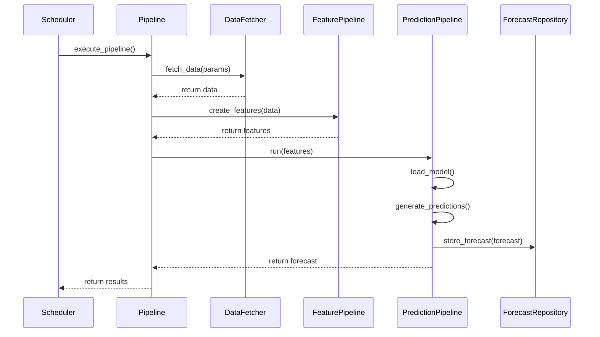
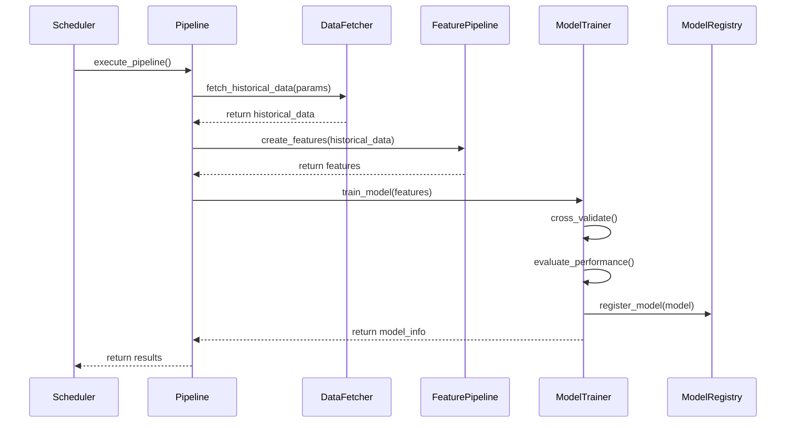
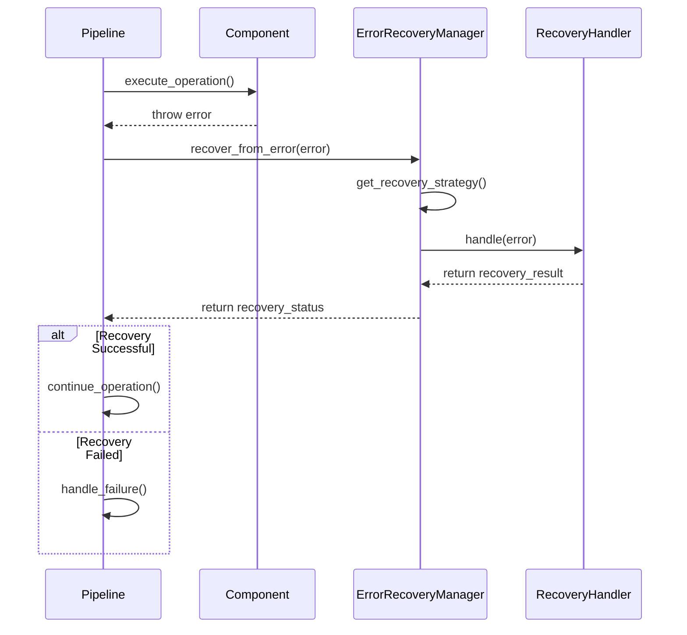

# Component Interaction in ERCOT RTLMP Spike Prediction System

## Introduction

This document describes the interactions between components in the ERCOT RTLMP spike prediction system. It details how the various modules communicate, share data, and coordinate operations to deliver reliable price spike forecasts. This document complements the overall architecture documentation by focusing specifically on how components work together.

## Core Component Interactions

The system is built around a modular architecture with clearly defined interfaces between components. The following sections detail the key interactions between these components.

### Task Management and Orchestration

The orchestration layer manages the execution of tasks across the system, ensuring proper sequencing and dependency management. It uses a task-based approach with dependency resolution to coordinate operations.

- The `TaskManager` class provides the foundation for defining, executing, and managing tasks with dependencies, priorities, and retry capabilities.
- Tasks are created with unique IDs and can have dependencies on other tasks, ensuring proper execution order.
- The `Pipeline` class uses the TaskManager to orchestrate the complete workflow from data fetching to inference.
- The `PipelineExecutor` manages multiple pipelines and coordinates their execution based on schedules.

### Scheduling and Timing

The scheduling system ensures that operations run at the appropriate times to meet business requirements.

- The `Scheduler` class manages the timing of system operations including daily inference runs, bi-daily model retraining, and data fetching.
- The `DailyScheduler` specializes in daily operations with predefined schedules for ERCOT market operations.
- Scheduled tasks are executed based on cron expressions or predefined frequencies (DAILY, HOURLY, etc.).
- The scheduler runs in a background thread and periodically checks for due tasks.

### Error Recovery and Resilience

The error recovery system ensures that the system can handle failures gracefully and maintain operation even in the presence of errors.

- The `ErrorRecoveryManager` handles errors across the pipeline with strategies for different error types and pipeline stages.
- Recovery strategies include RETRY, FALLBACK, SKIP, REPAIR, and RESTART depending on the error type.
- The `RecoveryContext` provides a context manager for error recovery operations with attempt tracking.
- Specialized handlers like `DataRecoveryHandler` and `ModelRecoveryHandler` implement recovery logic for specific error types.

## Data Processing Interactions

The data processing components interact to transform raw data into model-ready features and ultimately into forecasts.

### Data Fetching to Feature Engineering

The interaction between data fetching and feature engineering components is critical for preparing input data for the model.

- The `BaseDataFetcher` provides a standardized interface for retrieving data from various sources.
- Data fetchers implement caching, validation, and error handling for robust data retrieval.
- The `FeaturePipeline` receives data from fetchers through the `add_data_source` method.
- Feature engineering transforms raw data into model-ready features through a series of transformations.
- The feature pipeline ensures consistent feature generation across training and inference.

### Feature Engineering to Model Training

Feature engineering outputs are used for model training, with clear interfaces between these components.

- The `FeaturePipeline` produces a standardized feature set that is passed to the model training component.
- Feature selection may be applied to reduce dimensionality before training.
- The model training component uses the features to train and validate prediction models.
- Trained models are persisted with metadata about the features they expect.

### Feature Engineering to Inference

For inference operations, feature engineering interacts with the inference engine to generate forecasts.

- The `PredictionPipeline` uses the `FeaturePipeline` to prepare features for inference.
- The same feature transformations are applied during inference as during training.
- The inference engine loads models and applies them to the engineered features.
- Probability calibration may be applied to raw model outputs.
- The final forecasts are formatted and may be stored in the `ForecastRepository`.

## Pipeline Execution Flow

The complete pipeline execution involves coordinated interaction between all components.

### Daily Inference Pipeline

The daily inference pipeline demonstrates how components interact to produce forecasts.

- The scheduler triggers the inference pipeline at the scheduled time.
- The pipeline orchestrator creates tasks for data fetching, feature engineering, and inference.
- Data fetchers retrieve the latest data from ERCOT and weather sources.
- The feature pipeline transforms the raw data into model-ready features.
- The inference engine loads the current model and generates probability forecasts.
- Results are stored in the forecast repository and made available to downstream systems.

### Model Retraining Pipeline

The model retraining pipeline shows how components interact during model updates.

- The scheduler triggers the retraining pipeline on a bi-daily schedule.
- The pipeline orchestrator creates tasks for historical data fetching, feature engineering, and model training.
- Data fetchers retrieve historical data for the training period.
- The feature pipeline creates features from historical data.
- The model training component trains and validates new models.
- If the new model performs better, it replaces the current model in the model registry.

### Error Handling Flow

The error handling flow demonstrates how components interact during failure scenarios.

- When an error occurs in any component, it is caught by the task execution framework.
- The error recovery manager determines the appropriate recovery strategy based on error type and pipeline stage.
- For data errors, the system may use cached data or alternative sources.
- For model errors, the system may fall back to a previous model version.
- For inference errors, the system may use simplified prediction methods.
- The recovery process is logged and monitored for system health assessment.

## Component Communication Patterns

The system uses several communication patterns to facilitate component interaction.

### Function-Based Communication

Most component interactions use direct function calls with well-defined interfaces.

- Components expose public methods with clear signatures and return types.
- Type annotations ensure interface consistency.
- Function parameters and return values follow standardized formats.
- Error handling is consistent across component boundaries.

### Data-Centric Communication

Components exchange data through standardized data structures.

- pandas DataFrames are the primary data exchange format.
- Schemas ensure data consistency across component boundaries.
- Data validation occurs at component interfaces.
- Type aliases like `DataFrameType` and `ModelType` standardize type references.

### Event-Based Communication

Some components use event-based communication for loose coupling.

- The scheduler uses events to signal task execution.
- Task completion triggers dependent task execution.
- Error events trigger recovery processes.
- Logging events provide system observability.

## Interface Contracts

Clear interface contracts ensure reliable component interaction.

### Data Fetcher Interface

The data fetcher interface defines how data is retrieved from external sources.

- The `BaseDataFetcher` abstract class defines the interface with methods like `fetch_data`, `fetch_historical_data`, and `fetch_forecast_data`.
- Implementations must handle caching, validation, and error recovery.
- The interface includes timeout and retry parameters for resilience.
- Data validation ensures that retrieved data meets schema requirements.

### Feature Engineering Interface

The feature engineering interface defines how raw data is transformed into features.

- The `FeaturePipeline` class provides methods like `add_data_source` and `create_features`.
- The interface accepts configuration parameters for customization.
- Feature consistency validation ensures compatibility with models.
- The interface supports both training and inference scenarios.

### Model Interface

The model interface defines how models are trained and used for inference.

- Models must implement methods like `fit` and `predict_proba`.
- Model metadata includes required features and their types.
- The interface supports model versioning and comparison.
- Model persistence handles serialization and deserialization.

### Inference Interface

The inference interface defines how forecasts are generated.

- The `PredictionPipeline` class provides methods like `load_model` and `run`.
- The interface supports multiple thresholds and nodes.
- Probability calibration is optional but supported.
- Forecast output follows a standardized format with confidence intervals.

## Sequence Diagrams

The following sequence diagrams illustrate key component interactions.

### Daily Inference Sequence

### Model Retraining Sequence

### Error Recovery Sequence

## Configuration and Customization

Component interactions can be customized through configuration.

### Pipeline Configuration

The pipeline can be configured to enable or disable specific stages and customize their behavior.

- The `DEFAULT_PIPELINE_CONFIG` defines default settings for all pipeline stages.
- Configuration can be overridden at runtime for specific pipeline instances.
- Configuration affects which components are included in the pipeline and how they interact.
- Configuration validation ensures that component interactions remain valid.

### Feature Engineering Configuration

Feature engineering can be customized to include different feature types and transformations.

- The `DEFAULT_FEATURE_CONFIG` defines default settings for feature engineering.
- Configuration controls which feature types are enabled and their parameters.
- Feature selection can be enabled or disabled through configuration.
- Configuration affects the interface between feature engineering and downstream components.

### Inference Configuration

Inference can be customized for different thresholds, confidence levels, and output formats.

- The `InferenceConfig` class defines the configuration schema for inference.
- Configuration controls which thresholds are used for spike prediction.
- Confidence level for intervals can be customized.
- Output formatting options affect how forecasts are presented to downstream systems.

## Conclusion

The component interactions in the ERCOT RTLMP spike prediction system are designed for modularity, resilience, and maintainability. Clear interfaces, standardized data exchange formats, and robust error handling ensure reliable operation even in the presence of failures. The system's architecture allows for flexible configuration and extension while maintaining the integrity of component interactions.