# ERCOT RTLMP Spike Prediction System: Data Flow

## Introduction

This document details the flow of data through the ERCOT RTLMP spike prediction system, from external data sources to final forecasts. It describes the data transformations, storage mechanisms, and validation processes at each stage of the pipeline. The system is designed as a modular, batch-oriented pipeline for predicting the probability of price spikes in the ERCOT Real-Time Locational Marginal Price (RTLMP) market before day-ahead market closure, enabling battery storage operators to optimize their bidding strategies.

### Data Flow Principles

- Data flows through well-defined interfaces between components
- Each component validates incoming data before processing
- Data transformations are tracked and logged for reproducibility
- Data storage uses standardized formats with consistent schemas
- Data lineage is maintained throughout the pipeline

## High-Level Data Flow

The system's data flow begins with the Data Fetcher retrieving raw ERCOT market data and weather forecasts. This data is passed to the Feature Engineer, which transforms it into standardized feature sets stored in the Feature Store. During training, the Model Trainer retrieves historical features and targets from the Feature Store, trains models using cross-validation, and stores validated models in the Model Registry.

For daily inference, the system fetches the latest data, generates current features, loads the most recent validated model from the registry, and produces 72-hour probability forecasts. These forecasts are stored in the Forecast Repository and made available to downstream systems for battery storage optimization.

## Component Interactions

The data flow relies on well-defined interactions between system components, with each component having clear responsibilities for data processing:

| Interaction | Data Passed | Interface | Validation |
|-------------|-------------|-----------|------------|
| Data Fetcher → Feature Engineer | Standardized DataFrames with raw ERCOT and weather data | Function calls returning validated DataFrames | Schema validation ensures data structure consistency |
| Feature Engineer → Feature Store | Engineered feature DataFrames | Storage API calls with metadata | Feature completeness and type validation |
| Feature Store → Model Trainer | Historical features for training | Query API with date range parameters | Completeness checks for training periods |
| Model Trainer → Model Registry | Trained model artifacts with performance metadata | Storage API with versioning | Performance threshold validation |
| Feature Store → Inference Engine | Current features for prediction | Query API with date parameters | Feature alignment with model requirements |
| Model Registry → Inference Engine | Latest validated model | Load API with version specification | Model compatibility checks |
| Inference Engine → Forecast Repository | Probability forecasts with metadata | Storage API with timestamps | Forecast completeness and range validation |

## Data Sources

### ERCOT API

- **Description**: Provides RTLMP data at 5-minute granularity and grid condition information
- **Data Types**: 
  - Historical RTLMP values
  - Grid load forecasts
  - Generation mix data
  - Reserve margin information
- **Access Pattern**: Pull-based API requests with authentication
- **Refresh Frequency**: Every 5 minutes for real-time data, daily for historical data
- **Data Format**: JSON responses converted to pandas DataFrames

### Weather API

- **Description**: Provides weather forecasts and historical weather data relevant to energy demand
- **Data Types**:
  - Temperature forecasts
  - Wind speed and direction
  - Solar irradiance
  - Humidity and precipitation
- **Access Pattern**: Pull-based API requests with rate limiting
- **Refresh Frequency**: Hourly for forecasts, daily for historical data
- **Data Format**: JSON responses converted to pandas DataFrames

## Data Fetching Flow

The Data Fetcher component retrieves data from external sources, validates it, and provides standardized DataFrames to downstream components.

### Process Steps

1. Scheduler triggers data fetching based on configured schedule
2. Data Fetcher checks cache for recent data to minimize API calls
3. If cache is invalid or missing, Data Fetcher makes API requests
4. Raw responses are parsed and converted to pandas DataFrames
5. Data structure and content are validated against schemas
6. Standardized DataFrames are returned to the calling component

### Error Handling

- Connection failures trigger retries with exponential backoff
- Rate limiting is handled with appropriate delays between requests
- Data format changes are detected through schema validation
- Missing data is identified and logged with appropriate severity

### Sequence Diagram

## Feature Engineering Flow

The Feature Engineering component transforms raw data into model-ready features through a series of transformations.

### Process Steps

1. Feature Pipeline receives raw data sources from Data Fetcher
2. Time-based features are extracted from timestamp columns
3. Statistical features are calculated from RTLMP price data
4. Weather features are derived from weather forecast data
5. Market features are created from grid condition data
6. Feature selection is applied to reduce dimensionality
7. Final feature set is validated for consistency
8. Engineered features are stored in the Feature Store

### Feature Categories

#### Time Features
- **Description**: Features derived from timestamps
- **Examples**: hour_of_day, day_of_week, is_weekend, month, season
- **Transformation**: Extracted using pandas datetime functions

#### Statistical Features
- **Description**: Statistical measures of historical prices
- **Examples**: rolling_mean_24h, rolling_max_7d, price_volatility_24h
- **Transformation**: Calculated using rolling windows and statistical functions

#### Weather Features
- **Description**: Features derived from weather data
- **Examples**: temperature, wind_speed, solar_irradiance, humidity
- **Transformation**: Normalized and potentially combined with interaction terms

#### Market Features
- **Description**: Features derived from grid conditions
- **Examples**: load_forecast, reserve_margin, wind_penetration
- **Transformation**: Calculated from grid condition metrics and forecasts

### Sequence Diagram

## Model Training Flow

The Model Training component uses engineered features to train and validate prediction models.

### Process Steps

1. Model Trainer receives engineered features from Feature Store
2. Data is split into training and validation sets using time-based splitting
3. Cross-validation is performed to assess model stability
4. Hyperparameter optimization is applied to find optimal settings
5. Final model is trained on the full training dataset
6. Model performance is evaluated on the validation set
7. If performance meets criteria, model is saved to Model Registry
8. Model metadata and performance metrics are stored with the model

### Data Transformations

- Features are scaled or normalized if required by the model
- Target variable is created by applying thresholds to future prices
- Training/validation split preserves temporal ordering of data
- Cross-validation uses time-based folds to prevent data leakage

### Sequence Diagram

## Inference Flow

The Inference Engine generates probability forecasts using the latest data and trained models.

### Process Steps

1. Scheduler triggers inference pipeline before day-ahead market closure
2. Data Fetcher retrieves latest RTLMP data, weather forecasts, and grid conditions
3. Feature Engineer transforms raw data into model-ready features
4. Inference Engine loads the latest validated model from Model Registry
5. Model generates raw probability predictions for each threshold and hour
6. Probability calibration is applied to ensure well-calibrated forecasts
7. Confidence intervals are calculated for each prediction
8. Final forecast is stored in Forecast Repository with metadata
9. Visualization tools generate plots and dashboards from the forecast

### Data Transformations

- Features must match those used during model training
- Raw model outputs are calibrated to improve probability accuracy
- Forecasts are formatted with consistent structure for downstream use
- Metadata is attached to enable tracking and comparison

### Sequence Diagram

## Data Storage

The system uses several storage mechanisms to persist data at different stages of the pipeline.

### Storage Components

#### Data Cache
- **Purpose**: Temporary storage of raw data from external sources
- **Implementation**: In-memory dictionary and file-based cache using Parquet format
- **Access Pattern**: Key-value lookup based on request parameters
- **Retention Policy**: Time-based expiration (configurable TTL)

#### Feature Store
- **Purpose**: Persistent storage of engineered features
- **Implementation**: Parquet files organized by date and feature group
- **Access Pattern**: Date-range queries with optional feature filtering
- **Retention Policy**: 2 years of historical data

#### Model Registry
- **Purpose**: Version-controlled storage of trained models
- **Implementation**: Joblib serialization with JSON metadata
- **Access Pattern**: Model ID and version queries
- **Retention Policy**: All versions retained indefinitely

#### Forecast Repository
- **Purpose**: Storage of generated forecasts
- **Implementation**: Parquet files with JSON metadata
- **Access Pattern**: Timestamp and threshold-based queries
- **Retention Policy**: 1 year of historical forecasts

### Data Formats

#### Parquet
- **Usage**: Primary storage format for tabular data
- **Advantages**:
  - Columnar storage for efficient queries
  - Compression for reduced storage
  - Schema enforcement

#### JSON
- **Usage**: Metadata storage and configuration
- **Advantages**:
  - Human-readable
  - Flexible schema
  - Native support in Python

#### Joblib
- **Usage**: Model serialization
- **Advantages**:
  - Efficient for scikit-learn models
  - Handles Python objects well
  - Compression support

### Diagram

## Data Validation

Data validation occurs at multiple points in the pipeline to ensure data quality and consistency.

### Validation Points

#### Data Fetcher
- **Validation Type**: Schema Validation
- **Implementation**: Pandera schemas for DataFrame structure
- **Action on Failure**: Log error, attempt repair, or use cached data

#### Feature Engineer
- **Validation Type**: Feature Consistency
- **Implementation**: Feature Registry validation against expected features
- **Action on Failure**: Log warning, use default values for missing features

#### Model Trainer
- **Validation Type**: Data Quality
- **Implementation**: Statistical checks for outliers and distributions
- **Action on Failure**: Log warning, filter problematic data points

#### Inference Engine
- **Validation Type**: Prediction Quality
- **Implementation**: Range checks and consistency validation
- **Action on Failure**: Log warning, apply constraints to predictions

### Sequence Diagram

## Data Lineage

The system tracks data lineage to enable reproducibility and debugging.

### Tracking Mechanisms

#### Request Logging
- **Implementation**: Log all API requests with parameters
- **Purpose**: Track external data sources

#### Transformation Logging
- **Implementation**: Log feature engineering operations
- **Purpose**: Document data transformations

#### Model Metadata
- **Implementation**: Store training data information with model
- **Purpose**: Link models to training data

#### Forecast Metadata
- **Implementation**: Store model and feature information with forecast
- **Purpose**: Link forecasts to models and features

### Example Lineage

## Batch Processing Flow

The system operates in batch mode with scheduled execution of data processing pipelines.

### Scheduled Operations

| Operation | Schedule | Duration | Data Volume |
|-----------|----------|----------|-------------|
| Data Fetching | Daily at 00:00 | ~10 minutes | ~100MB per day |
| Feature Engineering | Daily at 00:15 | ~15 minutes | ~50MB per day |
| Model Retraining | Every 2 days at 01:00 | ~2 hours | ~1GB per training run |
| Inference | Daily at 06:00 | ~5 minutes | ~10MB per forecast |

### Data Retention

| Data Type | Retention Period | Storage Growth |
|-----------|------------------|----------------|
| Raw Data | 2 years | ~36GB per year |
| Engineered Features | 2 years | ~18GB per year |
| Models | Indefinite | ~1GB per year |
| Forecasts | 1 year | ~3.6GB per year |

### Diagram

```mermaid
gantt
    title Daily Batch Processing Schedule
    dateFormat  HH:mm
    axisFormat %H:%M
    
    section Data Operations
    Data Fetching           :a1, 00:00, 10m
    Feature Engineering     :a2, after a1, 15m
    
    section Model Operations
    Model Retraining        :b1, 01:00, 120m
    
    section Inference
    Inference Run           :c1, 06:00, 5m
    
    section Deadlines
    DAM Closure            :milestone, m1, 10:00, 0m
```

## Error Handling and Recovery

The system implements error handling and recovery mechanisms to ensure data flow reliability.

### Error Handling Strategies

#### Data Fetch Failure
- **Detection**: Exception during API request
- **Recovery**: Retry with exponential backoff, use cached data if available
- **Impact**: Potentially using slightly outdated data

#### Data Validation Failure
- **Detection**: Schema validation errors
- **Recovery**: Attempt data repair, use default values, or reject data
- **Impact**: Potential reduction in feature quality

#### Feature Engineering Failure
- **Detection**: Exception during feature calculation
- **Recovery**: Skip problematic features, use defaults
- **Impact**: Reduced feature set for model

#### Model Loading Failure
- **Detection**: Exception during model deserialization
- **Recovery**: Fall back to previous model version
- **Impact**: Using slightly outdated model

#### Inference Failure
- **Detection**: Exception during prediction generation
- **Recovery**: Use simplified model or previous forecast
- **Impact**: Potentially less accurate forecast

### Sequence Diagram

## Performance Considerations

The system is designed with performance considerations to ensure timely data processing and forecast generation.

### Key Metrics

| Metric | Target | Optimization |
|--------|--------|-------------|
| Data Fetch Time | <10 minutes for complete data | Caching, connection pooling, parallel requests |
| Feature Engineering Time | <15 minutes for all features | Vectorized operations, incremental processing |
| Model Training Time | <2 hours for complete training | Parallel cross-validation, feature selection |
| Inference Time | <5 minutes for 72-hour forecast | Efficient model loading, vectorized prediction |
| End-to-End Pipeline | Complete before DAM closure | Scheduled execution with buffer time |

### Scaling Considerations

#### Data Volume
- **Approach**: Chunked processing for large historical datasets
- **Implementation**: Process data in time-based chunks

#### Computation
- **Approach**: Parallel processing where possible
- **Implementation**: Use joblib Parallel for CPU-bound tasks

#### Storage
- **Approach**: Efficient storage formats
- **Implementation**: Parquet with compression for tabular data

## Conclusion

The data flow architecture of the ERCOT RTLMP spike prediction system is designed to ensure reliable, efficient processing of data from external sources to final forecasts. By implementing clear interfaces, comprehensive validation, and robust error handling, the system maintains data integrity throughout the pipeline while meeting the critical timing requirements for forecast generation before day-ahead market closure.

The modular design allows for independent evolution of components while maintaining consistent data flow patterns, supporting the system's primary goal of providing accurate price spike probability forecasts for battery storage optimization.