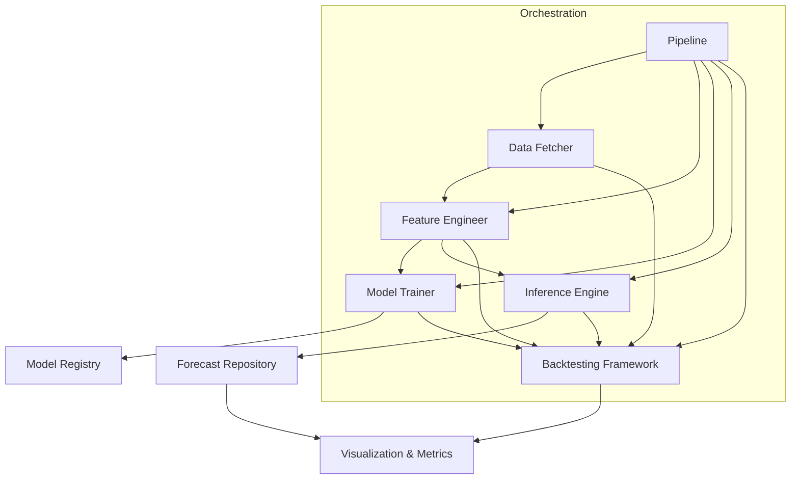
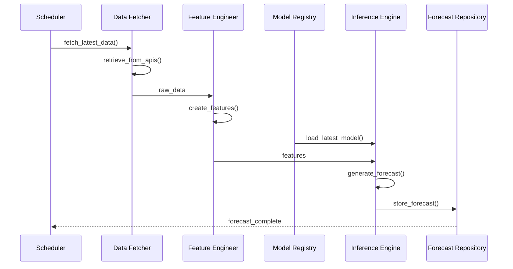
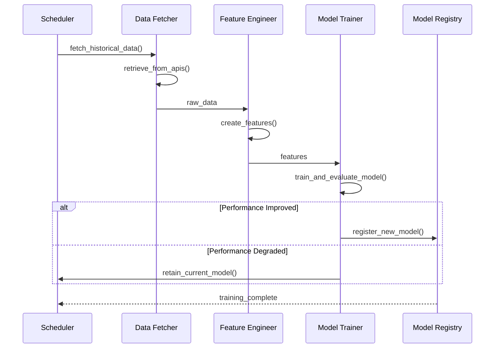
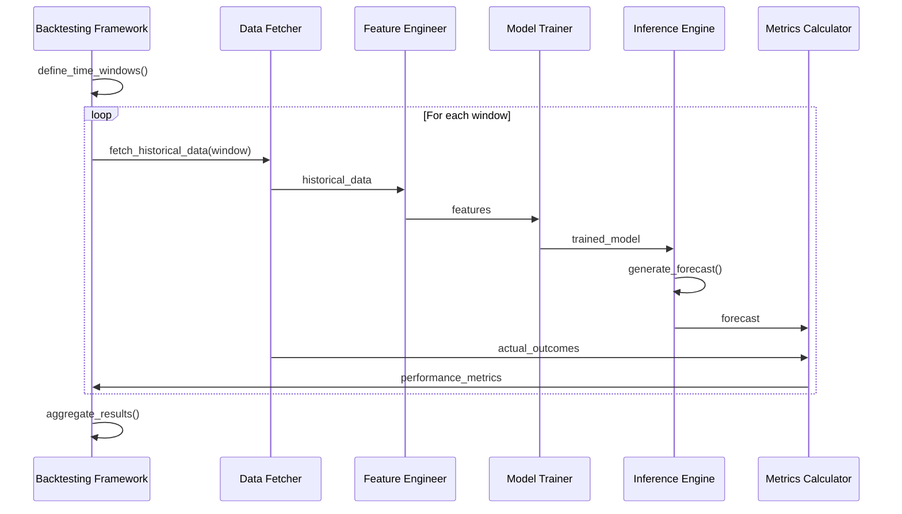

# ERCOT RTLMP Spike Prediction System: System Overview

## Introduction

This document provides a high-level overview of the ERCOT RTLMP spike prediction system architecture. It explains the system's purpose, components, and how they work together to deliver forecasting functionality. For more detailed information on specific aspects, refer to the data flow and component interaction documentation.

## System Purpose

The ERCOT RTLMP spike prediction system forecasts the probability of price spikes in the Real-Time Locational Marginal Price (RTLMP) market before day-ahead market closure. This enables energy storage operators to optimize battery charging/discharging strategies and maximize revenue by making more informed bidding decisions in the day-ahead market.

### Key Capabilities

- Predicts the probability of seeing at least one 5-minute RTLMP greater than a threshold value (x) over a particular hour
- Provides a 72-hour forecast horizon with hourly probabilities
- Retrains models every second day to maintain accuracy
- Delivers forecasts before day-ahead market closure

### Business Value

By quantifying the probability of RTLMP spikes, the system enables battery storage operators to develop more effective bidding strategies in the day-ahead market, potentially increasing the profitability of battery storage assets.

## Architectural Principles

The system architecture is guided by the following principles:

### Modularity

The system is designed with separate components for data fetching, feature engineering, model training, and inference, each with clearly defined interfaces.

### Functional Programming

The system employs a functional programming approach with stateless components where possible, reducing complexity and improving testability.

### Type Safety

Clear type definitions and validation at component boundaries ensure data consistency and reduce runtime errors.

### Idempotent Operations

Operations are designed to be idempotent where possible, supporting reliable retraining and inference even in the presence of failures.

### Pipeline-Oriented

The system follows a pipeline-oriented architecture where data flows through several distinct stages, with clear interfaces between components.

## System Boundaries

The system has well-defined boundaries that determine its scope and integration points:

### External Interfaces

- **ERCOT API**: Source for RTLMP data and grid condition information. Interaction through pull-based data retrieval with caching.
- **Weather API**: Source for weather forecast data relevant to energy demand. Interaction through pull-based data retrieval with caching.

### Internal Boundaries

- **Feature Store**: Storage for historical and engineered features. Read/write access from feature engineering and model components.
- **Model Registry**: Storage for versioned model artifacts. Write access from model training, read access from inference.
- **Forecast Repository**: Storage for prediction outputs. Write access from inference, read access from visualization and downstream systems.

### Out of Scope

- Real-time trading execution systems
- User interface development beyond basic visualization tools
- Integration with third-party trading platforms
- Price forecasting for markets outside ERCOT
- Optimization of battery charging/discharging strategies

## Core Components

### Data Fetcher

**Description**: Retrieves and standardizes raw data from external sources such as the ERCOT API and weather data providers.

**Responsibilities**:
- Fetch historical RTLMP data at 5-minute granularity
- Retrieve weather forecast data relevant to ERCOT market
- Fetch ERCOT grid condition data (load, generation mix, etc.)
- Standardize data formats for downstream processing
- Implement caching to minimize redundant API calls

**Dependencies**: ERCOT API, Weather API

**Critical Considerations**:
- Must handle API rate limits and connection failures
- Must handle data format changes from external sources
- Must complete data retrieval within specified timeframes

### Feature Engineer

**Description**: Transforms raw data into model-ready features using a pipeline of transformations.

**Responsibilities**:
- Generate time-based features from timestamps
- Calculate rolling statistics of RTLMP values
- Create features from weather forecast data
- Process grid condition data into predictive features
- Ensure consistent feature generation between training and inference

**Dependencies**: Data Fetcher, Feature Store

**Critical Considerations**:
- Must maintain consistent feature names and formats
- Must handle missing data appropriately
- Must process data efficiently with minimal memory footprint

### Model Trainer

**Description**: Trains and validates prediction models using cross-validation and hyperparameter optimization.

**Responsibilities**:
- Train machine learning models with cross-validation
- Evaluate model performance with appropriate metrics
- Optimize hyperparameters for best performance
- Save and version model artifacts
- Implement retraining on a two-day cadence

**Dependencies**: Feature Engineer, Feature Store, Model Registry

**Critical Considerations**:
- Must implement appropriate validation strategy
- Must balance model complexity with inference speed
- Must complete training within allocated time window

### Inference Engine

**Description**: Generates probability forecasts using trained models for the 72-hour forecast horizon.

**Responsibilities**:
- Generate 72-hour hourly probability forecasts
- Handle multiple price threshold values
- Apply calibration to raw model outputs
- Format and store forecast results
- Complete before day-ahead market closure

**Dependencies**: Feature Engineer, Model Registry, Forecast Repository

**Critical Considerations**:
- Must complete before day-ahead market closure
- Must handle multiple threshold values efficiently
- Must produce well-calibrated probability forecasts

### Backtesting Framework

**Description**: Simulates historical forecasts to evaluate model performance under different market conditions.

**Responsibilities**:
- Simulate historical forecasts over user-specified time windows
- Calculate performance metrics for model evaluation
- Compare different model versions and configurations
- Support scenario analysis for model robustness

**Dependencies**: Data Fetcher, Feature Engineer, Model Trainer, Inference Engine

**Critical Considerations**:
- Must accurately reproduce historical conditions
- Must process multi-year backtests efficiently
- Must provide meaningful performance comparisons

### Visualization & Metrics

**Description**: Generates performance reports and visualizations to evaluate model quality and forecast accuracy.

**Responsibilities**:
- Generate performance visualizations and metrics
- Create calibration curves and reliability diagrams
- Visualize feature importance and model behavior
- Export standardized reports and visualizations

**Dependencies**: Inference Engine, Backtesting Framework, Forecast Repository

**Critical Considerations**:
- Must provide actionable insights on model performance
- Must generate consistent, interpretable outputs
- Must support both interactive exploration and automated reporting

### Pipeline Orchestration

**Description**: Coordinates the execution of system components in a defined sequence to ensure proper data flow and dependency management.

**Responsibilities**:
- Manage the flow of data between components
- Schedule and execute pipeline operations
- Handle errors and implement recovery strategies
- Ensure daily operations complete on schedule

**Dependencies**: All core components

**Critical Considerations**:
- Must ensure reliable execution of daily operations
- Must handle component failures gracefully
- Must maintain data integrity throughout the pipeline

## Component Relationships

The components interact through well-defined interfaces to form a complete forecasting system:

### Key Interactions

- **Data Fetcher → Feature Engineer**: The Data Fetcher provides standardized DataFrames to the Feature Engineer for transformation into model-ready features.
- **Feature Engineer → Model Trainer**: The Feature Engineer provides engineered features to the Model Trainer for model training and evaluation.
- **Feature Engineer → Inference Engine**: The Feature Engineer provides current features to the Inference Engine for generating forecasts.
- **Model Trainer → Model Registry**: The Model Trainer stores trained models in the Model Registry for later retrieval by the Inference Engine.
- **Model Registry → Inference Engine**: The Inference Engine loads models from the Model Registry for generating forecasts.
- **Inference Engine → Forecast Repository**: The Inference Engine stores generated forecasts in the Forecast Repository for consumption by downstream systems.

## Operational Flows

The system operates through several key workflows that coordinate component interactions:

### Daily Inference

The daily inference workflow generates 72-hour probability forecasts before day-ahead market closure.

**Steps**:
1. Scheduler triggers the inference pipeline
2. Data Fetcher retrieves latest RTLMP data, weather forecasts, and grid conditions
3. Feature Engineer transforms raw data into model-ready features
4. Inference Engine loads the latest validated model from the Model Registry
5. Inference Engine generates probability forecasts for each hour in the 72-hour horizon
6. Forecasts are stored in the Forecast Repository for consumption by downstream systems
7. Visualization tools generate plots and dashboards from the forecasts

### Model Retraining

The model retraining workflow updates models every second day to maintain accuracy as market conditions evolve.

**Steps**:
1. Scheduler triggers the training pipeline on a two-day cadence
2. Data Fetcher retrieves historical RTLMP data, weather data, and grid conditions
3. Feature Engineer transforms raw data into model-ready features
4. Model Trainer applies cross-validation to train and evaluate models
5. If performance improves, the new model is stored in the Model Registry
6. If performance degrades, the current model is retained

### Backtesting

The backtesting workflow simulates historical forecasts to evaluate model performance under different market conditions.

**Steps**:
1. User or scheduler initiates backtesting with specified parameters
2. Backtesting Framework defines time windows for historical simulation
3. For each window, historical data is retrieved up to the simulation date
4. Features are generated using only data available at the simulation time
5. Models are trained using only data available at the simulation time
6. Forecasts are generated and compared with actual outcomes
7. Performance metrics are calculated and aggregated across all windows

## Technology Stack

### Programming Languages

- **Python** (3.10+): Primary development language. Industry standard for data science and ML applications with extensive library support.

### Core Libraries

- **NumPy** (1.24+): Numerical computing foundation
- **pandas** (2.0+): Data manipulation and time series handling
- **scikit-learn** (1.2+): Machine learning framework
- **XGBoost** (1.7+): Gradient boosting implementation
- **LightGBM** (3.3+): Alternative gradient boosting implementation

### Utilities

- **pydantic** (2.0+): Data validation and configuration management
- **hydra** (1.3+): Configuration management
- **joblib** (1.2+): Model persistence
- **pytest** (7.3+): Testing framework

### Visualization

- **Matplotlib** (3.7+): Basic plotting capabilities
- **seaborn** (0.12+): Statistical visualization
- **plotly** (5.14+): Interactive visualization

### Storage

- **Parquet files**: Efficient columnar storage for features and forecasts
- **Joblib serialization**: Model artifact storage

## Cross-Cutting Concerns

### Error Handling

The system implements a comprehensive error handling strategy with three primary patterns: fail-fast validation, graceful degradation for non-critical failures, and retry with backoff for transient external service failures.

Components use the ErrorRecoveryManager to coordinate error handling across component boundaries. The Pipeline class uses this manager to handle errors during stage execution.

### Logging and Monitoring

The system implements structured logging with consistent severity levels (DEBUG, INFO, WARNING, ERROR, CRITICAL) to provide visibility into system operation.

Components use the get_logger function for consistent logging configuration and the log_execution_time decorator to track performance.

### Configuration Management

The system uses a hierarchical configuration system with validation to ensure consistent component configuration.

Pydantic models define the schema for all configuration components, enabling robust validation of configuration data.

### Type Safety

The system uses type annotations and validation to ensure type safety at component boundaries.

Type aliases like DataFrameType and ModelType provide consistent type definitions across components.

## Deployment Model

The system is designed as a standalone Python library for data processing and machine learning rather than a distributed application. It operates as a batch processing pipeline with scheduled execution rather than a continuously running service.

### Environment Requirements

- **Compute**: 4+ CPU cores, 8+ recommended. Required for parallel processing during model training.
- **Memory**: 16GB minimum, 32GB recommended. Needed for handling historical data and model training.
- **Storage**: 100GB minimum. Storage for historical data, features, and model artifacts.
- **Python**: Version 3.10+. Required for modern type hints and library compatibility.

### Scheduling

- **Data Fetching**: Daily at 00:00, execution window of 1 hour, high priority
- **Inference**: Daily at 06:00, execution window of 2 hours, critical priority
- **Model Retraining**: Every 2 days at 01:00, execution window of 4 hours, medium priority
- **Backtesting**: Weekly, Sunday at 02:00, execution window of 6 hours, low priority

## Future Considerations

### Distributed Training

For larger datasets or more complex models, the system could be extended to support distributed training using frameworks like Dask.

### Real-time Inference

While the current system focuses on daily forecasting, it could be extended to support more frequent updates or real-time inference as market conditions change.

### Additional Data Sources

The modular design allows for easy integration of additional data sources such as fuel prices, transmission constraints, or market participant behavior.

### Advanced Model Architectures

The system could be extended to support deep learning models or more complex ensemble approaches as requirements evolve.

## Conclusion

The ERCOT RTLMP spike prediction system architecture is designed to provide reliable, accurate forecasts of price spike probabilities before day-ahead market closure. By implementing a modular, pipeline-oriented approach with clear component boundaries and well-defined interfaces, the system achieves the flexibility to evolve while maintaining the reliability required for operational use. The architecture prioritizes data integrity, consistent processing, and timely delivery of forecasts to support the critical business requirement of optimizing battery storage operations in the ERCOT market.